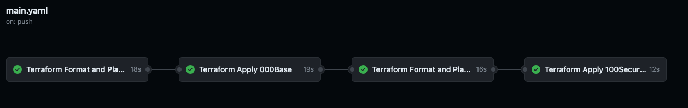
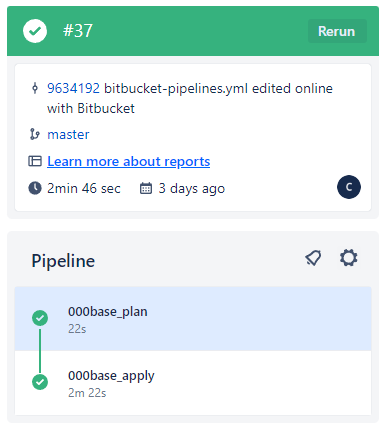

# Comparing Github Actions Bitbucket Pipelines

## Github Actions Overview

Github actions looks for a `.yml` or a `.yaml` file under the `.github/workflows` directory.

GitHub Actions supports Linux, macOS, and Windows Server.

Free tier: GitHub Actions free tier gives you 2000 minutes/month and 500 MB of storage.

### Github Actions Runner

If you use a GitHub-hosted runner, each job runs in a fresh instance of a runner image specified by `runs-on`.

Available GitHub-hosted runner labels are:

| OS (YAML workflow label) | Notes |
| ------------------------ | ----- |
| ubuntu-latest, ubuntu-22.04, ubuntu-20.04 | The ubuntu-latest label currently uses the Ubuntu 22.04 runner image. |
| windows-latest, windows-2022, windows-2019 | The windows-latest label currently uses the Windows 2022 runner image. |
| macos-latest, macos-14 [Beta], macos-13, macos-12, macos-11 | The macos-latest workflow label currently uses the macOS 12 runner image. |

GitHub has an ["Actions Marketplace"](https://github.com/marketplace) with thousands of actions ready to use. These actions allow us to improve our workflow with things like installing language environments, caching data between jobs, or deploying a project with just a couple of lines of code.

### Github Actions Artifacts

Artifacts allows persistent data after a job has completed, and share that data with another job in the same workflow. An artifact is a file or collection of files produced during a workflow run. For example, you can use artifacts to save your build and test output after a workflow run has ended. All actions and workflows called within a run have write access to that run's artifacts.

Using the `actions/upload-artifact@v3` and `actions/download-artifact@v3` actions you can have files persist between different jobs, for example to upload a terraform plan named `tfplan` between one job to another:

```YAML
- name: Publish Terraform Plan
uses: actions/upload-artifact@v3
with:
    name: tfplan
    path: ./tfplan
```

```YAML
- name: Download Terraform Plan
uses: actions/download-artifact@v3
with:
    path: ./tfplan
    name: tfplan
```

### Github Actions Secrets

Under Settings > Secrets and Variables, Actions you can save `Repository secrets` which can be referenced in your pipeline for example the below pipeline sets AWS access keys using the secrets values which allows Terraform to access your AWS environment.

```YAML
env:
  AWS_ACCESS_KEY_ID: ${{ '{{ secrets.AWS_ACCESS_KEY_ID }}' }}
  AWS_SECRET_ACCESS_KEY: ${{ '{{ secrets.AWS_SECRET_ACCESS_KEY }}' }}
```

!!! note
    If a secret was used in the job, GitHub automatically redacts secrets printed to the log. You should avoid printing secrets to the log intentionally.

### Github Actions Example

The below is a Github Pipelines example which on push to master branch:

- Stores AWS credentials as environment variables
- Sets up Terraform using a specific version `1.5.5`
- Runs a terraform init and format
- Runs a terraform plan and outputs to console on failure
- Uploads the terraform plan file to artifacts
- Downloads the artifacts
- Runs a terraform apply using the plan output from the previous step



```YAML
name: Deploy Terraform
defaults:
  run:
    shell: bash

on:
  push:
    branches:
      - master
  workflow_dispatch:

env:
  AWS_ACCESS_KEY_ID: ${{ '{{ secrets.AWS_ACCESS_KEY_ID }}' }}
  AWS_SECRET_ACCESS_KEY: ${{ '{{ secrets.AWS_SECRET_ACCESS_KEY }}' }}

jobs:
  tf_fmt_plan_000base:
    name: Terraform Format and Plan 000Base
    runs-on: ubuntu-latest
    defaults:
      run:
        working-directory: ./layers/000base
    permissions:
      contents: read
      pull-requests: write
    steps:
      - name: Checkout the repository to the runner
        uses: actions/checkout@v2
      - name: Setup Terraform with specified version on the runner
        uses: hashicorp/setup-terraform@v3
        with:
          terraform_version: 1.5.5
          terraform_wrapper: true
      - name: Terraform init
        id: init
        run: terraform init
      - name: Terraform format
        id: fmt
        run: terraform fmt -check
        continue-on-error: true
      - name: Terraform Plan
        id: plan
        run: |
          export exitcode=0
          terraform plan -detailed-exitcode -no-color -out 000base_tfplan || export exitcode=$?

          echo "exitcode=$exitcode" >> $GITHUB_OUTPUT
          
          if [ $exitcode -eq 1 ]; then
            echo Terraform Plan Failed!
            exit 1
          else 
            exit 0
          fi
      - name: Publish Terraform Plan
        uses: actions/upload-artifact@v3
        with:
          name: 000base_tfplan
          path: ./layers/000base/000base_tfplan
  tf_apply_000base:
    name: Terraform Apply 000Base
    timeout-minutes: 30
    needs: tf_fmt_plan_000base
    runs-on: ubuntu-latest
    environment: 'prod'
    defaults:
      run:
        working-directory: ./layers/000base
    permissions:
      contents: read
      pull-requests: write
    steps:
      - name: Checkout the repository to the runner
        uses: actions/checkout@v2
      - name: Setup Terraform with specified version on the runner
        uses: hashicorp/setup-terraform@v3
        with:
          terraform_version: 1.5.5
      - name: Terraform init
        id: init
        run: terraform init
      - name: Download Terraform Plan
        uses: actions/download-artifact@v3
        with:
          path: ./layers/000base/
          name: 000base_tfplan
      - name: Terraform Apply
        run: terraform apply -auto-approve 000base_tfplan
```

## Bitbucket Pipelines Overview

Bitbucket Pipelines looks for a `.yml` or a `.yaml` file called `bitbucket-pipelines.yml` located at the root directory of the repository.

Bitbucket Pipelines runs your builds in Docker containers. These containers run a Docker image that defines the build environment. You can use the default image provided by Bitbucket or get a custom one.

Free tier: Bitbucket Pipelines free tier has 50 build minutes/month and 1 GB of storage.

### Bitbucket Pipelines Runner

Bitbucket Pipelines supports public and private Docker images including those hosted on Docker Hub, AWS, GCP, Azure and self-hosted registries accessible on the internet. (Bitbucket Pipelines cannot currently access Docker images that cannot be accessed via the internet.)

!!! note
    Bitbucket Pipelines only supports Linux environments at the moment.

### Bitbucket Pipelines Artifacts

Artifacts allows persistent data after a job has completed, and share that data with another job in the same workflow. An artifact is a file or collection of files produced during a workflow run. For example, you can use artifacts to save your build and test output after a workflow run has ended. All actions and workflows called within a run have write access to that run's artifacts.

Using the `artifacts` option in a step allows you to have files persist between different steps, for example to upload a terraform plan named `tfplan` between one job to another:

```YAML
- step:
    name: terraformplan
    script:
        - terraform plan -no-color -out tfplan
    artifacts:
        - ./tfplan
```

```YAML
- step:
    name: download_artifact
    artifacts:
        download: true
```

### Bitbucket Pipelines Secrets

In Repository settings > Pipelines > Repository variables.

Environment variables added on the repository level can be accessed by any users with push permissions in the repository. To access a variable, put the $ symbol in front of its name. For example, access AWS_ACCESS_KEY_ID by using $AWS_ACCESS_KEY_ID.

### Bitbucket Pipelines Example

The below is a Bitbucket Pipelines example which on push to master:

- Pulls a specific docker image of Terraform `1.5.5`
- Performs a terraform initialisation using stored AWS credentials
- Performs a terraform plan
- Uploads the terraform plan output to artifacts
- Downloads the terraform plan from artifacts for a second step
- Performs a terraform init and then a terraform apply from the previous job using artifacts



```YAML
image: hashicorp/terraform:1.5.5
pipelines:
    branches:
        master:
            - step:
                name: 000base_plan
                script:
                    - cd layers/000base
                    - terraform init -backend-config="access_key=$AWS_ACCESS_KEY_ID" -backend-config="secret_key=$AWS_SECRET_ACCESS_KEY"
                    - terraform validate
                    - terraform plan -no-color -out 000base_tfplan
                artifacts:
                  - layers/000base/000base_tfplan
            - step:
                name: 000base_apply
                trigger: manual
                artifacts:
                  download: true
                script:
                    - cd layers/000base
                    - terraform init -backend-config="access_key=$AWS_ACCESS_KEY_ID" -backend-config="secret_key=$AWS_SECRET_ACCESS_KEY"
                    - terraform validate
                    - terraform apply -auto-approve 000base_tfplan
```
