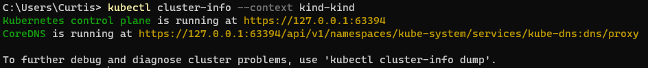
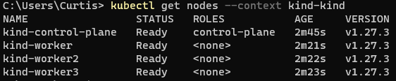

# Setting up a Kubernetes cluster locally on your machine

This document presumes you are running a windows machine.

## Prerequisites

Follow the ["Install Docker Desktop on Windows"](https://docs.docker.com/desktop/install/windows-install/#install-docker-desktop-on-windows)

Install Kind via chocolatey

```bash
choco install kind
```

## Use Kind to create your K8 cluster

Run the below:

```bash
kind create cluster
```

To see your cluster information run:

```bash
kubectl cluster-info --context kind-kind
```



### Use Kind to create a K8 cluster with multiple nodes

Save the below to a file named `kind.config`

```yaml
# this config file contains all config fields with comments
# NOTE: this is not a particularly useful config file
kind: Cluster
apiVersion: kind.x-k8s.io/v1alpha4
# patch the generated kubeadm config with some extra settings
kubeadmConfigPatches:
- |
  apiVersion: kubelet.config.k8s.io/v1beta1
  kind: KubeletConfiguration
  evictionHard:
    nodefs.available: "0%"
# patch it further using a JSON 6902 patch
kubeadmConfigPatchesJSON6902:
- group: kubeadm.k8s.io
  version: v1beta3
  kind: ClusterConfiguration
  patch: |
    - op: add
      path: /apiServer/certSANs/-
      value: my-hostname
# 1 control plane node and 3 workers
nodes:
# the control plane node config
- role: control-plane
# the three workers
- role: worker
- role: worker
- role: worker
```

Run the below referencing your `kind.config`

```bash
kind create cluster --config '.\Documents\Kind\kind.config'
```

Now when you run get nodes you can see a control-plane and 3 worker nodes

```bash
kubectl get nodes --context kind-kind
```


