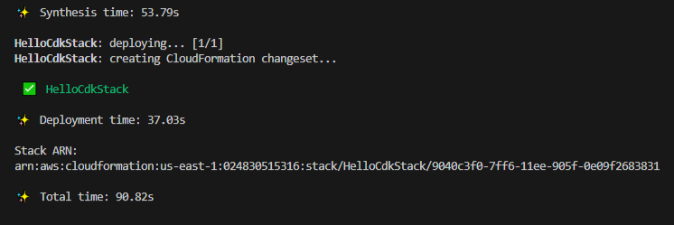

# How to deploy using AWS Java CDK

!!! note
    The code for this is located in `how-to/AWS_Java_CDK/hello-cdk`

## Prerequisites

You must have Java and Maven installed, we do this inside the Dev Container with:

```bash
# Install NVM
RUN nvm install ${NODE_VERSION}

# Install AWSCLI
RUN pip install --upgrade pip && \
    pip install --upgrade awscli

# Install CDK
RUN npm install -g aws-cdk
RUN cdk --version

# Install Maven
RUN sudo apt-get install maven -y
```

## Installation

Install CDK Toolkit if this isn't already done in your Dev Container

```bash
npm install -g aws-cdk 
```

You may need to install NPM

```bash
sudo apt-get install npm
```

## Set your AWS credential environment variables

Run the below:

```bash
export AWS_ACCESS_KEY_ID=ABCDEFGHIJKLMNOPQRSTUVWXYZ
export AWS_SECRET_ACCESS_KEY=ABCDEFGHIJKLMNOPQRSTUVWXYZ1234567890
export AWS_DEFAULT_REGION=us-east-1
```

## Building your application

Build your app directory:

```bash
mkdir hello-cdk
cd hello-cdk
```

Now initialize the app by using the cdk init command. Specify the desired template ("app") and programming language as shown in the following examples:

```bash
cdk init app --language java
```

Build the app:

```bash
mvn compile -q
```

You may need to run a maven dependency:

```bash
mvn dependency:list
```

If you get the error below make sure to bootstrap:

`current credentials could not be used to assume 'arn:aws:iam::{ACCOUNT_ID}:role/cdk-hnb659fds-deploy-role-024830515316-{REGION}', but are for the right account. Proceeding anyway.`

```bash
cdk bootstrap
```

!!! note
    If you're deploying this again to a new account such as the ACG playground, you'd need to bootstrap again.

## Add a resources

Adding an S3 bucket, add the below to `src/main/java/com/myorg/HelloCdkStack.java`

```java
package com.myorg;

import software.amazon.awscdk.*;
import software.amazon.awscdk.services.s3.Bucket;

public class HelloCdkStack extends Stack {
    public HelloCdkStack(final App scope, final String id) {
        this(scope, id, null);
    }

    public HelloCdkStack(final App scope, final String id, final StackProps props) {
        super(scope, id, props);

        Bucket.Builder.create(this, "MyFirstBucket")
            .versioned(true).build();
    }
}
```

## Deploy application

Synthesize an AWS CloudFormation template for the app, as follows.

```bash
cdk synth
```

!!! note
    The cdk synth command executes your app, which causes the resources defined in it to be translated into an AWS CloudFormation template. The displayed output of cdk synth is a YAML-format template. Following, you can see the beginning of our app's output. The template is also saved in the cdk.out directory in JSON format.

To deploy the stack using AWS CloudFormation, issue:

```bash
cdk deploy
```

!!! note
    As with cdk synth, you don't need to specify the name of the stack if there's only one in the app.<br>
    It is optional (though good practice) to synthesize before deploying. The AWS CDK synthesizes your stack before each deployment.

You will see the below if the deployment is successful.



## Deploying an application written in Cloudformation

Run the above steps up until:

```bash
cdk bootstrap
```

Add the cloudformation template to `src/main/java/com/myorg/`.

Adding an S3 bucket, add the below to `src/main/java/com/myorg/HelloCfnCdkApp.java` referencing your template file `s3.template`.

```java
import software.amazon.awscdk.Stack;
import software.amazon.awscdk.StackProps;
import software.amazon.awscdk.cloudformation.include.CfnInclude;
import software.constructs.Construct;

public class HelloCfnCdkApp extends Stack {
    public MyStack(final Construct scope, final String id) {
        this(scope, id, null);
    }

    public HelloCfnCdkApp(final Construct scope, final String id, final StackProps props) {
        super(scope, id, props);

        CfnInclude template = CfnInclude.Builder.create(this, "Template")
            .templateFile("s3.template")
            .build();
    }
}
```

To deploy the stack using AWS CloudFormation, issue:

```bash
cdk deploy
```

To deploy the stack using AWS CloudFormation and a parameter, issue:

```bash
cdk deploy MyStack --parameters uploadBucketName=uploadbucket
```

To reference multiple paramters:

```bash
cdk deploy MyStack --parameters uploadBucketName=upbucket --parameters downloadBucketName=downbucket
```

!!! note
    By default, the AWS CDK retains values of parameters from previous deployments and uses them in subsequent deployments if they are not specified explicitly. Use the --no-previous-parameters flag to require all parameters to be specified.

## Reference Links

["Getting started with the AWS CDK"](https://docs.aws.amazon.com/cdk/v2/guide/getting_started.html)

["Your first AWS CDK app"](https://docs.aws.amazon.com/cdk/v2/guide/hello_world.html)

["CDK Parameters"](https://docs.aws.amazon.com/cdk/v2/guide/parameters.html)
