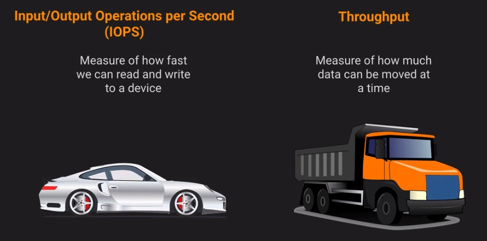
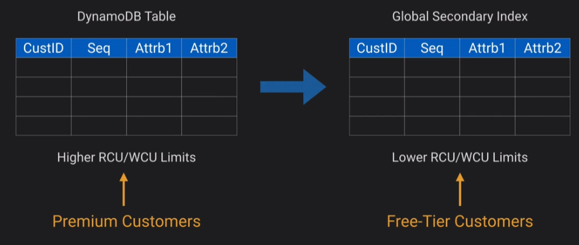

## Datastores

### Design Solutions for Organisational Complexity

- Deploying encryption strategies for data at rest and in transit
- Data backup and restoration

### Design for new solutions

- Storage options on AWS
- Storage tiering and transfer cost
- Configuring database replication
- Operating and maintaining high-availability
- AWS Storage services and replication strategies (S3/RDS/Elasticache)

### Continuous Improvement for Existing Solutions

- Data retention, sensitivity and regulatory requirements
- Data replication methods

### Accelerate Workload Migration and Modernisation

- Different databases
- Selecting the appropriate storage service
- Selecting the appropriate database platform

## Datastore Concepts




## S3

- S3 is an object store
- Used in other AWS services behind the scenes
- Maximum object size is 5TB
- Largest object in a single PUT is 5GB
- Recommended to use multi-part uploads if larger than 100MB

S3 has much more in common with a database than a filesystem

Security options:

- Resource based - Object ACL and Bucket policy
- User-based - (IAM policies)
- Optional MFA before delete

Storage classes:

- Standard
- Standard IA
- One-zone IA
- Reduced redundancy
- Intelligent tiering
- Glacier
- Glacier deep archive

Encryption keys:

- SSE-S3 - S3s existing encryption key for AES-256
- SSE-C - Upload your own AWS-256 key
- SSE-KMS - Use a key generated by KMS
- Client-side - Encrypt objects using local encryption before uploading

Bucket Polocies vs IAM:

- Bucket policies are defined at the bucket resource, you give access to all or some objects to a principal
- IAM policies grant temporary access in the form of a role to user, service or application
- Bucket policies are Resource-based
- IAM policies are Identity-based

- First access is determined whether there is an explicit DENY on the Bucket Policy for said user
- Then access is determined whether there is an ALLOW on the Bucket Policy for said user
- Then the IAM user permissions are checked whether there is a role they can assume with S3 permissions on the bucket

Using an S3 Gateway Endpoint can be used to reduce cost for public Ingress/Egress to/from the S3 bucket.

Glacier:

- Cheap but slow to respond and very infrequently accessed
- 'Cold storage'
- Faster retrieval options if you pay

Glacier Vault:

- Can use Glacier as a service without using S3
- Has Archives, similar to an S3 object
- Has Policies, defines what rules the vault must abide by (ie nobody can delete)
- Access to the Vault is administered by IAM
- Archives and Policies can't be changed (immutable) but can be overwritten

- You create a Glacier Vault lock
- You have 24 hours to confirm the vault lock
- If this isn't confirmed within 24 hours it is aborted

## EBS

- Similar to virtual hard drives
- Can only be assigned to EC2
- Tied to a single AZ
- Choices of IOPS, Throughput and Cost

Instance stores:

- Temporary
- Only available when the EC2 instance is running
- Locked to the one instance

Snapshots:

- Initial snapshot contains all data
- Subsequent snapshots only take a snapshot of the data added from the previous snapshot

## EFS

- Implementation of NFS fileshare
- Elastic storage capacity, pay for what you use
- Multi-AZ
- Configure mount points in one or more AZs
- Can be mounted on-premise but network considerations are needed (Direct Connect recommended)
- Can use Datasync to sync on-premise data to EFS (or EFS to EFS)
- 3 times more expensive to EBS and 10+ times more expensive to S3

## FSx

FSx is a fileshare service is a distributed file system which provices options for non-NFS options for filesharing.

Most commonly used for Windows file services as some windows applications may not work with EFS

Four flavours:

- NetApp ONTAP
- OpenZFS
- FSx for windows file server
- FSx for Lustre

Can use Managed Microsoft AD to provide access to FSx

## Amazon Storage Gateway

- A VM that you can run on premise
- Provides local storage resources backed by S3 and Glacier
- Often used for DR to sync to AWS
- Useful for cloud migrations getting data into AWS

- File gateway - NFS or SMB - Allow on prem or EC2 instances to store objects in S3 via NFS
- Volume Gateway Stored - iSCSI - Async replication of on prep to S3
- Volume Gateway Cached - iSCSI - Primary data stored in S3 with frequently access data cached locally on-prem
- Tape gateway - iSCSI - Virtual media and tape library for use with existing backup software

Use case would be initial migration to AWS from on-prem would use Volume Gateway Stored, then you can move to Volume Gateway Cached

## Database on EC2

- Run any DB on EC2 with full flexibility
- Have to manage backups, redundancy, patching
- Not a managed service
- Generally used when DB engines aren't supported in RDS

## RDS

- Managed DB for MySQL, Maria, PostgreSQL, MSSQL, Oracle and MySQL Aurora
- Automated backup and patching in defined maint windows
- Push-button scaling, replication and redundancy

| If you need | Don't use RDS, use: |
| ----------- | ------------------- |
| Lots or large binary objects | S3 |
| Automated scalability | DynamoDB |
| Name/Value Data | DynamoDB |
| Data which isn't structured | DynamoDB (NoSQL as there's no schema) |
| Use a non RDS supported engine | EC2 |
| You need complete control of the DB engine | EC2 |

A multi-AZ deployment has a Master database in one AZ and a Standby (or Secondary) database in another AZ. Only the Master database serves traffic. If the Master fails, then the Secondary takes over.

A Read Replica is a read-only copy of the database. It is actively running and apps can use it for read-only queries. A Read Replica can be in a different AZ or even in a different region.

## Aurora

- Fully managed RDS service for MysqL and PostreSQL
- Multi-AZ by design
- Autoscaling managed by AWS
- Easier multi-region replication


Your main instance handles all write jobs, once data is written it's available to read in 100ms.

Aurora is good for read traffic as you can distribute the read jobs across instances.

Aurora natively handles high availability, if there's an AZ failure your read replica is moved to the master. The Cluster endpoint doesn't change.

If you're reading from a read replica you can use the Reader endpoint.

You can set up read replicas in different regions.


## DynamoDB

- Managed Multi-az NoSQL datastore with Cross Region replication option
- Defaults to eventual consistency reads but can request strongly consistent reads via SDK parameter
- Priced on throughput rather than compute
- Provision read and write capacity in anticipation of need
- On demand capacity for flexible capacity at a small premium cost
- Achieve ACID compliance with DynamoDB Transactions

!!! note
    In computer science, `ACID` is a set of properties of database transactions intended to guarantee data validity despite errors, power failures, and other mishaps. In the context of databases, a sequence of database operations that satisfies the ACID properties is called a transaction.

    For example, when a customer withdraws money from an ATM, an ACID transaction is executed to update their account balance and record the transaction. The transaction is atomic, meaning it succeeds or fails, and the account balance remains constant.

A `table` is a collection of `items`, and each `item` is a collection of `attributes`. DynamoDB uses `primary keys` to uniquely identify each `item` in a `table` and `secondary indexes` to provide more querying flexibility.

### Relational vs NoSQL

Relational concepts use tables and fienlds.

NoSQL is designed to manage name value pairs ie JSON.

### Read and Write capacity units

For on-demand mode tables, you don't need to specify how much read and write throughput you expect your application to perform. DynamoDB charges you for the reads and writes that your application performs on your tables in terms of read request units and write request units.

DynamoDB `read requests` can be either strongly consistent, eventually consistent, or transactional.

- A strongly consistent read request of an item up to 4 KB requires one read request unit.
- An eventually consistent read request of an item up to 4 KB requires one-half read request unit.
- A transactional read request of an item up to 4 KB requires two read request units.

If you need to read an item that is larger than 4 KB, DynamoDB needs additional read request units. The total number of read request units required depends on the item size, and whether you want an eventually consistent or strongly consistent read. For example, if your item size is 8 KB, you require 2 read request units to sustain one strongly consistent read, 1 read request unit if you choose eventually consistent reads, or 4 read request units for a transactional read request.

One `write request` unit represents one write for an item up to 1 KB in size. If you need to write an item that is larger than 1 KB, DynamoDB needs to consume additional write request units. Transactional write requests require 2 write request units to perform one write for items up to 1 KB. The total number of write request units required depends on the item size. For example, if your item size is 2 KB, you require 2 write request units to sustain one write request or 4 write request units for a transactional write request.

### Indexes and keys

The below is a table named 'People'.

```JSON
{
    "PersonID": 101,
    "LastName": "Smith",
    "FirstName": "Fred",
    "Phone": "555-4321"
}

{
    "PersonID": 102,
    "LastName": "Jones",
    "FirstName": "Mary",
    "Address": {
                "Street": "123 Main",
                "City": "Anytown",
                "State": "OH",
                "ZIPCode": 12345
    }
}

{
    "PersonID": 103,
    "LastName": "Stephens",
    "FirstName": "Howard",
    "Address": {
                "Street": "123 Main",
                "City": "London",                                    
                "PostalCode": "ER3 5K8"
    },
    "FavoriteColor": "Blue"
}
```

- Each item in the table has a unique identifier, or primary key, that distinguishes the item from all of the others in the table. In the People table, the `primary key` consists of one attribute (`PersonID`).
- Some of the items have a nested attribute (`Address`). DynamoDB supports nested attributes up to 32 levels deep.

When you create a table, in addition to the table name, you must specify the `primary key` of the table. The primary key uniquely identifies each item in the table, so that no two items can have the same key.

DynamoDB supports two different kinds of primary keys:
- `Partition key` - A simple `primary key`, composed of one attribute known as the `partition key`.
- `Partition key and sort key` – Referred to as a `composite primary key`, this type of key is composed of two attributes. The first attribute is the partition key, and the second attribute is the sort key. A `composite primary` key gives you additional flexibility when querying data. For example, if you provide only the value for Artist, DynamoDB retrieves all of the songs by that artist. To retrieve only a subset of songs by a particular artist, you can provide a value for Artist along with a range of values for SongTitle.

### Secondary indexes

You can create one or more secondary indexes on a table. A secondary index lets you query the data in the table using an alternate key, in addition to queries against the primary key. DynamoDB doesn't require that you use indexes, but they give your applications more flexibility when querying your data. After you create a secondary index on a table, you can read data from the index in much the same way as you do from the table.

DynamoDB supports two kinds of indexes:

- `Global secondary index` – An `index` with a `partition key` and `sort key` that can be different from those on the table.
- `Local secondary index` – An `index` that has the same `partition key` as the table, but a different `sort key`.

The following diagram shows the example `Music` table, with a new index called `GenreAlbumTitle`. In the index, `Genre` is the `partition key` and `AlbumTitle` is the `sort key`.

| Music Table | GenreAlbumTitle  |
| ----------- | ---------------- |
| <pre lang="json">{<br>  "Artist": "No One You Know",<br>  "SongTitle": "My Dog Spot",<br>  "AlbumTitle": "Hey Now",<br>  "Price": 1.98,<br>  "Genre": "Country",<br>  "CriticRating": 8.4<br>}</pre> | <pre lang="json">{<br>    "Genre": "Country",<br>    "AlbumTitle": "Hey Now",<br>    "Artist": "No One You Know",<br>    "SongTitle": "My Dog Spot"<br>}</pre> |
| <pre lang="json">{<br>    "Artist": "No One You Know",<br>    "SongTitle": "Somewhere Down The Road",<br>    "AlbumTitle": "Somewhat Famous",<br>    "Genre": "Country",<br>    "CriticRating": 8.4,<br>    "Year": 1984<br>}</pre> | <pre lang="json">{<br>    "Genre": "Country",<br>    "AlbumTitle": "Somewhat Famous",<br>    "Artist": "No One You Know",<br>    "SongTitle": "Somewhere Down The Road"<br>}</pre> |
| <pre lang="json">{<br>    "Artist": "The Acme Band",<br>    "SongTitle": "Still in Love",<br>    "AlbumTitle": "The Buck Starts Here",<br>    "Price": 2.47,<br>    "Genre": "Rock",<br>    "PromotionInfo": {<br>        "RadioStationsPlaying": {<br>            "KHCR",<br>            "KQBX",<br>            "WTNR",<br>            "WJJH"<br>        },<br>        "TourDates": {<br>            "Seattle": "20150622",<br>            "Cleveland": "20150630"<br>        },<br>        "Rotation": "Heavy"<br>    }<br>}</pre> | <pre lang="json">{<br>    "Genre": "Rock",<br>    "AlbumTitle": "The Buck Starts Here",<br>    "Artist": "The Acme Band",<br>    "SongTitle": "Still In Love"<br>}</pre> |
| <pre lang="json">{<br>    "Artist": "The Acme Band",<br>    "SongTitle": "Look Out, World",<br>    "AlbumTitle": "The Buck Starts Here",<br>    "Price": 0.99,<br>    "Genre": "Rock"<br>}</pre> | <pre lang="json">{<br>    "Genre": "Rock",<br>    "AlbumTitle": "The Buck Starts Here",<br>    "Artist": "The Acme Band",<br>    "SongTitle": "Look Out, World"<br>}</pre> |

| Index type | Description | Remember |
| ---------- | ----------- |--------- |
| Global Secondary Index | Partition key and sort key can be different from those on the table | Not restriced to just the partitioning set forth by the partition key, global |
| Local Secondary Index | Same partition key as the table but different sort key | Have to stay local and respect the tables partition key but can choose whatever sort key I want |

| Index type | When to use | Example |
| ---------- | ----------- |-------- |
| Global Secondary Index | When you want a fast query of attributes outside of the primary key | "I'd like to query sales orders by customer number rather than sales order number" |
| Local Secondary Index | When you already know the partition key and want to quickly query on another attribute | "I have the sales order number but I'd like to retrieve only those records with a certain Material number" |

You can query the GenreAlbumTitle index to find all albums of a particular genre (for example, all Rock albums). You can also query the index to find all albums within a particular genre that have certain album titles (for example, all Country albums with titles that start with the letter H).

```JSON
{
    "salesordernum" : "12346435",
    "timestamp" : "22-10-2023",
    "salesorder" : {
        "salesordertytpe" : "schedule",
        "materialnum" : "123217856"
    },
    "customer" : {
        "customernum" : "234235",
        "customername" : "Jimbob"
    }
}
```

If you created a Global Secondary Index using `customernum` you could query by Customer Number at light-speed.

If you created a Local Secondary Index using `materialnum` you could query bu Sales Order Number and Material Number at light-speed.

Attribute projections are attributes projected into an index, ie:

- customernum (key)
- customername
- salesordernum
- timestamp
- materialnum

You can also create a `replica` table by creating a `Global secondary index` using the same `partition key` and `sort key`. A use case for this would be if you wanted the same set of data present to higher and lower tier customers, you can set higher RCU/WCU limits for the higher tier customers.



## DocumentDB

DocumentDB is a NoSQL JSON document database service, it is designed to be compatibale with MongoDB. 

DocumentDB has one main instance and multiple replicas, similar to Aurora.

## Redshift

Fully managed clustered peta-byte scale data wahrehouse. It's PostresSQL compatible.

## Preparing for Data 

ETL

- Extract
- Transform
- Load

`Extract` only the data relevant to your data need.

`Transform` the data ie sorting, de-duplicating.

`Load` the data into your application source.

### AWS Glue

ETL at scale. Glue crawlers can pull data.

AWS Glue is serverless.

Data sources: S3, Redshift, RDS or DB on EC2.

A Glue Crawler will collect data and stores data in a Glue Data Catalog.

You can then use something like Athena to parse that data.

### AWS Athena

AWS Athena is a managed service. You can use it to analyse data where it lives.

Can ingest databases from S3 objects and use standard SQL to query that data.

## AWS Neptune

Fully managed graph database which supports open graph APIs for both Gremlin and SPARQL.

## Elasticache

Fully managed implementation of in-memory datastores - Redis and Memcached

Billed by node size and hours of use.

Use cases:

- Storing web sessions
- Database caching - taking load off the RDS layer
- Leaderboards

`Memcached` is generally the no-frills straight forward option for when you need to cache objects.

`Redis` is more feature heavy, supports clustering, backup/restore and you need encryption to run it.

## Other Database options

- `Athena` - used to query raw data in S3 via SQL.
- `Quantum Ledger` - based on blockchain, provides immutable journal as a service.
- `Timestream` - Keeping up with time-series data
- `Opensearch` - Mostly a search engine but also a document store, used to be Elasticsearch
