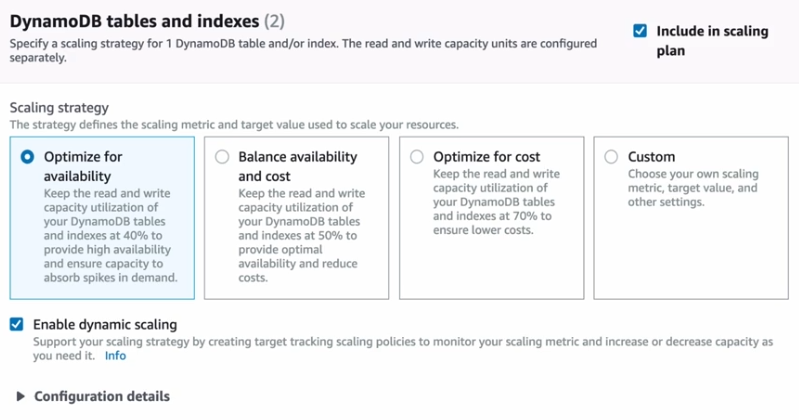
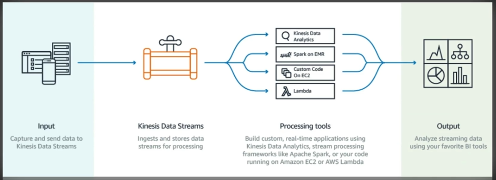

## Architecting to Scale

### Design Solutions for Organisational Complexity

- AWS right sizing tools - AWS Compute Optimizer and AWS S3 Storage Lens

### Design for new solutions

- Auto scaling policies
- Service quotas and limits
- Performance monitoring

### Continuous Improvement for Existing Solutions

- Monitoring and logging
- Instance fleets

### Accelerate Workload Migration and Modernisation

- Containers
- Serverless
- Integration services - SQS, SNS, Step functions

## Architecting to Scale overview

Loosely coupled architecture - Components can work independently and require little to no knowledge of the inner workings of other components.

## Autoscaling

### EC2 Autoscaling Cooldown

- Configurable duration that gives your scaling a chance to come up to speed
- Default is 300 seconds
- Automatically applies to dynamic scaling, it's optional to manual scaling but not supported for scheduled
- Can override cooldown

### AWS Autoscaling

- Target tracking scaling – Scale a resource based on a target value for a specific CloudWatch metric.
- Step scaling – Scale a resource based on a set of scaling adjustments that vary based on the size of the alarm breach.
- Scheduled scaling – Scale a resource one time only or on a recurring schedule.

Example for DynamoDB scaling:

Predictive scaling uses machine learning to learn your load and calculate expected capacity

## Compute Optimizer

- Machine learning tool to give recommendations on compute resources
- Increase efficiency by reconfiguring over-provisioned resources
- Improve performance for under-provisioned resources
- Can be activated in one account or in an organisation

Compatible resources:

- EC2 - instance types and optimising ASGs
- EBS - Recommendations on volume types and sizes
- ECS on Fargate - Optimise task size and container size
- Lambda - Optimise the CPU and Memory allocation

## Kinesis

Collection of services for processing streams of various data

Data is processed in `shards` which are able to ingest 1000 records per second each

A default limit of 500 shards is set but you can request an increase to unlimited

Data records ingested consist of:

- Partition key
- Sequence number
- Data blob (up to 1MB)

Not persistent storage, default retention is 25 hours, can be configured to 365 days but should be used for transient storage moving data to another service to be ingested

### Kinesis Data streams

Ingest high volume of data and process it in a number of ways

### Kinesis Firehouse

Prepares and loads the data to a destination of choice

### Kinesis Data analytics

Can run analytics on the data as it's coming in, can run standard SQL queries against the data streams

### Kinesis Shards

Like lanes in a motorway, the more lanes, the more traffic that can go through

Then you can either use applications to process the data in the streams or firehose to send that data to another service

### Kinesis Example

- Pull in tweets from Twitter API
- Send them to a Kinesis stream
- Kinesis firehose sends the data to an S3 bucket
- Lambda parses the data and stores it in DynamoDB

## DynamoDB Auto scaling

Two ways to scale DynamoDB

- Throughput - based on RCU and WCUs
- Size - based on the storage size of data (max item is 400kb)

- Partition - a physical space where DynamoDB data is stored
- Partition key - a Unique identifier for each record, sometimes known as a Hash key
- Sort key - In combination with the partition key, optional second part of a composite key that defines storage order

Formula to decide on how many partitions are in a table:

| Method | Calculation | Note |
| ------ | ----------- | ---- |
| By Capacity | (Total RCU / 3000) + (Total WCU / 1000) | How many read units and write units are provisioned |
| By Size | Total Size / 10GB | Number of 10GB chunks the data takes up |
| Total Partitions | Round Up for the MAX (By Capacity, By Size) | The max of either of the above |

Example:

- 2000 RCUs
- 2000 WCUs
- 10GB Data

| Method | Calculation | Value |
| ------ | ----------- | ----- |
| By Capacity | (2000 / 3000) + (2000 / 1000) | 2.66 |
| By Size | Total Size / 10GB | 1 |
| Total Partitions | Round Up for the MAX (By Capacity, By Size) | 2.66 - So 3 partitions |

If you use say the Date as the partition key, and there's a lot of read/writes for that particular day then you end up with a `Hot partition` in that all traffic is only hitting the one partition:

A good idea would be to  use the sensor_id as the partition key which distributes the data across multiple partitions, and then use the date as the sort key.

Can use autoscaling and scale on capacity.

- Cannot scale down if the consumption drops to zero
- Can send minimal traffic which causes autoscaling to realise the traffic is back to a low amount
- Can also manually reduce the max capacity to be the same as the minimum

## DynamoDB On-Demand scaling

Useful if you can't deal with scaling lag or have no idea of the anticipated capacity requirements

It instantly allocates capacity as needed with no concept of provisioned capacity

This ends up costing more than traditional provisioning or autoscaling

## DynamoDB Accelerator - DAX

This is an in memory cache that provides micro-second responses.

Use cases:

- Requires fastest possible reads such as live auctions or financial trading
- Read-intense scenarios where you want to offload reads from the DynamoDB
- Repeated reads against a large set of DynamoDB data

Generally wouldn't use DAX on a write heavy scenario, just read.

## Cloudfront

Can deliver content to your users by caching static and dynamic content at AWS edge locations

Dynamic content delivery is achieved using HTTP cookies forwarded from your origin

Supports Adobe Flash Media Server RMTP protocol but you have do specifically choose RMTP delivery method.

Web distributions also support media and live streaming but use HTTP/HTTPS

Origins can be:

- S3
- EC2
- ELB

Invalidate a cloudfront cache:

- Simply delete the file from the origin and wait for the TTL to expire
- Use the console to request an invalidation on all content or you can specify for example /images/*
- Use Cloudfront API to submit an invalidation
- Use third-party tool such as CFN Planet cloudfront purge tool

Cloudfront supports geo-restrictions to blacklist regions

## Event driven architecture

A way to trigger asynchronous events across your AWS environments based on events

An event is any change in state or an update signal sent by an event producer

Event routers filter and push the events and their payloads to the relevant service

Serverless:

- No patches or OS management
- Flexible scaling based on the load
- High availability
- Scales to zero when not in use

Some services do not scale to zero:

- Aurora serverless
- Neptune serverless
- EMR serverless
- Opensearch serverless

These are generally best for a 'serverless' environment but there are minimum payments for use

## SNS

A good use of SNS is to split out a workflow into different services/jobs from one trigger, for example:

## SQS

- Scalable hosted message queueing service
- Integrates with KMS for encrypted messages
- Transient storage, not persistent - default is 4 days, max is 14 days
- Max message size of 256KB but using Java SQS SDK you can have messages as large as 2GB
    - Essentially this stores the message on S3 and the mssage points to this file

### Amazon MQ

- Functions the same as SQS but is an implementation of Apache ActiveMQ
- HG within a region
- ActiveMQ API
- Designed as a drop-in replacement for on-premis message brokers
- SQS is better for new environments

## AWS Serverless Application Model (SAM)

- Open source framework for building serverless apps on AWS
- Uses YAML as the configuration language
- Includes a CLI-like functionality to create and update serverless apps
- Enables local testing and debugging of apps `sam local start-api`
- Extension of Cloudformation

AWS have a Serverless application repository, can download a pre-built application

Not to be confused with Serverless framework, this is multi-cloud, not just AWS.

## Scaling Containers

### App runner

- Designed exclusively for Synchronous HTTP applications
- Supplies compute and networking for container images, Python, Java or Node.js projects
- Supports public and private endpoints

### Batch

- Run thousands of containerised batch jobs
- Plans, schedules and executes your compute workloads
- Dynamically provisions CPU and memory optimised compute resources based on needs
- Runs the jobs as ECS, EKS or Fargate
- Can use spot instances

## Step functions

- Managed workflow
- Define your app as a state machine
    - Within the state machine you can create tasks, steps, timers
- ASL declarative JSON
- Visual interface to see the workflow
- Apps can update the stream via Step Function API

## Elastic Map Reduce (EMR)

- Managed Hadoop framework for processing huge amounts of data

## Amazon Quicksight

- Serverless pay-per use service
- Low cost compare to other BI solutions
- SPICE and Autograph technologies

Supported data sources:

- Athena
- Aurora
- Redshift
- S3
- RDS
- Opensearch

## Opensearch

- Open-source search and analytics suite forked from elasticsearch
- AWS provide Opensearch clusters
- Create dashboards or use built-in Kibana
- Visualise, search and analyse data in real time
- More advanced querying and lower cost at scale compared to cloudwatch

## Quiz

Your DynamoDB table has approximately 25 GB of data and 1000 RCUs. How many partitions can we expect for this table assuming the use of provisioned mode?

- Unable to determine

!!! note
    We can't determine without the WCUs.

When developing a Amazon Kinesis Data Stream application, what is the recommended method to read data from a shard?

- Amazon Kinesis Client Library (KCL)

!!! note
    AWS recommends using Amazon Kinesis Client Library (KCL) if applicable because it performs heavy-lifting tasks associated with distributed stream processing, making it more productive to develop applications. 
    You can only use Amazon Kinesis API to build your Amazon Kinesis Application

You are designing a DynamoDB datastore to record electric meter readings from millions of homes once a week. We share on our website weekly live electric consumption charts based of this data so the week must be part of the primary key. How might we design our datastore for optimal efficiency?

- Use a table per week to store the data.

!!! note
    General design principles in Amazon DynamoDB recommend that you keep the number of tables you use to a minimum. For most applications, a single table is all you need. However, for time series data, you can often best handle it by using one table per application per period. 
    If we put all the time series data in one big table, the last partition is the one that gets all the read and write activity, limiting the throughput. If we create a new table for each period, we can maximize the RCU and WCU efficiency against a smaller number of partitions.

In CloudFront, Behaviors permit which of the following scenarios?

- Delivery of different origins based on URL path

!!! note
    Behaviors allow us to define different origins depending on the URL path. This is useful when we want to serve up static content from S3 and dynamic content from an EC2 fleet for example for the same website.
