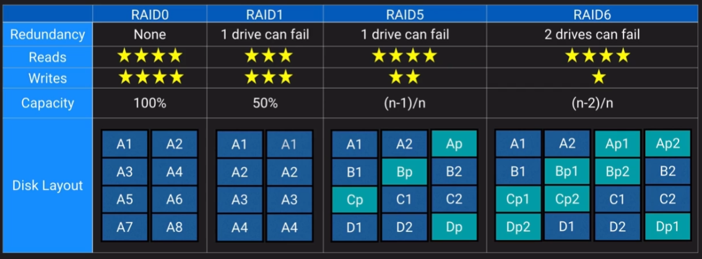

## Business Continuity

### Design Solutions for Organisational Complexity

- RTO and RPO
- Disaster recover strategy
- Pilot light, warm stand-by, multi-site

### Design for new solutions

- DR solutions on AWS

### Continuous Improvement for Existing Solutions

- Creating a DR plan
- Backup practices
- HA and resiliency

### Accelerate Workload Migration and Modernisation

- Networking in migration scenarios

## Business Continuity Overview

- Backup and Restore - Back up the infrastructure and host it somewhere else such as Rackspace
- Pilot light - Have a minimal infrastructure hosted elsewhere, somewhere like Rackspace but need manual setup during a DR situation
- Warm standby - Have a minimal infrastructure hosted elsewhere, somewhere like Rackspace but most of the infra is setup and needs minimal configuration during a DR situation
- Multi-site - Have a second environment hosted elsewhere all configured ready for a failover during a DR situation using something like a DNS update

## EBS

- SLA target of 99.999%
- Replicates within the AZ
- However this means it's vulnerable to an AZ failure
- Can set up RAID on an EC2 instance with EBS

RAID5 and RAID6 is not advised for EBS on EC2 as traffic goes over the network and the parity writes can cause a lot of i/o

## S3

- Standard class - 99.99% availability
- Standard infrequent access - 99.9% availability
- One-zone infrequent access - 99.5% availability

Standard and Standard IA have multi-az durability

## EFS

- Mountpoints can be in different AZs for redundancy

## EC2

Reserved Instances is the only way to guarantee that resources will be available when needed.

## Database HA options

### DynamoDB HA

- Distributes data across partitions by default
- Partitions are replicated synchronously across three AZs within a region
- Global Tables allow for multi-region availability and fault tolerance

### RDS

- Multi-AZ should not be confused with read replica
- Multi-AZ is a replica of the database in another AZ but it cannot be read from
- Read replica - can have a replica in another region for regional disaster recovery (warm standby)
- Can use backup/restore with snapshots if the RPO is leniant and the RTO isn't immediate

### Aurora

- Has a main instance and can have multiple read replicas in separate AZs
- You can send read traffic to the read replicas
- During an AZ outage the read replica is promoted to the main instance
- Can have global databases which has one primary region and up to 5 secondary regions

### Redshift

- Datawarehouse availability
- Only RA3 instances support multi-az
- Best other option for HA is multi-node cluster

## Network HA

- Use subnets in separate AZs within your VPC
- Direct connect is not highly available by default
- Use multiple tunnels in a VPN for redundancy
- Elastic IPs can allow changing out assets without impacting name resolution
- R53 health checks can provide DNS redirects during a failover
- NatGWs should be created in multiple AZs

## Quiz

Which of the following is false about Redshift in the context of fault tolerance?

- Redshift multi-node clusters are Multi-AZ by default.

!!! note
    Redshift (general availability) supports single-AZ deployments. A workaround would be to set up your data warehouse clusters in multiple AZ's by loading your data from the same S3 input files. Released as a preview feature in November 2022, Redshift can support Multi-AZ deployments for RA3 clusters, but it is not a default setting.

Your client is seeking recommendations to help reduce the risk of underlying hardware failure on AWS. Which might you recommend?

- Make use of horizontal scaling over vertical scaling where possible
- Make use spread placement groups

!!! note
    Purchasing reserved instances provides cost savings but does not directly address the risk of hardware failure.

You need an in-memory cache, but you want it to be able to survive an AZ failure. Which option is best?

- Elasticache for Redis

!!! note
    Elasticache for Redis supports multi-AZ configurations while Memcached does not.

Your client has defined an RPO and RTO of 24 hours for their 2 GB database. What general approach would you recommend to fulfill these requirements most cost-effectively?

- Backup and Restore

!!! note
    Pilot Light is a more complex and costly solution than necessary for a 24-hour RPO and RTO. It maintains a minimal version of the environment running with data replication, which can be scaled up when needed, but is still more costly than a simple backup and restore strategy. 
    With the relatively small data size and generous RTO/RPO, a simple backup and restore process would work well. It is the most cost-effective approach for meeting the client's requirements and can be easily implemented.
