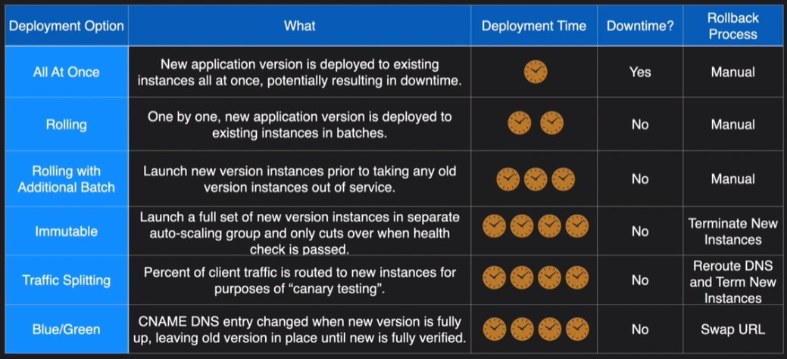
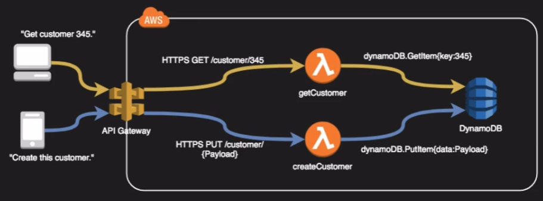
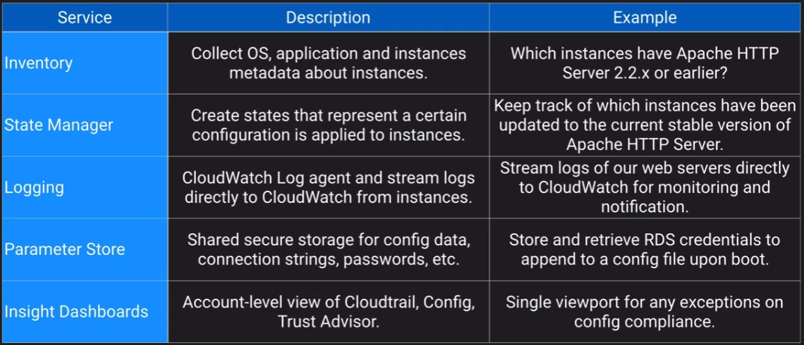
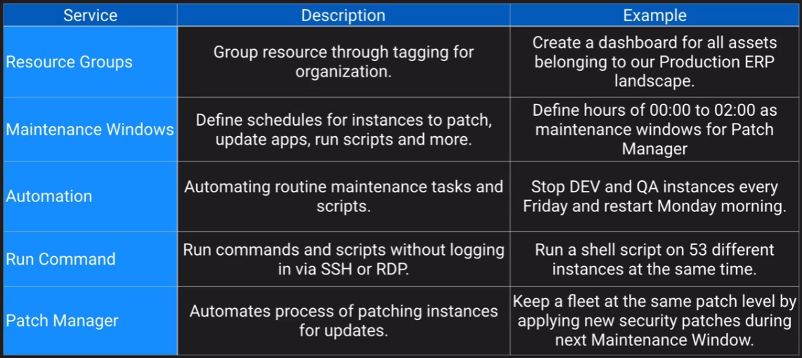

## Deployment and Operations Management

### Design for new solutions

- IAC
- CI/CD
- Config management (systems manager)

### Continuous Improvement for Existing Solutions

- Improve CI/CD pipeline

### Accelerate Workload Migration and Modernisation

- Portfolio assessment

## Deployment Overview

### Rolling deployment

- Create a new launch template version with a new AMI
- Terminate EC2 instances and have them update to the new AMI

### A/B Testing

- Use Route53 to send 10% of the traffic to the new version of code

### Canary release

- Deploy version 2 of code on one EC2 instance
- If this has no issues then deploy to the rest of the instances

### Blue Green

- Have two environments running
- Switch over using Route 53 to the Green version
- If there's issues then switch back to the Blue version

#### Blue Green issues

- Hard to use blue/green on the web layer if the code updates are coupled with a Data layer update
- Some upgrades require upgrade routines, licensing etc

## Elastic Beanstalk

- Orchestration service to make push button deployments
- Wide range of supported platforms from Docker, PHP, Java to Node.js
- Supports multiple environments within the app ie Dev, QA, Prod
- Great for ease of deployment but not great if you require maximum control



## Cloudformation

### Stack policies

Protect specific resources from your stack from being unintentionally deleted or updated

Example:

```json
{
  "Statement" : [
    {
      "Effect" : "Allow",
      "Action" : "Update:*",
      "Principal": "*",
      "Resource" : "*"
    },
    {
      "Effect" : "Deny",
      "Action" : "Update:*",
      "Principal": "*",
      "Resource" : "LogicalResourceId/ProductionDatabase"
    }
  ]
}
```

### Stacksets

Deploy and update resources across your organisation

## Service Catalog

Create products and share those products with other accounts in the organisation to allow users to deploy resources.

Portfolios can contain many products

## API Gateway

- Managed high available service to front-end REST APIs
- Backed with custom code via Lambda, as a proxy for another AWS service or any HTTP API
- Can be:
    - Regionally based
    - Private
    - Edge Optimised



## Management tools

### AWS Config

- Allows you to assess, audit and evaluate configurations of your AWS resources
- Very useful for config management as part of an ITIL program
- Creates a baseline of various config settings and files and then tracks variations against that baseline
- Config rules can check resources for compliancy

Example of config rules:

- Is backup enabled on RDS?
- Do EC2 instances have required tags?
- Are EBS volumes encrypted?

### Opsworks

- Managed instance of Chef and Puppet
- Provide config management to deploy code, automate tasks, configure instances, perform upgrades
- Three offerings:
    - Opsworks for Chef automate
    - Opsworks for Puppet enterprise
    - Opsworks stacks
- Opsworks for Chef automate - fully managed implementation of Chef
- Opsworks for Puppet enterprise - fully managed implementation of Puppet
- Opsworks Stacks - AWS creation and uses an embedded Chef solo client installed on EC2 instances to run Chef recipes. Also supports on-prem

## Systems Manager

- Centralised console and toolset for a wide variety of system management tasks
- Requires SSM agent
- Designed for managing large fleet of systems, tens or hundreds





## Business Applications and End-user computing

- Amazon appstream - Similar to workspaces but only apps eg Word, Excel
- AWS Client VPN - 
- Amazon Chime - Meeting and video conferencing (like skype and zoom)
- Alexa for business - deploy alexa functionality and skills internally like echo in conference room
- Amazon worklink - Secure access to internal web/applications - basically a secure proxy
- Amazon workspaces - Desktop as a service
- AWS connect - Contact center - telephony
- Amazon workdocs - online document storage (like google docs)
- Amazon workmail - managed email and calendar as a service, compatible with exchange

## Machine Learning

- Amazon comprehend - Natural languace processing - finds insight and relationships within text
- Amazon polly - text to speech- Amazon 
- Amazon translate - translate text to different languages
- Amazon forecast - combines time-series data to deliver accurate forecasts
- Amazon lex - conversational interface - chatbox
- Amazon personalise - recommendation enginer based on demographic behavioural data
- Amazon rekognition - image and video analysis
- Amazon textract - extract text from scanned documents
- Amazon transcribe - speech to text

Amazon SageMaker is a fully managed machine learning service. With SageMaker, data scientists and developers can quickly and easily build and train machine learning models, and then directly deploy them into a production-ready hosted environment.

## IOT

The Internet of Things (IoT) describes the network of physical objects—“things”—that are embedded with sensors, software, and other technologies for the purpose of connecting and exchanging data with other devices and systems over the internet.

Device connection:

- AWS IOT Core - route IOT messages by the trillions
- AWS IOT 1-click - simple integration for compatible devices
- AWS IOT Events - trigger alerts when events occur
- AWS IOT Greengrass - Build IOT device software
- AWS IOT Things graph - develop workflows and models for integrated devices

Device Management:

- AWS IOT Device management - Device registry, organising devices, firmware updates
- AWS IOT Device defender - security service for IOT configurations

Analytics and visiblity:

- AWS IOT Analytics - Develop reports from IOT devices
- AWS IOT Sitewise - Monitor IOT devices on the edge

## Quiz

Creating a new AMI, assigning it to a new Launch Configuration, and then updating an existing Auto Scaling Group is an example of which upgrade method?

- Disposable upgrade

!!! note
    A disposable upgrade is one where a new release is deployed on new instances while instances containing the old version are terminated.<br>
    A multi-stage upgrade involves deploying the new version in stages, gradually replacing the older version. While the given scenario does involve replacing instances, it does not explicitly mention a staged approach.

You are helping a customer build a CloudFormation template. During the stack creation, you need to get a software license key from a third party via API call. What resource would you use?

- AWS::CloudFormation::CustomResource

!!! note
    There are a few ways to call an API but among these choices, AWS:CloudFormation::CustomResource is the only one that can be used to call out to fetch a value from a third-party API.

How can you allow users to provision a standard API Gateway and Lambda microservice in their AWS Account in your organization without giving them permissions to the underlying services?

- Use AWS Service Catalog to create a product with a CloudFormation template that deploys the standard API Gateway and Lambda microservice, and grant users access to this product.

You are responsible for managing AWS cloud solutions in multiple regions. You want to use OpsWorks Stacks to help in that management. Which of the following are false?

- OpsWorks allows you to clone stacks within the same region and to other regions.

!!! note
    While OpsWorks does allow you to clone stacks within the same region, it does not support cloning stacks to other regions directly. You would need to manually recreate the stack in the desired region.

You have been collecting IoT messages from hundreds of vibration and temperature monitoring IoT devices in your warehouse. These devices are connected to AWS IoT Core. You want to build reports based on the time-series data collected from these devices. Which solution should you implement to achieve this goal?

- Send the data from IoT Core to AWS IoT Analytics, process the data, and use Amazon QuickSight to build reports based on the time-series data.

!!! note
    Sending data from AWS IoT Core to AWS IoT Analytics allows you to process and analyze the IoT data. You can then use Amazon QuickSight to visualize and create reports based on the processed time-series data.

