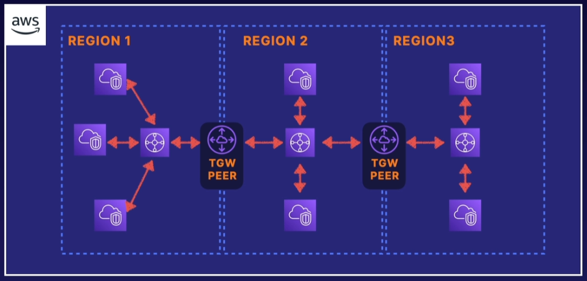
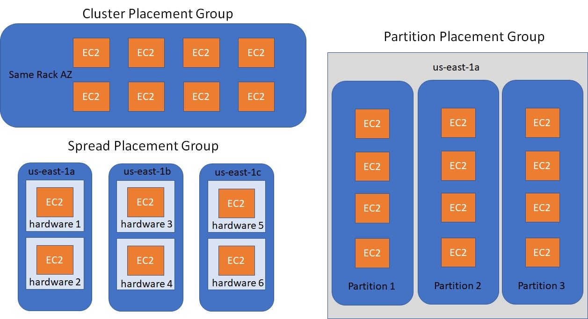

## Networking

### Design Solutions for Organisational Complexity

- AWS VPC, VPN, TGW
- Hybrid DNS, Route53 resolver
- Network segmentation
- Network traffic monitoring
- Route tables, SG, NACLs

### Design for new solutions

- Rotue53
- AWS service endpoints
- Multi-AZ and multi-region

### Continuous Improvement for Existing Solutions

- HA and resilient network
- AWS Global network offerings if global accelerator, cloudfront and edge computing

### Accelerate Workload Migration and Modernisation

- Hybrid network, direct connect, S2S VPN

## Networking Concepts

AWS Reserved IP addresses, eg VPC subnet CIDR is 10.0.0.0/24

- 10.0.0.0 - Network Address
- 10.0.0.1 - Reserved for the VPC router
- 10.0.0.2 - Reserved for AWS DNS
- 10.0.0.3 - Reserved for future use
- 10.0.0.255 - VPCs don't support broadcast so AWS reserves this address

## VPC to VPC networking

- VPC Peering Direct traffic between VPCs using the AWS network
- AWS Transit Gateway - can be used to direct traffic across many VPCs
- Software VPN
- AWS Managed VPN

VPC Peering has no Transitive Peering.

ie  `VPC A <---> VPC B <---> VPC C`

VPC A cannot talk to VPC C.

Transit Gateway needs an TGW Attachment in a subnet in each AZ.

TGW peering within the same region can use TGW attachments across accounts, as long as they are within region.

TGW Peering is needed when communicating across Regions.

## Internet Gateway

No availability risk as it's completely redundant. There are also no bandwidth constraints.

Provides route table target for Internet bound traffic

Also performs NAT on instances with public IP addresses.

Does **not** perform NAT for instances with private IPs only.

Egress-only internet gateway prevents inbound connectivity to IPv6 instances.

## Border Gateway Protocol

- Required for Direct connect and optional for VPN
- Alternative of not using BGP with AWS VPC is static routes
- AWS supports BGP community tagging as a way to control traffic scope and route preference
- Requires TCP port 179

## Placement groups

|   | **Clustered** | **Spread** | **Partition** |
| - | ------------- | ---------- | ------------- |
| **What** | Instances placed into a low-latency group within an AZ | Instances spread across underlying Hardware across different AZs | Instances grouped into partitions and spread across racks |
| **When** | Low Latency / High network throughput | Hardware redundancy | Hardware redundancy |
| **Pros** | Enhanced networking | Can span AZs | Better than spread for large replicated workloads |
| **Cons** | Finite capacity | Max 7 instances per group per AZ | Doesn't support dedicated hosts |

The default placement is to attempt to spread the instances.

## Direct Connect

- Connects your Datacenter to AWS global network
- Reduces dependency on public ISP demand
- Works with ISPs to establish the Direct connect connection
- Great for frequent large transfers of data

### High Availability

You can use a backup S2S VPN in case the Direct Connect connection goes down.

You can also set up two Direct Connect connections using two different ISPs for redundancy.

Lastly you can use Direct Connect SITELINK to establish connectivity between two Datacenters via AWS. This is useful should the internet go down, you can still access the DCs from eachother using the AWS network.

## PrivateLink

- Securely connect to VPC endpoints
- Highly available and scalable
- Traffic does not traverse the public internet
- Control API endpoints, sites and services reachable from your VPC
- Can only connect within region

## Global Accelerator

- Allows public app users to shortcut past public infrastructure using AWS network at edge locations
- Provides global static public IPs to access your application endpoints
- Can use used for failover in multi-region atchitecture
- Your static entry points are protected by AWS shield

## Route 53

| **Failover Policy** | **Route53** |
| ---------- | ----------- |
| Simple | Simple failover |
| Failover | Fails over to the backup if the Primary fails a health-check |
| Geolocation | Routes based on the region |
| Geoproximity | Routes based on the region taking into consideration region ie 'us-east-1' over 'us-west-2' |
| Latency | Directs to resources based on the lwest latency |
| Multi-value answer | Similar to a load balancer, R53 responds with multiple addresses |
| Weighted | You can setup mulitple resources and routes based on percentage of weight assigned |

## Cloudfront

Is a content delivery service for simple static catching

## Quiz

You have an app currently hosted in three Regions around the globe and you have defined Route 53 geolocation routing to route people to the nearest Region. Some customers complain that they are not able to access the service. What could be the cause?

- You need to ensure that you have a default route in addition to other geolocation routes.

!!! note
    For geolocation routing, you need to be sure you have a default record in the case that the location cannot be determined. This will help ensure all users can access the service, even if their location cannot be identified.

Which of the following DNS record types does Route 53 not support?

- TLSA

!!! note
    TLSA records are used to specify the keys used in a domain's TLS servers. This record type is not supported by Amazon Route 53 at the moment.

You have a domain name registered with Route53 in Account A. You would like to register a subdomain, or a child domain, in Account B. You have already created the Hosted Zone for the subdomain in Account B. What is the next step to allow for proper query forwarding from the parent DNS account to the new subdomain?

- Copy the NS record from the newly created hosted zone in Account B. Create a new NS record in the Hosted Zone for the parent domain in Account A and paste the NS records for the subdomain.

!!! note
    Creating and linking the NS records between the parent domain and subdomain allows for proper query forwarding between the two.

Which AWS networking component is used for IPv6 traffic only?

- Egress-only internet gateway

!!! note
    An egress-only internet gateway is for use with IPv6 traffic only.

What might I consider to decrease the likelihood that multiple EC2 instances are impacted by some sort of underlying hardware failure in AWS?

- Spread placement groups

!!! note
    Spread Placement Groups ensure that your instances are placed on physically separate hosts, reducing the risk of multiple instances being impacted by a single hardware failure.

You are building an application hosted on AWS for a customer. The customer has a very old firewall that can whitelist external destinations via IP address only. Which solution could you use to allow your AWS application to leverage static IP addresses that can be whitelisted by the customer firewall?

- Application loadbalancer with Global accelerator
- Network loadbalancer with EIP

!!! note
    You can use AWS Global Accelerator to get static IP addresses that act as a fixed entry point to your application endpoints. 
    Network Load Balancers support static IP addresses. You can also assign one Elastic IP address per subnet enabled for the load balancer. Reference: What is a Network Load Balancer?.

Which of these statements on Direct Connect are FALSE?

- AWS Direct Connect can be connected to an internet gateway to route traffic to the internet.
- Direct Connect connections are highly available.

!!! note
    Direct Connect connections consist of a single connection between your network and AWS with no inherent redundancy. Additionally, traffic coming from on-premises via a Direct Connect connect is restricted from internet access.

You want to allow your VPC instances to resolve using on-premises DNS. Can you do this and how/why?

- Yes, by configuring a DHCP Option Set to issue your on-premises DNS IP to VPC clients.

!!! note
    You can use DHCP Option Sets to configure which DNS server addresses are configured for EC2 instances in a VPC. This can be any IP address. As long as its can be reached from the VPC, instances can use it to resolve DNS queries.
