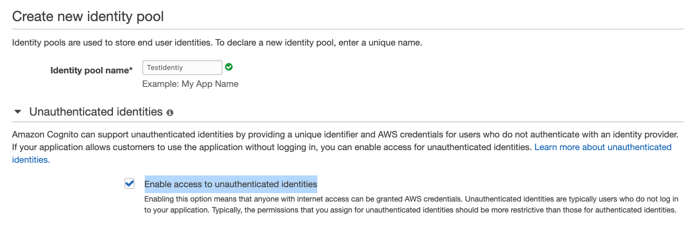

## Final Test

A start-up firm is developing a new three-tier application which collects sensor data from thousands of IoT devices. These small-sized data should be written to the database in a fast efficient way. Data should be stored for a long term for performing analytical queries quickly. Application and web layer solution is already designed. The firm is looking for a database that can provide optimum reads and writes to handle high workloads.

What solution can be designed for this requirement?

- For fast analytic queries, use Provisioned IOPS SSD while for high throughput data writes use General Purpose SSD with Amazon RDS
- `For fast analytic queries, use magnetic store while for high throughput data writes use memory store with Amazon Timestream`

!!! note
    The question is regarding IOT hence Timestream should be the database.<br>
    Amazon Timestream has two tiers of storage: a memory store and a magnetic store. Data in both the storage tiers are replicated across multiple Availability zones in a region. Based on retention policies, data can be moved from the memory store to the magnetic store.<br>
    Memory storage is suitable for high throughput writes and fast point-in-time queries.<br>
    Magnetic storage is suitable for low throughput writes and fast analytical queries along with long-term data storage.

___

A manufacturing company has deployed AWS Managed Microsoft AD for managing a large user base in the AWS cloud. The Security team is looking to capture AD controller events logs, such as failed login attempts or changes made to user groups. The captured logs should be analyzed in real-time, and a dashboard should be created depicting trends and insights of each event.

How can a solution be designed for this requirement most efficiently?

- Stream event logs from AD controllers to Amazon Kinesis Data Analytics using Amazon CloudWatch Logs and Amazon Kinesis Firehose. Analyze the events in Amazon Kinesis Data Analytics and store the results in Amazon Redshift using Amazon Kinesis Firehose. Use Amazon QuickSight to create a dashboard for trends based on the data stored in Amazon Redshift.
- `Stream event logs from AD controllers to Amazon OpenSearch Service using Amazon CloudWatch Logs and AWS Lambda. Analyze events in Amazon OpenSearch Service and create a visualization in the Amazon OpenSearch dashboard.`

!!! note
    Amazon OpenSearch Service is a managed service for search and analytical engine use cases supporting OpenSearch and legacy AWS Elasticsearch. It can also be used to create visualizations based on the analyzed data and create a dashboard with data. For the above case, event logs of the Amazon Managed Microsoft AD can be captured using Amazon CloudWatch logs. AWS Lambda can be used to push these logs in real time to Amazon OpenSearch. In Amazon OpenSearch, logs will be analyzed, and a dashboard will be created based on log data.

___

A new web application is designed by a developer team using Amazon API Gateway and AWS Lambda. REST APIs will be used for this purpose which will synchronously invoke the AWS Lambda function. The developer team is expecting a huge response to this application and looking for a secure solution for authenticating a large number of clients.

Which solution can be designed for this requirement in the most effective way?

- Create a request parameter-based Lambda authorizer. Configure API Gateway to call Lambda authorizer to authenticate clients making a request using REST API.
- `Create users in Amazon Cognito user pools. Create an API Gateway authorizer with this user pool and enable the authorizer on the REST API.`

!!! note
    request parameter-based Lambda authorizers are supported only for WebSocket API and not REST APIs

___

A financial company is embarking on a journey to migrate its on-premises applications, database, and servers to AWS. They are looking for a single place to discover their existing servers, plan migrations, and track the status of each application migration.

You are hired as a migration expert. The company expects you to come up with recommendations to analyze their applications and help them determine the optimal strategy and tools to migrate and modernize at scale.

Which AWS service will help you serve the company’s needs?

- Install AWS Application Discovery Agent on the on-premises servers and capture details of the application and their configurations, performance, etc. Use these data to plan your migration
- `Use AWS Migration Hub to discover or import your on-premises server details, build a migration plan, strategy, follow recommendations, and track migration on the simple and intuitive dashboard`

!!! note
    They are looking for a single place to discover their existing servers, plan migrations, and track the status of each application migration.<br>
    AWS Application Discovery Agent will be used in the application discovery step

___

A large enterprise company has created a data lake that is managed by a single account. Databases in the data lake need to be accessed by other accounts within the company. Amazon Redshift Spectrum will be used by other accounts on this shared database. The account managing the data lakes should provide access permissions to only selected tables of the database to users in other accounts. After the permissions are granted, other accounts should be able to run Amazon Redshift Spectrum queries on the shared tables in the databases.

How permission can be granted for this requirement?

- `Share selected tables in the databases using Lake Formation tag-based access control (LF-TBAC). Create a resource link for tables to enable Amazon Redshift Spectrum to run queries on the shared tables`

!!! note
    data location permissions are required by the AWS Glue Crawlers to access data in data lakes from other accounts. For integrated services like Amazon Athena and Amazon Redshift Spectrum, a resource link is required.

___

A company has a Redshift cluster for petabyte-scale data warehousing. The data within the cluster is easily reproducible from additional data stored on Amazon S3. The company wants to reduce the overall cost of running this Redshift cluster. Which scenario would meet best for the needs of the running cluster? Choose the correct answer from the options below.

- `Enable automated snapshots but set the retention period to a lower number to reduce storage costs`
- Disable manual snapshots on the cluster

!!! note
    we cannot get disabled manual snapshots

___

An engineering firm is planning to deploy IoT sensors across its multiple factories. The deployment will be performed using ready-to-use simple devices. Users in the project deployment group need to access these IoT devices using mobile devices as well from the AWS console. Once deployment is complete, the Operations team needs to proactively determine the state of these IoT devices to perform maintenance activities.

What solution can be designed to meet these requirements?

- `Use AWS IoT 1-Click to access devices remotely using mobile devices. Use AWS IoT Events to ingest data from IoT devices to detect the state of the devices and alert the Operations team`
- Use AWS IoT Device Management to access devices remotely using mobile devices. Use AWS IoT Events to ingest data from these devices to detect the state of the devices and alert the Operations team

!!! note
    AWS IoT 1-click helps to launch AWS Lambda functions from the ready-to-use simple IoT devices. It can also be used to manage these devices from mobile apps or from the console.<br>
    Usually IoT Device Management would be the best case here but they need to be managed by mobile devices.

___

An IoT company has a new product which is a camera device. The device has installed several sensors and can record video as required. The device has AWS Kinesis Video Streams SDK in the software and can transmit recorded video in real-time to AWS Kinesis. Then the end-users can use a desktop or web client to view, download, or share the video stream. The client app should be simple and use a third-party player such as Google Shaka Player to display the video stream from Kinesis. How should the client app be designed?

- `The client can use HLS for live playback. Use GetHLSStreamingSessionURL API to retrieve the HLS streaming session URL, then provide the URL to the video player`

!!! note
    The most straightforward way to view or live playback the video in Kinesis Video Streams is by using HLS. HTTP Live Streaming (HLS) is an industry-standard HTTP-based media streaming communications protocol.<br>
    using GetDASHStreamingSessionURL API with Kinesis Video Streams, videos can be played in URL in the media player but not in the mobile phone browser.

___

Your company runs on-premises virtual machines in the VMware vCenter and plans to migrate them to AWS via the AWS Application Migration Service. To prepare for the migration, you want to use the Application Discovery Service Agentless Collector to collect information about the on-premises environment. Which of the following are the prerequisites of using the Agentless Collector so that the VMware VMs can be discovered? (Select TWO)

- Create an IAM role with the predefined IAM policy “AWSApplicationDiscoveryAgentAccess” and attach the role to the Agentless Collector
- `Update the on-premises firewall settings to allow outbound access to the AWS domains that Agentless Collector requires (i.e. arsenal-discovery.us-west-2.amazonaws.com).`
- `Create an IAM user with the predefined IAM policy “AWSApplicationDiscoveryAgentlessCollectorAccess” for the Agentless Collector to authenticate with AWS when forwarding the data`

!!! note
    Agentless Collector needs the IAM user credentials to authenticate with AWS to forward data to the Application Discovery Service.

___

You have created an API Gateway API to expose the "GET /user?user={name}" method to invoke a Lambda function. The method has a query string called "user". The Lambda function will respond with a message of "Hello, {name}!". You have deployed the Lambda function as follows:

```java
exports.handler = function(event, context, callback) {
    var res ={
        "statusCode": 200,
        "headers": {
            "Content-Type": "*/*"
        }
    };
    if (event.user==null) {
        callback(new Error('Missing the required greeter parameter.'));
    } else {
        res.body = "Hello, " + event.user +"!";
        callback(null, res);
    }
};
```

How would you set up the Lambda integration with the API method properly?

- Use AWS CLI “aws apigateway put-integration” to set up the Lambda proxy integration. Use a template file to configure the mapping of the user query string parameter to the event property for the Lambda function
- `Use AWS CLI “aws apigateway put-integration” to set up the Lambda custom integration. Configure the mapping of the user query string parameter to the user property of the JSON payload for the Lambda function.`

!!! note
    For Lambda integrations, you must use the HTTP method of POST for the integration request, according to the specification of the Lambda service action for function invocations.<br>
    Lambda Proxy Integration sent the request directly from the client to the lambda function without any modifications. It directly maps one URL to one lambda function.

___

A data analysis engineer had an old on-premise database for his meteorology analysis for years. This database is growing too big and becoming less responsive. He prefers to migrate it to AWS DynamoDB, and he already has the mapping rules in place. However, he has been told that the database type is unsupported by AWS Database Migration Service. He can export the data to CSV format files from the old database. How can the data analysis engineer migrate the data to AWS DynamoDB successfully?

- Firstly, upload the CSV files to S3. Create an S3 source endpoint and DynamoDB target endpoint in AWS DMS. Create a migration task by referring to the source and target endpoints. Add the mapping rule in the task using a JSON format
- `Upload the exported CSV files to S3 at first. Then create S3 source endpoint and DynamoDB target endpoint in AWS DMS console. When the S3 source endpoint is configured, add the table mapping rule with a JSON table structure. Create a Replication Task to move the data from the source endpoint to the target endpoint`

!!! note
    The mapping rule should be put in the source endpoint configuration rather than the task settings if S3 is the source for DMS.

___

A manufacturing company whose head office is in Sydney, have plants in 16 locations across the world. Employees based in these 16 locations have to send their daily development data to AWS for storage and further analysis. Data size is expected to be in GBs. What is the best way to send the data to AWS?

- `They can send through S3 Transfer acceleration and store the data in Amazon S3`

!!! note
    Transfer acceleration gives the ability to write into the single S3 Bucket from various locations. It uses edge locations to move the data.

___

A company has applied Service Control Policies (SCP) to an AWS Organization to deny any instance launch other than t2. micro instance type. This AWS Organization comprises a single OU with two accounts: Production and Development. Development accounts need to launch a c5. xlarge instance type for a month’s time to perform testing of a new application. Post testing phase, the Development account should only launch the t2. micro instance type. The production account should launch only the t2. micro instance type at all times.

Which combination of changes can be done in SCP to meet this requirement?

- Create a new OU named Development. Move the Development account to this OU. Create a new SCP allowing access to launch the c5. xlarge instance type. Make no changes to the existing SCP attached to the root
- `Create a new OU named Development. Move the Development account to this OU. Create a new SCP allowing to launch c5. xlarge instance type and attach it to the new OU. Detach existing SCP from the root and attach it to the OU which has a Production account.`

!!! note
    SCP at the root level denies the launch of the c5. xlarge instance type; attaching an SCP at OU level to allow the launch of the c5. xlarge instance type won’t grant permission.

___

Your team is developing an Android app. You need to use an Amazon Cognito Identity Pool to create unique identities for the app users and federate them with the identity provider from Google. You also want to allow unauthenticated guest access for the application. Guests can get temporary tokens for limited access. How would you implement the guest access using Amazon Cognito?

- `Enable the unauthenticated access in Cognito Identity Pool. Guest users can request an identity ID via the GetId API`

!!! note
    unauthenticated access feature can be enabled in Cognito Identity Pool



___

You are an AWS admin in an IT firm. Recently your firm ran into some complications due to different sets of security rules set for each application. The firm decides to use AWS Firewall Manager to make it easier to bring new applications and resources into compliance by enforcing a common set of security rules. The firm now counts on you to enable the AWS Firewall Manager for them. What are the mandatory prerequisites you should be aware of to use AWS Firewall Manager? (Select THREE)

- Enable AWS Resource Access Manager to centrally configure AWS Network Firewalls or associate Amazon Route 53 Resolver DNS Firewall rules across accounts and VPCs
- `Enable AWS Config for each member accounts in your organization`
- `The Firewall Manager must be associated with the management account of your AWS organization or associated with a member account that has the appropriate permissions`
- `Your accounts must be part of AWS Organizations and must have enabled all features`

!!! note
    Resource sharing isn't a pre-requisite

___

As the AWS Solutions Architect for a large healthcare organization, you have been tasked with migrating the organization's legacy on-premises data warehouse to Amazon Redshift. The organization's management team is concerned about the potential downtime and data loss during the migration process.

To address these concerns, you decide to use the AWS Schema Conversion Tool (AWS SCT) to convert the existing schema and migrate the data to Amazon Redshift with minimal downtime and data loss.

Which combination of the below options would you recommend to use the AWS Schema Conversion Tool to ensure a successful migration of the legacy data warehouse to Amazon Redshift? (Select TWO)

- Use the AWS SCT to generate a CloudFormation template that automates the creation of the Amazon Redshift cluster, and then use the template to launch the cluster and migrate the data
- `Use the AWS SCT to convert the existing schema to a format compatible with Amazon Redshift, and then use AWS DMS to migrate the data to Amazon Redshift`
- `Use the AWS SCT to convert the existing schema to a format compatible with Amazon Redshift, and then use AWS Glue to migrate the data to Amazon Redshift`

!!! note
    AWS SCT is only used to convert schema
