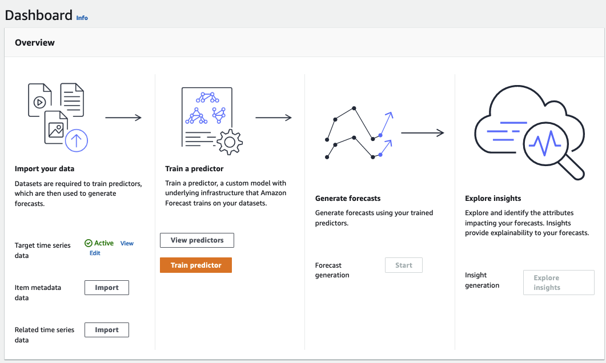

## Machine Learning

As an AWS consultant, you need to design a solution for a new web application. The application aims to analyze videos. When a new video file is uploaded by users, the application needs to detect and identify objects and events contained in the videos (i.e. trees, flowers, parties, etc.). The analysis results will be stored in a NoSQL database for further processing. The application should be serverless and only be charged when it is processing uploaded videos. Which of the following options would you select for the requirement?

- `Store the video files in S3 and trigger a Lambda function for S3 events. In the Lambda function, trigger Amazon Rekognition API “StartLabelDetection” to detect labels in the videos. Store the results of labels in a DynamoDB table`

!!! note
    You don't want to store anything in Kinesis long term, and DynamoDB is a good option for NoSQL

___

You are working in a big retail company. For the business' success, your team needs to build a new service to generate highly accurate time-series forecasts of price. The service should use statistical and machine learning algorithms to deliver price predictions. The company has already a big amount of historic time-series price data which can be used by the service to train the required machine-learning data model. You plan to use Amazon Forecast to build the service. Which of the following options would you choose to use Amazon Forecast properly?

- `Store the historical time-series data in S3 and import the data into Amazon Forecast. Create a predictor in Amazon Forecast based on the imported data. After the predictor is trained, create and export a Forecast`

!!! note
    In Amazon Forecast, the data needs to be imported from S3 and a predictor will be created. After the predictor is trained and active, a Forecast can be generated. Please check the following process:

___

You are working in a large bank as an AWS solutions architect. The company owns an online payment system. Your team needs to build a new application to automate the detection of online payment fraud by flagging suspicious payment transactions before the payments are processed and orders are fulfilled. You plan to use Amazon Fraud Detector as a fully managed Machine Learning (ML) fraud detection solution. In order for Amazon Fraud Detector to generate correct fraud predictions, the first part that you need to do is to create the relevant Amazon Fraud Detector model. Which of the following steps belongs to this part?

- `Train the Amazon Fraud Detector model by selecting the historical event dataset as model inputs and configuring the fraud label classifications`

!!! note
    Amazon Fraud Detector needs to use the model inputs to train the model first. After the model is trained and ready to deploy, it can be used to generate fraud predictions.
