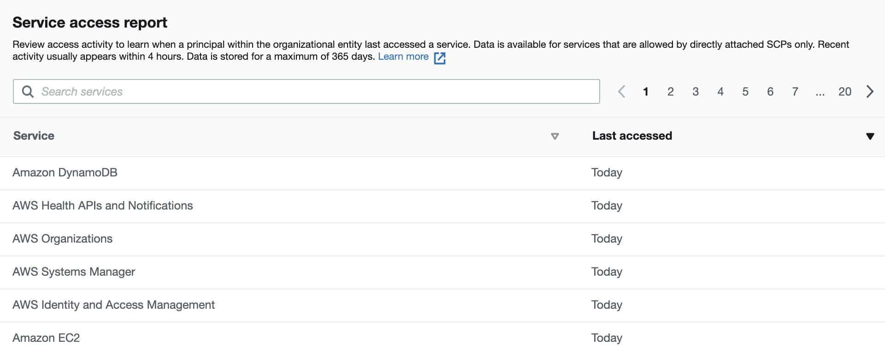
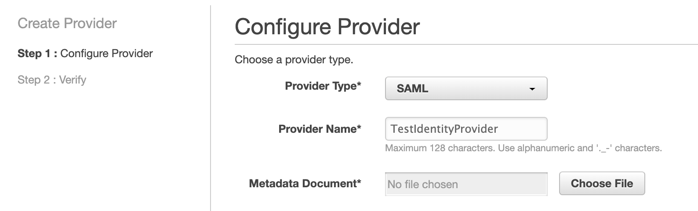
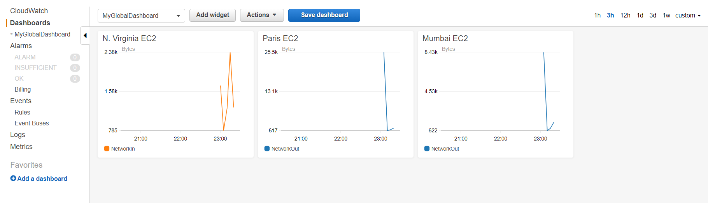

## Practice Test 1

An engineering firm has deployed a critical application on the web servers of an Amazon EC2 instance launched in a VPC. The Operations Team is looking for a detailed analysis of the traffic from these web servers. They have enabled VPC flow logs on the VPC. Logs should be analyzed using open-source tools in near-real time and should be visualized to create dashboards.

What solution can be proposed for this requirement?

- `Ingest VPC flow logs to Amazon Kinesis Data Firehose which will deliver these logs to Amazon OpenSearch Service for analyzing and visualizing logs in near-real time`

!!! note
    Amazon OpenSearch Service (OpenSearch Service) makes it easy to deploy, operate, and scale OpenSearch Service for log analytics, full text search, application monitoring, and more.

___

You are an AWS Solutions Architect in a financial company. The company recently started working on migrating legacy applications to AWS. You planned to use a new AWS Organization to manage all AWS accounts so that you can easily configure accounts, assign organizational units, configure security policies, etc. Which methods are valid for you to add accounts to the Organization? (Select TWO)

- `In the AWS Organization console, create accounts within your organization`
- `In the management account of the Organization, create invitations to other accounts and wait for them to accept the invitations`

!!! note
    Accounts cannot request to join an organisation, it has to be invited or created from the org.

___

You have signed in to an AWS Organization's management account using an admin IAM user. You need to move accounts to this Organization from one OU (Organizational Unit) to another or back to the root from an OU. However, the operation was disallowed due to a lack of permissions. So you started looking at the IAM policies attached to this user. Which permissions do you need to move accounts among OUs? (Select TWO)

- `organizations:DescribeOrganization`
- `organizations:MoveAccount`

___

In an AWS Organization, the Root is attached to a default SCP that allows all actions on all resources. And other OUs or AWS accounts are attached with SCPs that contain Deny lists. For example, an SCP that denies cloudtrail:StopLogging is attached to an OU. However, you think that the Deny lists can be improved to contain more services such as those that are not used. How would you find out the AWS services that are allowed by the SCP but are never used?

- `In the IAM console, click the Organization activity and check the last accessed data to identify services that are never used`
- In the AWS Config console, list the AWS services that are not used by IAM userswrong

!!! note
    service report in Organization Activity can be used to identify the AWS services to be included in the Deny lists.



___

You were hired as an AWS Architect in a company to help migrate legacy applications from on-premises to AWS. The team is trying to use AWS Migration Hub to visualize the migrating process. The first step is using discovery tools to get valuable server data such as performance summary and performance time series. The team has good SQL experience, so they hope that AWS Athena can be used to analyze the imported data. Given that the legacy applications are installed in Linux CentOS 7 or above physical servers, which discovery tool is the best for you to use?

- `Install AWS Discovery Agent on the servers which transmit data to AWS Application Discovery Service. Then in Migration Hub, enable the Data Exploration in Amazon Athena`
- Install AWS Discovery Agent on the physical servers and configure the agent to send data to an S3 bucket. Create related tables in AWS Athena to analyze the server data

!!! note
    Discovery Agent can transfer data securely to Application Discovery Service instead of S3.

___

Your company owns a large number of on-premises virtual machines managed in VMware vCenter. To plan the migration from local servers to AWS, you have installed AWS Discovery Connector in the VMware vCenter Server that helps collect information about the virtual machines. The Discovery Connector has already registered with the Application Discovery Service successfully. Which data can be discovered by the Discovery Connector? (Select TWO.)

- `Average number of read and write I/O operations per second`
- `Average free RAM expressed in MB`
- The running process data on the local server

!!! note
    `Agentless discovery` can be performed by deploying the Application Discovery Service Agentless Collector (Agentless Collector) (OVA file) through your VMware vCenter. Agentless Collector collects the following static configuration data: `Server hostnames, IP addresses, MAC addresses, disk resource allocations, database engine versions, and database schemas. Additionally, it collects the utilization data for each VM and database providing the average and peak utilization for metrics such as CPU, RAM, and Disk I/O.`<br>
    `Agent-based discovery` can be performed by deploying the AWS Application Discovery Agent on each of your VMs and physical servers. The agent installer is available for Windows and Linux operating systems. `It collects static configuration data, detailed time-series system-performance information, inbound and outbound network connections, and processes that are running.`

___

As an AWS Solutions Architect, you need to configure an identity service in AWS based on SAML. Since you already have a SAML identity provider outside of AWS, you plan to use the same IdP to manage user identities. To create the SAML identity provider in IAM, the below steps may be required.

1. Configure the SAML IdP with relying party trust.
2. Use AWS CLI assume-role-with-web-identity to return a set of temporary security credentials for authentication.
3. Get the SAML metadata document from the IdP.
4. Create a SAML IAM identity provider from AWS console or CLI.
5. In IdP, configure SAML Assertions for the authentication response.

Which one describes the correct sequences?

- `Get the SAML metadata document from the IdP.`
- `Create a SAML IAM identity provider from AWS console or CLI.`
- `Configure the SAML IdP with relying party trust.`
- `In IdP, configure SAML Assertions for the authentication response.`

note !!!
    Before creating the identity provider, you need to get the metadata document from IdP:



___

Your team is developing an Android app. You need to use an Amazon Cognito Identity Pool to create unique identities for the app users and federate them with the identity provider from Google. You also want to allow unauthenticated guest access for the application. Guests can get temporary tokens for limited access. How would you implement the guest access using Amazon Cognito?

- `Enable the unauthenticated access in Cognito Identity Pool. Guest users can request an identity ID via the GetId API`
- Activate the unauthenticated access feature in Cognito User Pool. Link the User Pool in Cognito Identity Pool

!!! note
    Unauthenticated identities is managed in Cognito Identity Pool instead of User Pool.

___

You implement a REST API using a Lambda Function. The API is exposed through the AWS API gateway. The Lambda Function calls a third-party service to retrieve the data. But this third-party service may not respond in time. You already increased the timeout of the Lambda Function to be 15 minutes. However, sometimes users still get an HTTP 504 error after about 30 seconds. Which of the following options is the most possible reason?

- The error code indicates that there is an Internal Server Error. Check the CloudWatch Logs of the Lambda Function
- `The maximum of integration timeout for AWS API Gateway is 29 seconds. Although the timer for Lambda Function does not expire yet, the API Gateway already hits its limitation`

!!! note
    504 error is a Gateway Timeout error<br>
    Amazon API Gateway limits. The integration timeout is 50 milliseconds - 29 seconds for all integration types. And the limit cannot be increased.

___

You create a Lambda Function to process clients’ queries from a web application. The workload is time sensitive so that you want the Lambda function to finish processing and respond as quickly as possible. You prefer allocating more resources such as memories or CPUs to the Lambda Function. However, you are unsure how many resources are being used at the moment. Which action can help you to get the current memory usage and allocate more resources if needed?

- Check the default CloudWatch metrics to get the allocated and used memories. Pre-allocate more resources to the Lambda Function if required
- `Check CloudWatch Logs to get the max memory used and allocate more memory if needed`

!!! note
    Lambda functions are allocated CPU proportional to the memory configured.<br>
    You can get the mac memory from the cloudwatch logs

___

A middle-sized company is planning to migrate its on-premises servers to AWS. At the moment, they have used various licenses, including windows operating system server, SQL Server, IBM Db2, SAP ERP, etc. After migration, the existing licenses should continue to work in EC2. The IT administrators prefer to use a centralized place to control and manage the licenses to prevent potential non-compliant license usages. For example, SQL Server Standard's license only allows 50 vCPUs, which means a rule is needed to limit the number of SQL Servers in EC2. Which option is correct for the IT administrators to use?

- `Define license rules in AWS License Manager for the required licenses. Enforce the license rules in EC2 and track usage in the AWS License Manager console`
- Define and enforce license rules in AWS License Manager for the Microsoft relevant licenses such as windows, SQL Server as only Microsoft licenses are supported. For the other licenses such as IBM Db2, track the license usage in AWS System Manager

!!! note
    AWS License Manager can manage non-microsoft licenses

___

You have developed a web application to collect monthly expense reports. To the nature of the application and looking at the usage statistics, it is mostly used around the last week of the month and the first week of the month. To increase the application performance, you added a caching layer in front of the application servers. So the reports are cached and served immediately. You started off with Elasticache Redis with a "cache.t2.small" node type. The application has been running fine. When looking at the performance activity in CloudWatch, 60% of the requests are served by the cache, and the cache cannot cope with additional content requirements. You want to improve the application with minimal changes and resources. Please select a valid option.

- `Modify the ElastiCache instance from t2 small to t2 medium, as t2 medium is more suitable for the given requirement`
- Run the web application from S3 and serve with CloudFront

!!! note
    The question wanted miniman changes and resources, hence changing the instance type is the right answer

___

An IoT company has a new product which is a camera device. The device has installed several sensors and can record video as required. The device has AWS Kinesis Video Streams SDK in the software and can transmit recorded video in real-time to AWS Kinesis. Then the end-users can use a desktop or web client to view, download, or share the video stream. The client app should be simple and use a third-party player such as Google Shaka Player to display the video stream from Kinesis. How should the client app be designed?

- `The client can use HLS for live playback. Use GetHLSStreamingSessionURL API to retrieve the HLS streaming session URL, then provide the URL to the video player`
- The client can use Adobe HTTP Dynamic Streaming (HDS) for live playback. Use GetHDSStreamingSessionURL API to retrieve the HDS streaming session URL, then provide the URL to the video player

!!! note
    GetHLSStreamingSessionURL API is required for third-party players to play the HLS streams.<br>
    HTTP Live Streaming (HLS) should be used to playback the Kinesis Video Streams.

___

You are building a large-scale confidential documentation web server on AWS, and all of the documentation for it will be stored on S3. One of the requirements is that it cannot be publicly accessible from S3 directly. You will need to use CloudFront to accomplish this. Which of the methods listed below would satisfy the requirements as outlined? Choose an answer from the options below.

- `Create an Origin Access Identity (OAI) for CloudFront and grant access to the objects in your S3 bucket to that OAI only`
- Create an S3 bucket policy that lists the CloudFront distribution ID as the Principal and the target bucket as the Amazon Resource Name (ARN)

!!! note
    OAI gives CloudFront exclusive access to the S3 bucket and prevents other users from accessing the public content of S3 directly via S3 URL.

___

You are a software engineer and are creating a new web service in AWS. The service is about daily schedules that end users can configure and fetch. It contains an AngularJs front end that deals with data in a DynamoDB table called "UserScheduleData" with read and write permissions. You plan to use API Gateway and Lambda to handle the backend service. During development, you also need to do integration tests frequently using curl for the API endpoints. You have created a role “ScheduleRoleLambda” for Lambda itself. What below options should you perform to ensure that Lambda contains the necessary permissions in the service role? (Select TWO)

- AWSXrayWriteOnlyAccess policy is needed for “ScheduleRoleLambda” so that a segment record with details about the function invocation and execution can be saved for tracking and debug purpose
- `“ScheduleRoleLambda” should have a policy for CloudWatch Logs including CreateLogGroup, CreateLogStream and PutLogEvents`
- `An IAM policy to allow DynamoDb access is needed for “ScheduleRoleLambda”. The resource should be the arn of “UserScheduleData” and the actions should contain "dynamodb:GetItem" and "dynamodb:PutItem`

!!! note
    Cloudwatch logs permissions are always needed in Lambda

___

You currently have 9 EC2 instances running in a Cluster Placement Group. All these nine instances were initially launched at the same time and seemed to be performing as expected. You decide that you need to add two new instances to the group. However, when you attempt to do this, you receive a 'capacity error.' Which of the following actions will most likely fix this problem? Choose the correct answer from the options below.

- Create another placement group and launch new instances in that group. Make sure that both the placement groups are in the same subnet
- `Stop and restart all the instances in the Placement Group and then try the launch again`

!!! note
    If you receive a capacity error when launching an instance in a placement group that already has running instances, stop and start all of the instances in the placement group and try the launch again. Restarting the instances may migrate them to hardware that has capacity for all the requested instances.

___

A company has deployed an IoT sensor fleet across a large number of solar farms in the Australia region. The Management team wants to maintain the fleet count without any disruptions. For this, the Operations Head is looking to proactively detect any anomalies with IoT sensor behaviour. IoT sensors should be automatically rebooted if any issues are identified in the sensor behaviour.

What solution can be proposed for this requirement?

- `Perform anomaly detection using AWS IoT Device Defender and based upon those inputs, perform a remote reboot of IoT devices using AWS IoT Device Management`
- Perform anomaly detection using AWS IoT Device Management and based upon those inputs, perform a remote reboot of IoT devices using AWS IoT 1-Clic

!!! note
    AWS IoT 1-click is not a suitable service to perform a remote reboot of IoT devices.<br>
    AWS IoT 1-Click is a service that makes it easy for simple devices to invoke AWS Lambda functions that run a specific action

___

Singapore-based College is closed due to covid 19. College wants to continue Online classes. They are also looking for a solution to offer college-based applications/software/Labs to students easily. What device-agnostic solution for all college students will you suggest?

-`You can suggest using Amazon AppStream 2.0 in VPC. Amazon AppStream 2.0 price is based on a monthly fee per streaming user and stream resource required for provisioning. Students can access the application through the browser in their personal system`
- You can suggest using Amazon AppStream 2.0. Amazon AppStream 2.0 price is based on an hourly fee per streaming user and stream resource required for provisioning. Students can access the application through the browser in their personal system

!!! note
    Amazon AppStream offers a desktop-based application through streaming. Price is based on a monthly fee per streaming user and stream resource required for provisioning.

___

In your organization, your DevOps team is in charge of provisioning resources in an AWS account. Tim was a team member and created a Customer Managed Key in KMS several months ago. The default key policy is removed, and the key policy is as below.

```JSON
{
  "Version": "2012-10-17",
  "Id": "key-consolepolicy-1",
  "Statement": [
    {
      "Sid": "Enable IAM User Permissions",
      "Effect": "Allow",
      "Principal": {"AWS": "arn:aws:iam::111122223333:user/Tim"},
      "Action": "kms:*",
      "Resource": "*"
    }
  ]
}
```

As Tim leaves the company, his accounts are deleted including the above IAM user. As a result, the CMK becomes unmanageable for other users to view or use. How should you deal with this problem?

- `Contact AWS Support to regain access to the CMK`
- Log in as the root user of the AWS account and add another user as the key administrator

!!! note
    You'll need to contact AWS as the `"Principal": {"AWS": "arn:aws:iam::111122223333:root"},` isn't in the key policy.

___

Your company asked you to create a mobile application. The application is built to work with DynamoDB as the backend and Javascript as the front end. During the application's usage, you notice that sometimes during the daytime, the write requests are throttled because of low provisioned write capacity. How can you effectively resolve this problem of DynamoDB in the easiest way?

- `Enable DynamoDB Auto Scaling to meet the requirements`
- Increase write capacity of DynamoDB to meet the peak loads

___

A manufacturing company whose head office is in Sydney, have plants in 16 locations across the world. Employees based in these 16 locations have to send their daily development data to AWS for storage and further analysis. Data size is expected to be in GBs. What is the best way to send the data to AWS?

- `They can send through S3 Transfer acceleration and store the data in Amazon S3`

!!! note
    S3 Transfer acceleration gives the ability to write into the single S3 Bucket from various locations. It uses edge locations to move the data.

___

You have just developed a new mobile application that handles analytics workloads on large-scale datasets stored on Amazon Redshift. Consequently, the application needs to access Amazon Redshift tables. Your company is asking to expand the scope of the application. Which of the following methods would be the best, both practically and security-wise, to access the tables?

- Create an HSM client certificate in Redshift and authenticate using this certificate
- `Use roles that allow a web identity federated user to assume a role that allows access to the Redshift table by providing temporary credentials`

!!! note
    The certificate is stored in a secure Hardware Storage Module (HSM), and used by the Amazon Redshift cluster to encrypt data files.

___

You have acquired a new contract from a client to move all of their existing infrastructures onto AWS. You notice that they are running some of their applications using multicast, and they need to keep it running as such when it is migrated to AWS. You discover that multicast is not available on AWS, as you cannot manage multiple subnets on a single interface on AWS, and a subnet can only belong to one availability zone. Which of the following would enable you to deploy legacy applications on AWS that require multicast?

- Provide Elastic Network Interfaces to communicate between the subnets
- `Rely on a Transit Gateway, enable multicast, and create a multicast domain associated with the relevant subnets`

!!! note
    TGW allows enabling multicast and select subnets to include in the multicast domain when associating VPC attachments.

___

You are an AWS admin in an IT firm. Recently your firm ran into some complications due to different sets of security rules set for each application. The firm decides to use AWS Firewall Manager to make it easier to bring new applications and resources into compliance by enforcing a common set of security rules. The firm now counts on you to enable the AWS Firewall Manager for them. What are the mandatory prerequisites you should be aware of to use AWS Firewall Manager? (Select THREE)

- `Your accounts must be part of AWS Organizations and must have enabled all features`
- `The Firewall Manager must be associated with the management account of your AWS organization or associated with a member account that has the appropriate permissions`
- Have a policy type ready for AWS WAF, and AWS Network Firewall, and specify the set of rules or protections you need in place
- `Enable AWS Config for each member accounts in your organization`

!!! note
    You set up a policy once the pre-requisites are done.<br>
    Config is needed for AWS Firewall Manager.

___

The Japan-based fintech company is running applications in AWS. Those are mission-critical applications, and they want to analyze the application logs using Amazon Redshift. The applications forward the logs to a Kinesis Data Firehose. What do you suggest to send the records from Kinesis Data Firehose to Redshift?

- `Configure Kinesis Data Firehose to deliver your data to the S3 bucket first and then issue an Amazon Redshift COPY command to load the data into your Amazon Redshift cluster`
- Use Amazon S3 to store raw data and send the data to Amazon Redshift using Load Command

!!! note
    LOAD isn't a valid command to move the data into Redshift<br>
    You'd want to use Kinesis Firehose to send the data to S3.

___

Your company has an e-commerce platform that is expanding all over the globe. You have EC2 instances deployed in multiple regions. You want to monitor the performance of all of these EC2 instances. How will you set up CloudWatch to monitor EC2 instances in multiple regions?

- Create separate dashboards in every region
- `Have one single dashboard that reports the metrics from CloudWatch pertaining to different regions`

!!! note
    You can set up a single dashboard and monitor resources from other regions



___

Your fortune 500 company has undertaken a TCO analysis evaluating the use of Amazon S3 versus acquiring more hardware. The outcome was that all employees would be granted access to use Amazon S3 for storage of their personal documents. Which of the following will you need to consider so that you can set up a solution that incorporates a single sign-on from your corporate AD or LDAP directory?

- `Setting up a federation proxy or identity provider`
- `Using AWS Security Token Service to generate temporary tokens`
- `Configuring IAM roles that have suitable permissions to the related S3 resources`

___

A financial company was recently a victim of suspicious activity and plans to use Amazon Detective to make it easy to analyze, investigate, and quickly identify the root cause of potential security issues or suspicious activities. The company would want to manage multiple accounts with Amazon Detective due to its huge amount of data. As an AWS Architect for the company, what would you suggest from the following options as the best available solution?

- `Amazon Detective is a multi-account service that aggregates data from monitored member accounts under a single administrative account within the same region. Hence, it’s possible to manage multiple accounts with Amazon Detective`

!!! note
    `Amazon Detective` is a multi-account service that aggregates data from monitored member accounts under a single administrative account within the `same region`.

___

A team has just received a task to build an application that needs to recognize faces in streaming videos. They will get the source videos from a third party that uses a container format (MKV).

The APP should be able to quickly address faces through the video in real-time and save the output in a suitable manner for downstream to process. As recommended by the AWS Solutions Architect colleague, they would like to develop the service using AWS Rekognition. Which below options are needed to accomplish the task? (Select THREE)

- S3 buckets to store the source MKV videos for AWS Rekognition to process. S3 should be used in this case as it has provided an unlimited, highly available, and durable storing space. Make sure that the third party has the write access to S3 buckets
- `A Kinesis video stream for sending streaming video to Amazon Rekognition Video. This can be done by using Kinesis “PutMedia” API in Java SDK. The PutMedia operation writes video data fragments into a Kinesis video stream that Amazon Rekognition Video consumes`
- `An Amazon Rekognition Video stream processor to manage the analysis of the streaming video. It can be used to start, stop, and manage stream processors according to needs`
- `A Kinesis data stream consumer to read the analysis results that Amazon Rekognition Video sends to the Kinesis data stream. The consumer can be autoscaled by running it on multiple EC2 instances under an Auto Scaling group`

!!! note
    Source videos should be put into the Kinesis video stream instead of S3.

___

A data analysis engineer had an old on-premise database for his meteorology analysis for years. This database is growing too big and becoming less responsive. He prefers to migrate it to AWS DynamoDB, and he already has the mapping rules in place. However, he has been told that the database type is unsupported by AWS Database Migration Service. He can export the data to CSV format files from the old database. How can the data analysis engineer migrate the data to AWS DynamoDB successfully?

- Firstly, upload the CSV files to S3. Create an S3 source endpoint and DynamoDB target endpoint in AWS DMS. Create a migration task by referring to the source and target endpoints. Add the mapping rule in the task using a JSON format
- `Upload the exported CSV files to S3 at first. Then create S3 source endpoint and DynamoDB target endpoint in AWS DMS console. When the S3 source endpoint is configured, add the table mapping rule with a JSON table structure. Create a Replication Task to move the data from the source endpoint to the target endpoint`

!!! note
    The mapping rule with a JSON table structure needs to be in the source configuration, not the task

___

A large company starts to use AWS organizations with the consolidated billing feature to manage its separate departments. The AWS operation team has just created 3 OUs (organization units) with 2 AWS accounts each. To be compliant with company-wide security policy, CloudTrail is required for all AWS accounts which is already been set up. However, after some time, there are cases that users in certain OU have turned off the CloudTrail of their accounts. What is the best way for the AWS operation team to prevent this from happening again?

- `Update the AWS Organizations feature sets to “All features” and then create a Service Control Policies (SCP) to Prevent Users from Disabling AWS CloudTrail. This can be achieved by a deny policy with cloudtrail:StopLogging denied`
- Use Service Control Policies (SCP) to prevent users from disabling AWS CloudTrail. This can be done by a allow policy that denies cloudtrail:StopLogging

!!! note
    AWS Organisations have two feature sets, consolidated billing and all features.<br>
    Consolidated billing does not include the more advanced features.<br>
    We need to enable all features for SCPs, etc
