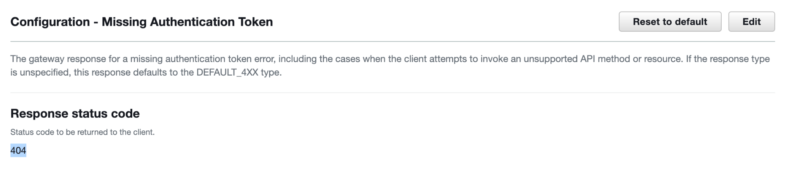
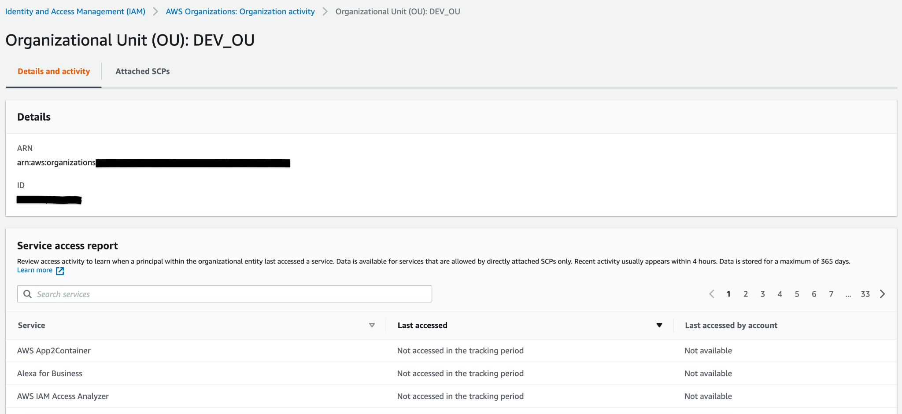
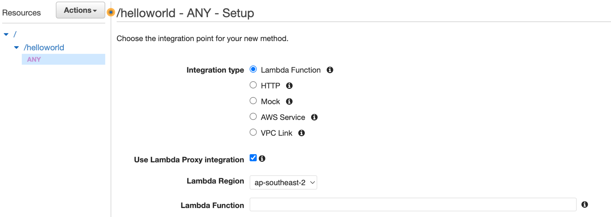

## Practice Test 2

Your company uses AWS Direct Connect to connect its on-premises network with an AWS VPC. DNS records of the AWS resources in the VPC are managed by a Route 53 private hosted zone. Now you want to forward DNS queries of the on-premise network to the Route 53 Resolver so that records in the Route 53 private hosted zone can be resolved in the on-premises network. Which of the following actions is appropriate for the above requirement to take place?

- `Create a Route 53 Resolver inbound endpoint in the VPC and configure resolvers on the on-premises network to forward DNS queries to the inbound endpoint`
- Create a Route 53 Resolver outbound endpoint in the VPC and create one or more rules to specify the domain names of the DNS queries that you want resolvers on the on-premises network to forward to Route 53

!!! note
    The DNS zone exists within Route 53 and resolutions are needed from on-premis.<br>
    As such this needs to be an inbound endpoint.

___

You are working in a large company as an AWS Solutions Architect. Your company uses VPN connections to connect an AWS VPC with the on-premises networks. There is a DNS resolver in the on-premises network to manage several domain names. Now, you also want to resolve these domain names for the AWS resources in the VPC (i.e., EC2 instances). Which of the following options should be used to achieve this requirement? (Select TWO)

- `Create an outbound endpoint in the AWS Route 53 Resolver for the AWS VPC`
- In the default route table of AWS VPC, create a route to forward all DNS queries to the on-premises DNS resolver’s domain name.
- `In AWS Route 53 Resolver, define rules to specify which DNS queries are forwarded to the DNS resolver on the on-premises network`

!!! note
    Outbound endpoint is required to forward DNS queries from AWS VPC to the on-premises network.

___

You are working in a startup as an AWS consultant. The company owns an online education platform. Your team needs to build a new transcription feature in the platform that can automatically convert the audio to text. After users upload the audio files to the platform, the platform will save the files to an S3 bucket, and then the audio files will be converted. To improve the transcription accuracy, the feature should also allow the maintainers to add customized words for non-standard terms such as technical names and acronyms. How would you implement this feature in AWS?

- `Use the Amazon Transcribe service that uses machine learning models to convert speech to text. Create a custom vocabulary in Amazon Transcribe for any specific words`
- Implement the feature by calling the Amazon Textract APIs that can extract text from audio files in S3 buckets. Upload the non-standard words to Amazon Textract for custom text extractions

!!! note
    Amazon Textract is a service to detect text from documents such as forms, invoices, IDs, etc.<br>
    Amazon Transcribe is the most suitable service to convert speech to text in AWS.

___

You are working as an AWS Solutions Architect. The company has several new projects in the AWS Cloud and the development team needs your opinion on which AWS database service should be used. Which of the following scenarios would you suggest Aurora serverless as the database service? (Select TWO)

- `A Relational Database for a Java application. The peaks of the database activities are hard to predict. You want to automatically scale up and down the database without the need to manage the database capacity manually`
- A MySQL compatible database that stores application usage data with stable and predicted workload. The DB instance class should be memory optimized
- `A MySQL database for a proof-of-concept project that is idle most of the time and you want to pay on a per-second basis for the database capacity`

!!! note
    Aurora Serverless is good for unpredictable workloads.<br>
    Aurora Serverless v2 is an on-demand, autoscaling configuration for Amazon Aurora. Aurora Serverless v2 helps to automate the processes of monitoring the workload and adjusting the capacity for your databases.<br>
    With Aurora, you can choose Amazon Aurora Serverless, which automatically starts up, shuts down, and scales capacity up or down based on your application's needs; you pay only for capacity consumed.

___

Your team is developing a microservice with Amazon API Gateway and Lambda function. During testing, it has been found that end users hit invalid endpoints such as “https://xxxxxxxxxx.execute-api.ap-southeast-1.amazonaws.com/test/invalid”. When that happens, users receive an HTTP response with the status code 403 and a message { "message": "Missing Authentication Token" }. You want to modify the status code of the HTTP response from '403 Forbidden' to be '404 Not Found'. What is the most suitable way to achieve this?

- `In the AWS console, go to API Gateway and select the API. In the Gateway Responses pane of the API, choose ‘Missing Authentication Token’ and modify the status code from the default (403) to 404. Deploy the API to a new or existing stage.`
- In the AWS console, go to API Gateway and select the API. In the Resources pane of the API, create a method for the invalid endpoint. In ‘Method Response’, customize the HTTP response to be '404 Not Found'. Redeploy the API to a new stage.

!!! note
    The Responses pane in the API GW resources allows you to set the response to a Missing Authentication Token



___

Your company runs on-premises virtual machines in the VMware vCenter and plans to migrate them to AWS via the AWS Application Migration Service. To prepare for the migration, you want to use the Application Discovery Service Agentless Collector to collect information about the on-premises environment. Which of the following are the prerequisites of using the Agentless Collector so that the VMware VMs can be discovered? (Select TWO)

- `Update the on-premises firewall settings to allow outbound access to the AWS domains that Agentless Collector requires (i.e. arsenal-discovery.us-west-2.amazonaws.com).`
- `Create an IAM user with the predefined IAM policy “AWSApplicationDiscoveryAgentlessCollectorAccess” for the Agentless Collector to authenticate with AWS when forwarding the data.`
- Make sure the security group of the Application Discovery Service allows the IP range of the on-premises network on port 443.

!!! note
    The on premise firewall needs outbound access to the AWS domains that Agentless collector requires<br>
    You cannot configure a security group for the Application Discovery Service.<br>
    Agentless Collector needs the IAM user credentials to authenticate with AWS to forward data to the Application Discovery Service.<br>
    ["Create an IAM user for Agentless Collector"](https://docs.aws.amazon.com/application-discovery/latest/userguide/agentless-collector-gs-iam-user.html)

___

You are an AWS consultant working for a government firm. Its IT infrastructure has been set up in both the on-premises and AWS environments. There is a MySQL database deployed in AWS RDS for an important application. Your manager asks you to replicate the RDS MySQL database to an on-premises instance so that the instance can be used as a standby just in case the whole AWS environment has an outage. How could you achieve this requirement?

- `In the AWS RDS console, select the database, and create a read replica. Connect to the replica and record the binary log information through the mysql “show slave status” command. Switch the replication target from the read replica to the on-premises server through the mysql “change master” command with the binary log information that was recorded previously`
- Create a replication server in the AWS Database Migration Service. Add the RDS MySQL database as the source and the on-premises instance as the target. Create a migration task to begin the replication.

!!! note
    AWS Database Migration Service (DMS) is more appropriate for migrating databases between on-premises and AWS.<br>
     this option firstly creates a read replica and uses the read replica to dump the database and record the binary log information. Then with the MySQL binary log information (i.e., master_log_file and master_log_pos), users can configure the replication from the RDS instance to the on-premises server. The following is an example command in the on-premises server to establish the replication:<br>
    `mysql> change master to master_host='rds-endpoint',master_user='xxxxxxxx', master_password='xxxxxxxx', master_log_file='mysql-bin.000001', master_log_pos= xxx;`

___

A company is using AWS Organizations to manage multiple accounts in the AWS cloud. Users in these accounts are storing customer data in the Amazon S3 buckets which are encrypted using server-side encryption with customer-managed AWS KMS keys. The operations team is looking to identify any sensitive personal data stored in any accounts within AWS Organizations. The solution should seamlessly work for any new accounts added to the AWS Organizations without any additional changes.

- `Enable Amazon Macie within AWS Organizations. Turn on Amazon Macie Auto-enable settings. Grant the Macie service-linked IAM role in the AWS account permissions to decrypt the S3 objects`

!!! note
    Amazon Macie is a data security service that uses machine learning (ML) and pattern matching to discover and help protect your sensitive data.

___

A start-up company has migrated a web application to Amazon EC2 instance from an on-premises location. They have set up multiple accounts in AWS Organizations. Initial sizing of the Amazon EC2 instance was done based on the sizing of the servers at the on-premises location during migration activity. It's six months since the application was migrated and the Management team wants you to ensure Amazon EC2 instances are correctly sized for the optimal application performance in the cloud. Additionally, to address security gaps across all these accounts, they are looking only for critical recommendations related to security.

- `Use AWS Compute Optimizer EC2 instance-type recommendations with enhanced infrastructure metrics. Enable Organizational view for the AWS Trusted Advisor and use recommendations in AWS Trusted Advisor Priority aggregated across member accounts in your organization`

!!! note
    Compute Optimizer now offers `enhanced infrastructure metrics`, a new paid recommendation preference feature that enhances recommendation quality for EC2 instances and Auto Scaling groups. Activating it extends the metrics look-back period to three months. You can activate enhanced infrastructure metrics for individual resources or at the AWS account or AWS organization level.

___

A popular video hosting company hosts a variety of videos or media files with a duration of 15 minutes to 3 hours in centralized on-premise storage. The company wants to add a comprehensive set of features to create engaging viewing experiences, including graphic overlays, content protection, multi-language audio, closed captioning support, and professional broadcast formats, and convert all these media files into the formats that users can play back on mobile devices, tablets, web browsers, and connected televisions.

The company wants AWS as its cloud provider and plans to store the converted files in a cost-effective storage service and set up a secure, low latency, cache-based distribution system for selected users (users who have paid a fee).

- Use Amazon Kinesis Video Streams to convert media files stored in Amazon S3 into media files in the formats required by consumer playback devices
- `Use AWS Elemental MediaConvert to add those comprehensive features and convert media files stored in Amazon S3 into media files in the formats required by consumer playback devices`
- `Use Amazon S3 as storage to store converted media files.`
- `Use Amazon CloudFront Signed URL to achieve cache-based low latency content distribution system to the paid users only`

!!! note
    Kinesis video stream is a data stream, this cannot convert the files

___

An educational tech company seeks to embed best practices in its development and operational processes as it migrates to the cloud. Recently the company saw a massive spike in its monthly AWS spending. On further analysis, they found that some developers had accidentally launched a few Amazon EC2 & RDS instances in unexpected Regions.

You have been hired to establish best practices ensuring the least privileges for developers and control access to on-premises as well as AWS Cloud resources using Active Directory.

You got the responsibility to implement a cost-control mechanism by restricting the level of access that developers have to the AWS Management Console without impacting their productivity. The company would like to allow developers to launch EC2 and RDS instances only in the eu-west-1 region to control their AWS bills.

How can you help the company achieve the new security mandate while minimizing the operational burden on the DevOps team?

- `Set up SAML-based authentication tied to an IAM role that has the PowerUserAccess managed policy attached to it. Attach a custom policy that denies access to EC2 and RDS in any AWS Region except eu-west-1.`
- Set up SAML-based authentication tied to an IAM role that has a PowerUserAccess managed policy and a custom policy that denies all the developers access to any AWS services except AWS Service Catalog. Within AWS Service Catalog, create a product containing only EC2 and RDS service in eu-west-1 region

!!! note
    The service catalog option resricts way more than what is requested.

___

A company has two AWS accounts: one account for Production to manage live applications and one Development account for developers and testers to use as a sandbox that freely applies changes and test applications. In each account, you store application information in Amazon S3 buckets.

There are two IAM user groups in the Development account: Developers and Testers. Users in both user groups have permission to work in the Development account and access resources. Now the requirement is that a Developer must update the live applications in the Production account often. In the Production account, the developers need to store these applications in an Amazon S3 bucket called productionapp.

The company needs a security strategy that meets the following requirements:

Developers can use the AWS Management Console to access the productionapp bucket in the Production account.
They can also access the bucket by using API calls.
Testers attempting to access the productionapp bucket should fail.
In addition to this security requirement, the solution should also reduce Management and Operational overhead.

Which strategy will meet these requirements?

- `answer 1`
    - `Create an IAM role UpdateProductionApp in the Production account. Define the Development account as a trusted entity and specify a permissions policy that allows trusted users to update the productionapp bucket.`
    - `In the Development account, modify the IAM user group policy for Developers by enabling sts:AssumeRole to grant access to the IAM role UpdateProductionApp, explicitly deny Tester’s access to the IAM role UpdateProductionApp.`
    - `Test access by switching to the Production account and roles UpdateProductionApp`
- answer 2
    - Create an IAM role UpdateProductionApp in the Production account. Define the Development account as a trusted entity and specify a permissions policy that allows trusted users to update the productionapp bucket.
    - In the Development account, modify the IAM user group policy for Developers by enabling sts:AssumeRole to grant access to the UpdateProductionApp role, and explicitly deny Testers access to the UpdateProductionApp role.
    - Use the S3 bucket policy in productionapp bucket to grant the s3:PutObject and s3:PutObjectAcl permissions to Development account

!!! note
    S3 bucket policy has no part to play here. As long as options i & ii are satisfied, developers in Development account can access the bucket by just switching roles.

___

What do you infer from the below resource-based policy?

```JSON
{
    "Version": "2012-10-17",
    "Statement": [{
        "Effect": "Deny",
        "NotPrincipal": {"AWS": [
            "arn:aws:iam::222233334444:user/Bob",
            "arn:aws:iam::222233334444:root"
        ]},
        "Action": "s3:*",
        "Resource": [
            "arn:aws:s3:::myexamplebucket",
            "arn:aws:s3:::myexamplebucket/*"
        ]
    }]
}
```

- User Bob and all other users under root account 222233334444 will be allowed access to Amazon S3 bucket myexamplebucket
- `Both user Bob and root user will only be able to access to Amazon S3 bucket myexamplebucket. All other users in account 222233334444 are denied S3 access`

!!! note
    all principals except the user named Bob in AWS account 222233334444 are explicitly denied access to a resource.

___

You’re architecting APIs using Amazon API Gateway for one of the major eCommerce websites. The eCommerce company expects huge traffic. As a precautionary measure to prevent the APIs and the account from being overwhelmed by too many requests, the company has asked you to keep the below two points in mind:

To protect the performance and availability of the underlying service while ensuring access for all AWS customers.
To protect the customer from malicious code or misconfigurations that can result in unexpected charges.
What do you do in your API architecture to meet the above demand?

- Associate a CloudFront distribution with a Lambda@Edge function and integrate API Gateway as the origin
- `Set the target limits for individual API stages or methods to improve overall performance across all APIs in your account. Alternatively, enable usage plans to set throttles on client request submissions based on specified request rates and quotas. Also, Enable API caching to enhance responsiveness.`

!!! note
    Lambda@Edge is a lambda option that lets you run code globally, closer to your users, without provisioning or managing infrastructure within those regions.<br>

___

A company wants to free its teams from time-consuming database tasks like server provisioning, patching, backups, etc., and hence decided to migrate their on-premises MariaDB database to AWS. The company wants its AWS database to have built-in security, continuous backups, serverless compute, multiple read replicas, automated multi-Region replication, less expensive compared to other commercial-grade databases, and integrations with other AWS services.

The company is asking for your advice and help as a solution architect to migrate databases to AWS quickly and securely. They have conditions that the source database remains fully operational during the migration and downtime should be minimized to applications that rely on the database.

Which combination of architectural changes should you make to meet the above requirements?

- `Provision Amazon Aurora Mysql as the target DB instance in AWS. Provision Database Migration Service (DMS) replication instance and create DMS endpoints. Create DMS task, migrate data from the source database as on-premises MariaDB, and perform validation.`
- Provision DynamoDB as target DB instance in AWS. Provision Database Migration Service (DMS) replication instance and create DMS endpoints. Create DMS task, migrate data from the source database as on-premises MariaDB, and perform validation.

!!! note
    MariaDB is a community-developed, commercially supported fork of the MySQL relational database.<br>
    MongoDB is a NoSQL database which would be a good fit for Dynamo, not MariaDB

___

You join a company recently and need to manage an AWS Organization with several Organizational Units (OUs). A “FullAWSAcess” SCP has been attached to the organization’s Root that allows all services and actions. Other policies are attached in OUs to prevent users from using some AWS services or performing certain actions (i.e.deleting DynamoDB tables). Your manager asks you to identify the allowed AWS services that have not been accessed for 6 months in the Development OU. How do you achieve this in the easiest way?

- `In the AWS console, go to IAM > Access reports > Organization activity, select the Development OU, and check the last accessed information in the “Service access report” table`

!!! note
    `IAM > Access reports > Organization activity`



___

As a cloud engineer, you are managing an AWS Organization that covers several Organizational Units (OUs). To provide better governance in the AWS environment, you need to create AWS resources in the whole AWS Organization or certain Organization Units. For example, you would like to set up AWS Config rules across the whole company. Another requirement is that the resources should be in multiple regions that you have selected. You plan to create the resources through AWS CloudFormation. Which of the following methods is the most suitable?

- Create CloudFormation StackSets with self-managed permissions. On the “Set deployment options” page, configure the accounts and Regions into which you want to deploy the stack set.
- `. Create CloudFormation StackSets with service-managed permissions. Set the deployment options to “Deploy to organization” or “Deploy to organizational units”. Choose the Regions in which you want to deploy the stack instances..`

!!! note
    CloudFormation StackSets:<br>
    `self-managed permissions` - .<br>You create the AWS Identity and Access Management (IAM) roles required by StackSets to deploy across accounts and AWS Regions. These roles are necessary to establish a trusted relationship between the account you're administering the stack set from and the account you're deploying stack instances to. Using this permissions model, StackSets can deploy to any AWS account in which you have permissions to create an IAM role.
    `service-managed permissions` - For stack sets with service-managed permissions, the administrator account is either the organization's management account or a delegated administrator account. You can manage a stack set by signing in to the AWS administrator account that created the stack set.

___

As the company grows, the company’s AWS Organization is becoming complicated with a large number of Organizational Units (OUs) and AWS accounts. Due to several restructures to the company, new AWS accounts are being created, and existing AWS accounts are being suspended. As an AWS administrator, you need to maintain all AWS accounts in the AWS Organization. Your manager asks you to provide information that includes the details of individual AWS accounts, such as Account IDs, Email addresses, and statuses. Which is the most suitable way to achieve the requirement?

- `Sign in to the AWS Organizations console as an IAM user, choose “Actions” and click “Export account list” to download the organization account information as a CSV file.`

___

Your team is developing a mobile app and plans to use the Amazon Cognito identity pool to return temporary credentials to the application to access AWS resources. The “enhanced authflow” for Cognito has been chosen to simplify the network calls to get credentials. The app first authenticates with a third-party identity provider (i.e., Facebook), presents an ID token in a GetID request to the Amazon Cognito identity pool, and exchanges the token for an identity ID. For the further authentication flow, which option is correct?

- The identity ID is used in a GetOpenIdToken request to the Amazon Cognito identity pool. A new OAuth 2.0 token is returned and used in an AssumeRoleWithWebIdentity request to retrieve AWS API credentials.
- `The identity ID is used in a GetCredentialsForIdentity request to the Amazon Cognito identity pool. If the identity ID is validated successfully, AWS API credentials will be returned.`

!!! note
    `Enhanced authflow` simplifies credential retrieval by performing `GetOpenIdToken` and `AssumeRoleWithWebIdentity` in the background. The app does not need to send `GetOpenIdToken` or `AssumeRoleWithWebIdentity` messages.<br>
    `GetCredentialsForIdentity` message is used to fetch the AWS API credentials

___

Your team is developing a new application. A REST API is being set up in Amazon API Gateway with a Lambda function as the backend. To simplify the maintenance and configurations of the REST API, you plan to use proxy integration for the Lambda function so that you can change the Lambda function at any time without the need to redeploy the REST API in API Gateway. The entire HTTP request for all types of methods should be sent to the Lambda function as-is. About the Lambda proxy integration, which of the following configurations is correct?

- `In the REST API, set up an “ANY” method, choose “Use Lambda Proxy integration”, and select the backend Lambda in the “Lambda Function” field.`



___

You are an AWS Solutions Architect. Your team owns a website deployed in an Amazon Linux EC2 instance. Due to business needs, there is a new requirement to use the same instance to host another website by using multiple SSL certificates on a single server and associating each certificate with an elastic network interface (ENI). The new elastic network interface should be in a different subnet from the existing ENI. How would you configure it in the EC2 instance?

- `Create a new elastic network interface in a different subnet. Attach the network interface in “AWS EC2 console > Actions > Networking > Attach network interface”.right`
- There is no way to configure a secondary ENI under another subnet in an EC2 instance. All elastic network interfaces attached to a single EC2 instance must be in the same subnet.

!!! note
    Users can configure a secondary ENI in another subnet for an EC2 instance. Users must attach a network interface to an instance in the same Availability Zone.

___

You have created an API Gateway API to expose the "GET /user?user={name}" method to invoke a Lambda function. The method has a query string called "user". The Lambda function will respond with a message of "Hello, {name}!". You have deployed the Lambda function as follows:

```bash
exports.handler = function(event, context, callback) {
    var res ={
        "statusCode": 200,
        "headers": {
            "Content-Type": "*/*"
        }
    };
    if (event.user==null) {
        callback(new Error('Missing the required greeter parameter.'));
    } else {
        res.body = "Hello, " + event.user +"!";
        callback(null, res);
    }
};
```

How would you set up the Lambda integration with the API method properly?

- `Use AWS CLI “aws apigateway put-integration” to set up the Lambda custom integration. Configure the mapping of the user query string parameter to the user property of the JSON payload for the Lambda function`
- Use AWS CLI “aws apigateway put-integration-response” to set up the Lambda proxy integration. Configure the mapping of the user query string parameter to the user property of the JSON payload for the Lambda function.

!!! note
    “aws apigateway put-integration-response” is used to configure how to pass the result returned from the backend to the client.<br>
    “aws apigateway put-integration” is the correct command to configure the Lambda custom integration and map the user query string parameter to the user property of the JSON payload

___

You are working as an AWS solutions architect in a company. Your company deploys AWS resources mainly in the us-east-1 region, where multiple VPCs and subnets are created. At the same time, the company wants to build and run applications on-premises using the same programming interfaces as in AWS. Subnets should also be created on the local network so that local AWS compute instances can communicate with other instances in the AWS region within the same VPC. How would you design the solution to meet these requirements?

- `Set up AWS Outposts to run the applications on-premises. Connect Outpost to the AWS us-east-1 region with Direct Connect. Create subnets on the Outpost and launch on-premises AWS resources in the subnets.`
- Set up AWS Outposts to run the applications on-premises. Connect Outpost to the AWS us-east-1 region with VPN connections. Create a new VPC with subnets on Outpost and establish the VPC peer connections between the Outpost VPC and AWS VPC.

!!! note
    AWS Outposts is a fully managed service that extends AWS infrastructure, services, APIs, and tools to customer premises. By providing local access to AWS managed infrastructure, AWS Outposts enables customers to build and run applications on premises using the same programming interfaces as in AWS Regions, while using local compute and storage resources for lower latency and local data processing needs.<br>
    Instances in Outpost subnets communicate with other instances in the AWS Region using private IP addresses, all within the same VPC.<br>
    You don't need to create a new VPC

___

You are an AWS consultant working in a bank. The development team is working on a web application that reads some system parameters in the run time. These parameters have been stored in AWS Systems Manager Parameter Store (us-east-1) as SecureString encrypted by a KMS customer-managed key. All the parameters stored in the production AWS account have the prefix "prod". Now you need to create an IAM policy so that the web application can read the production parameters properly. Which of the following IAM policies is the most appropriate?

- `Answer 1`

```JSON
{   
    "Version": "2012-10-17",
    "Statement": [
        {             
            "Effect": "Allow",             
            "Action": [                 
                "ssm:GetParameters"             
            ],             
            "Resource": [                 
                "arn:aws:ssm:us-east-1:xxxxxxxxxxxx:parameter/prod-*"             
            ]         
        },         
        {             
            "Effect": "Allow",             
            "Action": [                 
                "kms:Decrypt"             
            ],             
            "Resource": [                 
                    "arn:aws:kms:us-east-1:xxxxxxxxxxxx:key/key-EXAMPLE-ID"             
                ]         
        }     
    ] 
}
```

- Answer 2

```JSON
{     
    "Version": "2012-10-17",     
    "Statement": [         
        {             
            "Effect": "Allow",             
            "Action": [                 
                "ssm:GetParameter"             
            ],             
            "Resource": [                 
                "arn:aws:ssm:us-east-1:xxxxxxxxxxxx:parameter/prod-*"             
            ]         
        },         
        {             
            "Effect": "Allow",             
            "Action": [                 
                "kms:Decrypt",     
                "kms:Encrypt",     
                "kms:GenerateDataKey"            
            ],             
            "Resource": [                 
                "arn:aws:kms:us-east-1:xxxxxxxxxxxx:key/key-EXAMPLE-ID"             
            ]         
        }     
    ] 
} 
```

!!! note
    To read the SecureString parameters encrypted by KMS, only the “kms:Decrypt” action is required

___

An IT firm has hybrid connectivity between on-premises location and AWS using AWS Direct Connect links. On-Premises users need to download project files stored in an Amazon S3 bucket. For providing access, IT firms do not want to create IAM users but are looking to use existing credentials created in SAML compatible Identity provider (IdP) deployed at on-premises locations.

Which sequence of events takes place while users access the Amazon S3 bucket?

- `Answer 1`
    - `Users make a request to IdP and get authenticated`
    - `IdP sends a SAML assertion to users`
    - `Users forward this SAML assertion to STS using AssumeRolewithSAML API`
    - `STS returns a temporary security credential that allows users to access the Amazon S3 bucket`
- Answer 2
    - Users make a request to IdP and get authenticated
    - IdP sends a SAML assertion to STS using AssumeRoleWithWebIdentity API on behalf of the users
    - STS returns temporary security credentials to IdP
    - IdP forwards this security credential to users allowing access to the Amazon S3 bucket

!!! note
    Assume Role with SAML API should be used by the client while sending SAML assertion to STS.

___

Developers in a large telecommunication company are working on a new mobile application for which low latency is a primary requirement. The application deployed with an IPv4 address will be accessed by 5G users of the telecommunication company. Applications will need secure connectivity to the internet to download security patches on a regular basis. Application data needs to be replicated securely to Amazon S3 buckets.

What solution can a Solution Architect propose for this requirement?

- `Deploy an application on an Amazon EC2 instance launched in AWS Wavelength Zone. For internet access, create a default route in the Carrier gateway attached to the Wavelength zone.`

!!! note
    AWS Wavelength embeds AWS compute and storage services within 5G networks, providing mobile edge computing infrastructure for developing, deploying, and scaling ultra-low-latency applications.<br>
    Wavelength Zone allows to deploy AWS compute and storage resources at the edge of the telecommunication carrier network.

___

A start-up firm has deployed thousands of sensors across the globe to capture environmental changes. These sensors send a continuous data log of size less than 4Kb that needs to be analyzed in real-time, and a summary of the environmental data needs to be stored for future requirements. The firm is looking for a cost-effective managed solution to implement this setup in AWS Cloud. The solution should be highly scalable to handle any future growth.

What solution can be designed to meet this requirement?

- `Capture the streaming data using Amazon Kinesis Data Streams. Use Kinesis Data Analytics for Apache Flink for the analysis of streaming data and store processed data in Amazon S3.`

!!! note
    Amazon Kinesis Data Analytics for Apache Flink is a fully managed service for performing analysis on streaming data.

___

A manufacturing company has deployed AWS Managed Microsoft AD for managing a large user base in the AWS cloud. The Security team is looking to capture AD controller events logs, such as failed login attempts or changes made to user groups. The captured logs should be analyzed in real-time, and a dashboard should be created depicting trends and insights of each event.

How can a solution be designed for this requirement most efficiently?

- `Stream event logs from AD controllers to Amazon OpenSearch Service using Amazon CloudWatch Logs and AWS Lambda. Analyze events in Amazon OpenSearch Service and create a visualization in the Amazon OpenSearch dashboard.`
- Stream event logs from AD controllers to Amazon OpenSearch Service using Amazon CloudWatch Logs and Amazon Kinesis Firehose. Analyze events in Amazon OpenSearch Service and create a visualization in the Amazon OpenSearch dashboard.

!!! note
    Amazon Kinesis Data Firehose captures and loads data in near real time.

___

An IT firm is working on a new application in AWS Cloud. The application needs to capture video files from thousands of smart home devices installed at various locations. Real-time analysis should be performed on the files received from the devices without any changes to the video files, and alerts should be sent to the home users app if any picture matches the video files. All the video files need to be discarded post-analysis. The team is looking for a high-performance scalable solution that can be set up with the least effort.

What solution can be proposed for this requirement?

- Capture the video files using Amazon Kinesis Firehose. Store the data in an Amazon S3 bucket. Use Amazon Rekognition to perform analysis on the video files and send an alert to the smart home app.
- `Capture the video files using Amazon Kinesis Video Streams. Use Amazon Rekognition to perform analysis on the video files and send an alert to the smart home app.`

!!! note
    Since there is no need to transform the data or store the data for future requirements, streaming video files to Amazon Kinesis Video streams is a better option than Amazon Kinesis Firehose.

___

An online retail company is working on an order-processing application using Amazon API Gateway and AWS Lambda. AWS Step functions will be used to coordinate between various components within the application. Some tasks for this application are long-running non-idempotent tasks such as payment processing, while some tasks are high-volume idempotent tasks like sending payment notifications to the customers. The company is looking to create workflows with AWS Step Functions for this requirement in a scalable, cost-effective way.

- `For non-idempotent tasks, use Standard workflows; for idempotent tasks, use Asynchronous Express workflows`
- For non-idempotent tasks, use Asynchronous Express workflows; for idempotent tasks, use Standard workflows

!!! note
    `Standard Workflows`: These are suitable for long-running tasks with exactly-once workflow execution.<br>
    `Synchronous Express Workflows`: These are suitable for tasks to be completed within 5 minutes. This supports at-most-once workflow execution<br>
    `Asynchronous Express Workflows`: These are suitable for tasks to be completed within 5 minutes. This supports at-least-once workflow execution.

___

An IT multinational company has created AWS Organizations for managing multiple accounts. AWS Security Hub is integrated with AWS Organizations. Recently this company has merged with another IT company that also hosts resources in AWS Cloud. The merged entity will have separate AWS Organizations, but the Security Head wants to consolidate accounts from both these AWS Organizations under a single Security Hub administrator account.

What actions can be initiated with the least manual effort?

- Send an invite from the management account of the AWS Organizations in which Security Hub is integrated
- `Send an invite from a Security Hub administrator account to the member accounts belonging to different AWS Organizations.`

!!! note
    Invite should be sent from the Security Hub administrator account, not from the AWS Organizations management account.

___

A message-broking application using WebSocket protocol is deployed at on-premises.

The company plans to migrate this application to AWS Cloud infrastructure without making any changes in the application code. The primary purpose for application migration to AWS Cloud is to reduce operational overhead and minimize cost. The proposed setup should be scalable and should integrate with the Amazon S3 bucket which will be used for storing messages. Which solution will meet these requirements?

- Deploy the application in AWS Cloud using Amazon SQS Standard queues along with Amazon EC2 instance.
- `Deploy the application in the AWS cloud using Amazon MQ along with Amazon EC2 instance.`

!!! note
    Amazon MQ provides a fully managed service for message-broker applications. It supports protocols such as JMS, NMS, AMQP 1.0 and 0.9.1, STOMP, MQTT, and WebSocket. It's best suited for deploying message brokers on the AWS cloud with reduced operational overhead and minimizing cost.

___

A new web application is designed by a developer team using Amazon API Gateway and AWS Lambda. REST APIs will be used for this purpose which will synchronously invoke the AWS Lambda function. The developer team is expecting a huge response to this application and looking for a secure solution for authenticating a large number of clients.

Which solution can be designed for this requirement in the most effective way?

- Create a request parameter-based Lambda authorizer. Configure API Gateway to call Lambda authorizer to authenticate clients making a request using REST API.
- `Create users in Amazon Cognito user pools. Create an API Gateway authorizer with this user pool and enable the authorizer on the REST API.`

!!! note
    Request parameter-based Lambda authorizers are supported only for WebSocket API and not REST APIs.
    This method is best suited when there is a need to provide access to a large number of global users.


___

A Java-based web application is migrated from On-premises to AWS. Amazon Elastic Beanstalk is used to deploy applications using ALB, Amazon EC2 instances in multiple AZ, and Amazon DynamoDB in provisioned capacity mode. Auto-scaling groups are created with general-purpose Amazon EC2 instances. Post-migration, customers observe a delayed response from web applications during busy hours. Further checks observed that the application performs a non-critical zip archive process causing load on the Amazon EC2 instance.

- `Redeploy the application using Elastic Beanstalk worker environments with Amazon SQS and Amazon EC2 instance for the zip archive process. For the front-end, use the web server environment of ALB, Amazon EC2 instance, and Amazon DynamoDB.`
- Redeploy Auto Scaling groups with memory-intensive Amazon EC2 instance instead of general-purpose Amazon EC2 instance.

!!! note
    ZIP archive is generally a compute-intensive process. Deploying a memory-intensive Amazon EC2 instance won’t be any value addition.<br>
    A worker environment can be deployed with Amazon Elastic Beanstalk for long-running application tasks. Long-running jobs can be sent to the Amazon SQS queue and are further processed by Amazon EC2 instances in the worker environment tier.

___

A start-up firm is developing a new three-tier application which collects sensor data from thousands of IoT devices. These small-sized data should be written to the database in a fast efficient way. Data should be stored for a long term for performing analytical queries quickly. Application and web layer solution is already designed. The firm is looking for a database that can provide optimum reads and writes to handle high workloads.

What solution can be designed for this requirement?

- `For fast analytic queries, use magnetic store while for high throughput data writes use memory store with Amazon Timestream`
- For fast analytic queries, use General Purpose SSD while for high throughput data writes use Provisioned IOPS SSD with Amazon RDS

!!! note
    `Amazon Timestream` is a serverless time series scalable database which can be used to store and analyze events. It is less costly than using relational databases for the same purpose. Amazon Timestream has two tiers of storage: a memory store and a magnetic store.<br>
    `Memory storage` is suitable for high throughput writes and fast point-in-time queries.<br>
    `Magnetic storage` is suitable for low throughput writes and fast analytical queries along with long-term data storage.

___

A company has deployed a legacy web application on an instance store-backed Amazon EC2 Linux instance. After the successful deployment in the us-west-1 region, the company is looking to replicate this deployment in other regions for quick deployment. The operations team is looking for a process to create an AMI from the existing Amazon EC2 instance in a cost-effective and efficient way.

Which steps can a solution architect initiate to meet this requirement?

- `Upload credentials to the instance`
- `Prepare the bundle using the command ec2-bundle-vol`
- `Upload bundle to Amazon S3 bucket using the command ec2-upload-bundle`
- `Register AMI using the register-image command`

!!! note
    `ec2-bundle-vol` - Prepare the bundle using the command ec2-bundle-vol: This step creates compressed encrypted files in a /tmp directory. If some files need to be excluded from the bundle, then those files can be excluded with command “-e option”.

___

A media firm is using Amazon S3 buckets to store all their media archives. Recently they have enabled encryptions with SSE-KMS on new S3 buckets containing millions of objects created by all users in the account. The finance team is observing a huge surge in cost since the encryption is enabled for the Amazon S3 bucket and they have engaged you to work on a solution to save cost and with the least admin overhead.

- Configure client-side encryption using keys stored within the application
- `Configure S3 bucket keys for SSE-KMS`

!!! note
    When a large number of objects stored in an Amazon S3 bucket are encrypted using SSE-KMS, Amazon S3 uses an individual KMS data key for each object. This leads to large volumes of requests to AWS KMS from the Amazon S3 bucket which results in higher costs.<br>
    To reduce this cost, Amazon S3 bucket keys can be used along with SSE-KMS. When Amazon S3 bucket keys are configured with the bucket, AWS generates short-lived bucket keys from AWS KMS which are stored locally in the bucket.<br>
    For all the objects in the bucket, instead of requesting a data key from AWS KMS, Amazon S3 will use a bucket key. This reduces the traffic between Amazon S3 and AWS KMS and in turn decreases costs significantly.

___

A technological company is planning to deploy thousands of sensors in a city which will capture pollution-related data. The data from these sensors should be captured and stored effectively in the Amazon DynamoDB table for further analysis. The payload data from these sensors should be formatted and stored in a single database table.

How can a solution be implemented for this requirement?

- `Create AWS IoT rules which will capture and send formatted data to the Amazon DynamoDB table`
- Enable AWS IoT FleetWise on the sensor data and store formatted data in the Amazon DynamoDB table

!!! note
    IoT FleetWise can be used to collect and transfer vehicle data in near real-time to the AWS Cloud. In the above case, there is no requirement for near real-time data collection from vehicles, but data is to be collected from stationary sensors and stored in the Amazon DynamoDB table.<br>
    Rules give your devices the ability to interact with AWS services. Rules are analyzed and actions are performed based on the MQTT topic stream. You can use rules to support the following tasks:<br>
        - Augment or filter data received from a device.<br>
        - Write data received from a device to an Amazon DynamoDB database.<br>
        - Save a file to Amazon S3.<br>
        - Send a push notification to all users who are using Amazon SNS.<br>
        - Publish data to an Amazon SQS queue.<br>
        - Invoke a Lambda function to extract data.

___

A web application is deployed using Amazon EC2 instance and Network Load Balancer (NLB). To support financial transactions, end-to-end encryption is configured with TLS certificates deployed on Amazon EC2 instances. The Quality Assurance team is observing degradation in application performance. On further analysis, it is found that CPU Utilization of the Amazon EC2 instance is hitting more than 80% constantly. The IT head is looking for a solution that can provide a better application performance even when demand for this application surges.

How can applications be redesigned for better performance with minimal changes in the existing setup?

- Configure Amazon CloudFront infront of NLB. Amazon CloudFront will use TLS certificates stored in AWS Certificate Manager
- `Configure TLS listener on Network Load Balancer using port 443`

!!! note
    Network Load Balancer supports TLS (Transport Layer Security) traffic and sets up a connection with the target instance over TCP or TLS. Performing a compute intensive workload of encrypting and decrypting the traffic on Amazon EC2 instances, may lead to high CPU utilization and performance degradation.  By configuring a TLS listener on NLB, encryption and decryption is handled by the NLB which can provide low latency and can handle high throughput traffic.

___

An engineering firm is using a web application deployed with AWS Elastic Beanstalk. For this application they have configured user pools with custom domains for Amazon Cognito. To comply with audit findings,the Operations Team is working on deleting all existing ACM certificates and updating them with new ones. While deleting some of the ACM certificates, they are getting an error as "The certificate is in use (associated with other AWS resources) and cannot be deleted. Disassociate the certificate from each resource in the list and try again." They are seeking your consultation to resolve this ACM certification error.

What suggestion can be provided for the requirement?

- `Remove the association of the existing ACM certificate with the CloudFront distribution by updating the ACM certificate associated with the custom domain of Amazon Cognito`

!!! note
    When a custom domain is added to the Amazon Cognito user pool, a CloudFront distribution is created with which the ACM certificate is associated. This CloudFront distribution is owned by Amazon Cognito and not by the individual account.

___

A trading consortium has created a private blockchain network using Amazon Managed Blockchain with Hyperledger Fabric framework. There are multiple AWS accounts as members of this network. VPC Private endpoints are created to enable all members access the resources. They have tied up with a new distributor which needs to be part of this network. Distributors should seamlessly join this network and access the Hyperledger Fabric resources.

What combination of steps should a solution architect initiate to meet these requirements?  (Select TWO)

- Create a proposal for inviting other AWS accounts to the blockchain network. Once a proposal is approved by an administrator in the network, other AWS accounts will receive the invite
- `Create a single VPC PrivateLink endpoint for all members in the AWS account from which Hyperledger Fabric resources will be accessed`
- `Create a proposal for inviting other AWS accounts to the blockchain network. Once a proposal is approved by current members of the network, other AWS accounts will receive the invite`

!!! note
    For inviting new accounts to join the network, all the current members and not just the administrator would approve based upon the voting rules of the network.

___

A telecommunications service provider is building a new application in an AWS Wavelength zone. This application is deployed on an Amazon EC2 instance launched in two Wavelength Zones 1 and 2 belonging to a single VPC A. Amazon EC2 instance can communicate with parent VPC and Internet. For synchronization traffic between the applications in two Wavelength zones, connectivity needs to be established between the Amazon EC2 instance. Connectivity should be established with fine-grain control allowing only specific Amazon EC2 instances to communicate from both Wavelength zones.

What solution can be proposed for this additional connectivity?

- Create two new subnets in existing VPC A and associate them with Wavelength zone 1 and Wavelength zone 2. Configure routing in the carrier gateway in each Wavelength zone to allow communication between the instances
- `Answer 2`
    - `Create a new VPC B.`
    - `Associate subnet in existing VPC A with Wavelength zone 1.`
    - `Create a subnet in VPC B and associate it with Wavelength zone 2.`
    - `Use Transit Gateway to enable communication between instances launched in Wavelength Zone 1 and Wavelength Zone 2`

!!! note
    Amazon EC2 instances launched in two different Wavelength Zones associated with a single VPC cannot communicate with each other. <br>
    To enable this communication, 2 different VPCs need to be created. Each Wavelength zone is associated with each VPC. Transit Gateway can be used to enable communication between these VPCs.<br>
    In the above case, Wavelength Zone 1 is associated with VPC A while Wavelength Zone 2 is associated with VPC B. To enable communication between instances in Wavelength Zone 1 and Wavelength Zone 2, Transit Gateway should be used to establish routing between VPC A and VPC B.

___

An engineering firm has a large number of Amazon S3 buckets launched in their AWS account. Internal and external users need to have different permission to store data in these Amazon S3 buckets. Access should be granted based on AWS security best practices of least privileges. The permissions should be efficiently granted considering the large volume of buckets and users in this account. A sample policy needs to be created for the bucket name my_test_bucket.

Which of the following policies is most suitable for the requirement?

- `Answer 1`

```JSON
{   
    "Version": "2012-10-17",   
    "Statement": [
        {     
            "Effect": "Allow",     
            "Action": "s3:*",     
            "Resource": ["arn:aws:s3:::my_test_bucket/*"]     
        }
    ] 
}
```

- Answer 2

```JSON
{   
    "Version": "2012-10-17",   
    "Statement": [     
        {       
            "Effect": "Allow",       
            "Principal": {         
                "AWS": ["arn:aws:iam::123456789000:user/ABC"]       
            },       
            "Action": "s3:*",       
            "Resource": ["arn:aws:s3:::my_test_bucket/*"]    
        }  
    ]
}
```

!!! note
    The second answer is incorrect as S3 bucket policy will allow user ABC full access to the bucket name my_test_bucket. Since there will be thousands of S3 buckets, maintaining a bucket policy for each user on every bucket will incur additional admin overhead.

___

A service provider firm is planning to deploy AWS IoT solutions across multiple countries in the Europe region. They will be deploying IoT devices in farms to gather environmental data. Some of the farm locations are remote locations where there are connectivity challenges. The firm is looking to perform local compute functionalities on remote devices and upload processed data securely in an encrypted format to the IoT core. The proposed solution should be scalable to thousands of devices and survive connectivity issues for data synchronization.

How can a solution be designed for this requirement?

- `Use AWS IoT Greengrass with connected devices located globally`
- Use AWS IoT Device Management with connected devices located globally

!!! note
    AWS IoT Greengrass is a software service that can help to run local compute, messaging, data caching, sync, and ML inference capabilities for connected devices.<br>
    AWS IoT Device Management is suitable for cloud-based device management and remote management of IoT devices. It is not a suitable option for running local compute on remote IoT devices.
