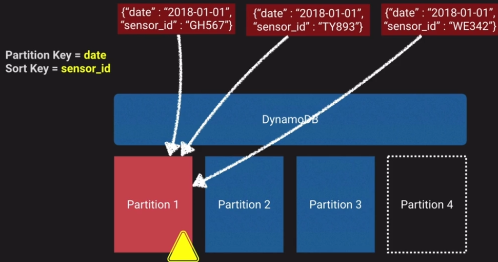

## To learn

| Service| Done |
| ------ | ---- |
| AWS Storage Gateway | ☑ |
| Dynamo DB Global or Secondary indexes | ☐ |
| Dynamo DB partition or sort key | ☐ |
| What is NOSQL | ☐ |
| AWS Compute Optimizer | ☐ |
| AWS S3 Storage Lens | ☐ |
| Instance fleets | ☐ |
| Kineses | ☐ |
| ASG scaling methods (simple etc) | ☐ |
| Endpoings (S3 test) | ☐ |

Done - &#9745;  
Not done - &#9744;

## AWS Storage Gateway

AWS Storage Gateway is a set of hybrid cloud storage services that provide on-premises low latency access to virtually unlimited cloud storage.

Offerings:

- File Gateway
- Tape Gateway
- Volume Gateway

Fully Managed Cache: The local gateway appliance maintains a cache of recently written or read data so your applications can have low-latency access to data that is stored durably in AWS. The gateways use a read-through and write-back cache, committing data locally, acknowledging the write operations, and then asynchronously copying data to AWS, reducing application latency.

### AWS File Gateway

#### AWS S3 File Gateway

Amazon S3 File Gateway presents a file interface that enables you to store files as objects in Amazon S3 using the industry-standard NFS and SMB file protocols, and access those files via NFS and SMB from your data center or Amazon EC2, or access those files as objects directly in Amazon S3

#### AWS FSx File Gateway

Amazon FSx File Gateway provides fast, low-latency on-premises access to fully managed, highly reliable, and scalable file shares in the cloud using the industry-standard SMB protocol. Customers can store and access file data in Amazon FSx with Windows-native compatibility including full NTFS support, shadow copies, and Access Control Lists (ACLs).

### Tape Gateway

Back up and archive on-premises data to virtual tapes on AWS using your network. Use Tape Gateway to replace physical tapes on premises with virtual tapes on AWS—reducing your data storage costs without changing your tape-based backup workflows. Tape Gateway supports all leading backup applications and caches virtual tapes on premises for low-latency data access. It compresses your tape data, encrypts it, and stores it in a virtual tape library in Amazon Simple Storage Service (Amazon S3). From there, you can transfer it to either Amazon S3 Glacier Flexible Retrieval or Amazon S3 Glacier Deep Archive to help minimize your long-term storage costs.

### Volume Gateway

Volume Gateway presents cloud-backed iSCSI block storage volumes to your on-premises applications. Volume Gateway stores and manages on-premises data in Amazon S3 on your behalf and operates in either cache mode or stored mode. In the cached Volume Gateway mode, your primary data is stored in Amazon S3, while retaining your frequently accessed data locally in the cache for low latency access. In the stored Volume Gateway mode, your primary data is stored locally and your entire dataset is available for low latency access on premises while also asynchronously getting backed up to Amazon S3.

## DynamoDB

### DynamoDB Primary Keys

#### Partition Key

`Partition key`: A simple primary key, composed of one attribute known as the partition key. Attributes in DynamoDB are similar in many ways to fields or columns in other database systems.

Example would be `OrderID` as the `Partition Key` in the table below:

| OrderID | CustomerID | State | TotalAmount |
| ------- | ---------- | ----- | ----------- |
| 1 | CID-100 | SHIPPED | 3200 |
| 2 | CID-101 | DELIVERED | 700 |
| 3 | CID-100 | SHIPPED | 3 |
| 4 | CID-102 | DELIVERED | 12 |

#### Partition Key and Sort Key

`Partition key and sort key`: Referred to as a `composite primary key`, this type of key is composed of two attributes. The first attribute is the partition key, and the second attribute is the sort key. All data under a partition key is sorted by the sort key value.

### DynamoDB Global or Secondary Index

### DynamoDB scaling

Two ways to scale DynamoDB

- Throughput - based on RCU and WCUs
- Size - based on the storage size of data (max item is 400kb)

- Partition - a physical space where DynamoDB data is stored
- Partition key - a Unique identifier for each record, sometimes known as a Hash key
- Sort key - In combination with the partition key, optional second part of a composite key that defines storage order

Formula to decide on how many partitions are in a table:

| Method | Calculation | Note |
| ------ | ----------- | ---- |
| By Capacity | (Total RCU / 3000) + (Total WCU / 1000) | How many read units and write units are provisioned |
| By Size | Total Size / 10GB | Number of 10GB chunks the data takes up |
| Total Partitions | Round Up for the MAX (By Capacity, By Size) | The max of either of the above |

Example:

- 2000 RCUs
- 2000 WCUs
- 10GB Data

| Method | Calculation | Value |
| ------ | ----------- | ----- |
| By Capacity | (2000 / 3000) + (2000 / 1000) | 2.66 |
| By Size | Total Size / 10GB | 1 |
| Total Partitions | Round Up for the MAX (By Capacity, By Size) | 2.66 - So 3 partitions |

If you use say the Date as the partition key, and there's a lot of read/writes for that particular day then you end up with a `Hot partition` in that all traffic is only hitting the one partition:

A good idea would be to  use the sensor_id as the partition key which distributes the data across multiple partitions, and then use the date as the sort key.

## ASG scaling methods

Step scaling methods don't have a cooldown period
