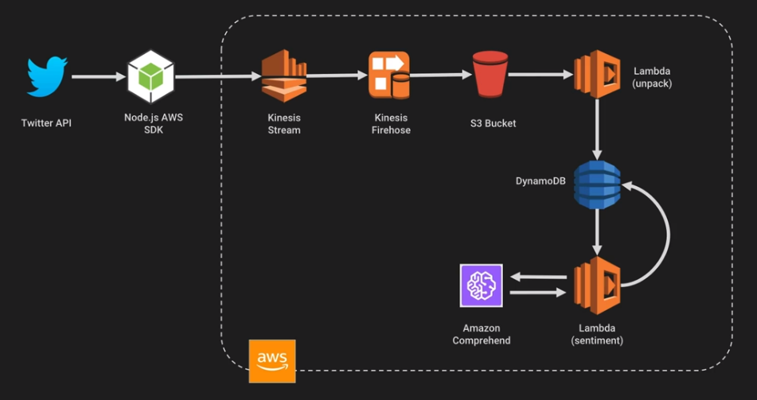

## To learn

| Service| Done |
| ------ | ---- |
| AWS Storage Gateway | &#9745; |
| Dynamo DB Global or Secondary indexes | &#9745; |
| Dynamo DB partition or sort key | &#9745; |
| What is NoSQL | &#9745; |
| AWS Compute Optimizer | &#9745; |
| AWS S3 Storage Lens | &#9745; |
| EC2 Instance fleets | &#9745; |
| ASG scaling methods (simple etc) | &#9745; |
| AWS VPC Gateway Endpoints | &#9745; |
| Kineses | &#9745; |
| Application portfolio assessment | &#9745; |
| Service Catalog Constraints | &#9745; |

Done - &#9745; <br>
Not done - &#9744;

## AWS Storage Gateway

AWS Storage Gateway is a set of hybrid cloud storage services that provide on-premises low latency access to virtually unlimited cloud storage.

Offerings:

- File Gateway
- Tape Gateway
- Volume Gateway

Fully Managed Cache: The local gateway appliance maintains a cache of recently written or read data so your applications can have low-latency access to data that is stored durably in AWS. The gateways use a read-through and write-back cache, committing data locally, acknowledging the write operations, and then asynchronously copying data to AWS, reducing application latency.

### AWS File Gateway

#### AWS S3 File Gateway


Amazon S3 File Gateway presents a file interface that enables you to store files as objects in Amazon S3 using the industry-standard NFS and SMB file protocols, and access those files via NFS and SMB from your data center or Amazon EC2, or access those files as objects directly in Amazon S3

#### AWS FSx File Gateway


Amazon FSx File Gateway provides fast, low-latency on-premises access to fully managed, highly reliable, and scalable file shares in the cloud using the industry-standard SMB protocol. Customers can store and access file data in Amazon FSx with Windows-native compatibility including full NTFS support, shadow copies, and Access Control Lists (ACLs).

### Tape Gateway


Back up and archive on-premises data to virtual tapes on AWS using your network. Use Tape Gateway to replace physical tapes on premises with virtual tapes on AWS—reducing your data storage costs without changing your tape-based backup workflows. Tape Gateway supports all leading backup applications and caches virtual tapes on premises for low-latency data access. It compresses your tape data, encrypts it, and stores it in a virtual tape library in Amazon Simple Storage Service (Amazon S3). From there, you can transfer it to either Amazon S3 Glacier Flexible Retrieval or Amazon S3 Glacier Deep Archive to help minimize your long-term storage costs.

### Volume Gateway

Volume Gateway presents cloud-backed iSCSI block storage volumes to your on-premises applications. Volume Gateway stores and manages on-premises data in Amazon S3 on your behalf and operates in either cache mode or stored mode. In the cached Volume Gateway mode, your primary data is stored in Amazon S3, while retaining your frequently accessed data locally in the cache for low latency access. In the stored Volume Gateway mode, your primary data is stored locally and your entire dataset is available for low latency access on premises while also asynchronously getting backed up to Amazon S3.


## DynamoDB

### DynamoDB Primary Keys

You need a Primary Key on every row of your DynamoDB table and it has to be unique.

#### Partition Key

`Partition key`: A simple primary key, composed of one attribute known as the partition key. Attributes in DynamoDB are similar in many ways to fields or columns in other database systems.

Example would be `OrderID` as the `Partition Key` in the table below:

| OrderID | CustomerID | State | TotalAmount |
| ------- | ---------- | ----- | ----------- |
| 1 | CID-100 | SHIPPED | 3200 |
| 2 | CID-101 | DELIVERED | 700 |
| 3 | CID-100 | SHIPPED | 3 |
| 4 | CID-102 | DELIVERED | 12 |

The below is a table named 'People'.

```JSON
{
    "PersonID": 101,
    "LastName": "Smith",
    "FirstName": "Fred",
    "Phone": "555-4321"
}

{
    "PersonID": 102,
    "LastName": "Jones",
    "FirstName": "Mary",
    "Address": {
                "Street": "123 Main",
                "City": "Anytown",
                "State": "OH",
                "ZIPCode": 12345
    }
}

{
    "PersonID": 103,
    "LastName": "Stephens",
    "FirstName": "Howard",
    "Address": {
                "Street": "123 Main",
                "City": "London",                                    
                "PostalCode": "ER3 5K8"
    },
    "FavoriteColor": "Blue"
}
```

- Each item in the table has a unique identifier, or primary key, that distinguishes the item from all of the others in the table. In the People table, the `primary key` consists of one attribute (`PersonID`).
- Some of the items have a nested attribute (`Address`). DynamoDB supports nested attributes up to 32 levels deep.

#### Partition Key and Sort Key

`Partition key and sort key`: Referred to as a `composite primary key`, this type of key is composed of two attributes. The first attribute is the partition key, and the second attribute is the sort key. All data under a partition key is sorted by the sort key value.

The following is an example table named Music that you could use to keep track of your music collection:

```JSON
{
    "Artist": "No One You Know",
    "SongTitle": "My Dog Spot",
    "AlbumTitle": "Hey Now",
    "Price": 1.98,
    "Genre": "Country",
    "CriticRating": 8.4
}

{
    "Artist": "No One You Know",
    "SongTitle": "Somewhere Down The Road",
    "AlbumTitle": "Somewhat Famous",
    "Genre": "Country",
    "CriticRating": 8.4,
    "Year": 1984
}

{
    "Artist": "The Acme Band",
    "SongTitle": "Still in Love",
    "AlbumTitle": "The Buck Starts Here",
    "Price": 2.47,
    "Genre": "Rock",
    "PromotionInfo": {
        "RadioStationsPlaying": {
            "KHCR",
            "KQBX",
            "WTNR",
            "WJJH"
        },
        "TourDates": {
            "Seattle": "20150622",
            "Cleveland": "20150630"
        },
        "Rotation": "Heavy"
    }
}

{
    "Artist": "The Acme Band",
    "SongTitle": "Look Out, World",
    "AlbumTitle": "The Buck Starts Here",
    "Price": 0.99,
    "Genre": "Rock"
} 
```

The `primary key` for Music consists of `two attributes` (Artist and SongTitle). Each item in the table must have these two attributes. The combination of Artist and SongTitle distinguishes each item in the table from all of the others.

In a table that has a partition key and a sort key, it's possible for multiple items to have the same partition key value. However, those items must have different sort key values.

### DynamoDB Global or Secondary Index

You can create one or more secondary indexes on a table. A secondary index lets you query the data in the table using an alternate key, in addition to queries against the primary key. DynamoDB doesn't require that you use indexes, but they give your applications more flexibility when querying your data. After you create a secondary index on a table, you can read data from the index in much the same way as you do from the table.

DynamoDB supports two kinds of indexes:

- `Global secondary index` – An `index` with a `partition key` and `sort key` that can be different from those on the table.
- `Local secondary index` – An `index` that has the same `partition key` as the table, but a different `sort key`.

Each table in DynamoDB has a quota of 20 global secondary indexes (default quota) and 5 local secondary indexes.

Creating a Global Secondary Index creates a copy of the Primary table using the new partition key and keeps the two tables in sync.

If you have 1 Primary table and 5 Global Secondary Indexes, one write to the table actually equates to 5 as the changes have to be written to the GSIs.

You can only define a Local Secondary Index at the time of creating the table.

The following diagram shows the example `Music` table, with a new index called `GenreAlbumTitle`. In the index, `Genre` is the `partition key` and `AlbumTitle` is the `sort key`.

| Music Table | GenreAlbumTitle  |
| ----------- | ---------------- |
| <pre lang="json">{<br>  "Artist": "No One You Know",<br>  "SongTitle": "My Dog Spot",<br>  "AlbumTitle": "Hey Now",<br>  "Price": 1.98,<br>  "Genre": "Country",<br>  "CriticRating": 8.4<br>}</pre> | <pre lang="json">{<br>    "Genre": "Country",<br>    "AlbumTitle": "Hey Now",<br>    "Artist": "No One You Know",<br>    "SongTitle": "My Dog Spot"<br>}</pre> |
| <pre lang="json">{<br>    "Artist": "No One You Know",<br>    "SongTitle": "Somewhere Down The Road",<br>    "AlbumTitle": "Somewhat Famous",<br>    "Genre": "Country",<br>    "CriticRating": 8.4,<br>    "Year": 1984<br>}</pre> | <pre lang="json">{<br>    "Genre": "Country",<br>    "AlbumTitle": "Somewhat Famous",<br>    "Artist": "No One You Know",<br>    "SongTitle": "Somewhere Down The Road"<br>}</pre> |
| <pre lang="json">{<br>    "Artist": "The Acme Band",<br>    "SongTitle": "Still in Love",<br>    "AlbumTitle": "The Buck Starts Here",<br>    "Price": 2.47,<br>    "Genre": "Rock",<br>    "PromotionInfo": {<br>        "RadioStationsPlaying": {<br>            "KHCR",<br>            "KQBX",<br>            "WTNR",<br>            "WJJH"<br>        },<br>        "TourDates": {<br>            "Seattle": "20150622",<br>            "Cleveland": "20150630"<br>        },<br>        "Rotation": "Heavy"<br>    }<br>}</pre> | <pre lang="json">{<br>    "Genre": "Rock",<br>    "AlbumTitle": "The Buck Starts Here",<br>    "Artist": "The Acme Band",<br>    "SongTitle": "Still In Love"<br>}</pre> |
| <pre lang="json">{<br>    "Artist": "The Acme Band",<br>    "SongTitle": "Look Out, World",<br>    "AlbumTitle": "The Buck Starts Here",<br>    "Price": 0.99,<br>    "Genre": "Rock"<br>}</pre> | <pre lang="json">{<br>    "Genre": "Rock",<br>    "AlbumTitle": "The Buck Starts Here",<br>    "Artist": "The Acme Band",<br>    "SongTitle": "Look Out, World"<br>}</pre> |

| Index type | Description | Remember |
| ---------- | ----------- |--------- |
| Global Secondary Index | Partition key and sort key can be different from those on the table | Not restriced to just the partitioning set forth by the partition key, global |
| Local Secondary Index | Same partition key as the table but different sort key | Have to stay local and respect the tables partition key but can choose whatever sort key I want |

| Index type | When to use | Example |
| ---------- | ----------- |-------- |
| Global Secondary Index | When you want a fast query of attributes outside of the primary key | "I'd like to query sales orders by customer number rather than sales order number" |
| Local Secondary Index | When you already know the partition key and want to quickly query on another attribute | "I have the sales order number but I'd like to retrieve only those records with a certain Material number" |

You can query the GenreAlbumTitle index to find all albums of a particular genre (for example, all Rock albums). You can also query the index to find all albums within a particular genre that have certain album titles (for example, all Country albums with titles that start with the letter H).

```JSON
{
    "salesordernum" : "12346435",
    "timestamp" : "22-10-2023",
    "salesorder" : {
        "salesordertytpe" : "schedule",
        "materialnum" : "123217856"
    },
    "customer" : {
        "customernum" : "234235",
        "customername" : "Jimbob"
    }
}
```

If you created a Global Secondary Index using `customernum` you could query by Customer Number at light-speed.

If you created a Local Secondary Index using `materialnum` you could query bu Sales Order Number and Material Number at light-speed.

Attribute projections are attributes projected into an index, ie:

- customernum (key)
- customername
- salesordernum
- timestamp
- materialnum

You can also create a `replica` table by creating a `Global secondary index` using the same `partition key` and `sort key`. A use case for this would be if you wanted the same set of data present to higher and lower tier customers, you can set higher RCU/WCU limits for the higher tier customers.


### DynamoDB RCU and WCUs

The read/write capacity mode controls how you are charged for read and write throughput and how you manage capacity. You can set the read/write capacity mode when creating a table or you can change it later.

Secondary indexes inherit the read/write capacity mode from the base table.

For on-demand mode tables, you don't need to specify how much read and write throughput you expect your application to perform.

#### Read Requests

DynamoDB read requests can be either strongly consistent, eventually consistent, or transactional.

- A strongly consistent read request of an item up to 4 KB requires one read request unit.
- An eventually consistent read request of an item up to 4 KB requires one-half read request unit.
- A transactional read request of an item up to 4 KB requires two read request units.

If you need to read an item that is larger than 4 KB, DynamoDB needs additional read request units. The total number of read request units required depends on the item size, and whether you want an eventually consistent or strongly consistent read. For example, if your item size is 8 KB, you require 2 read request units to sustain one strongly consistent read, 1 read request unit if you choose eventually consistent reads, or 4 read request units for a transactional read request.

#### Write Requests

One write request unit represents one write for an item up to 1 KB in size. If you need to write an item that is larger than 1 KB, DynamoDB needs to consume additional write request units. Transactional write requests require 2 write request units to perform one write for items up to 1 KB. The total number of write request units required depends on the item size. For example, if your item size is 2 KB, you require 2 write request units to sustain one write request or 4 write request units for a transactional write request.

### DynamoDB Capacity

#### Provisioned Capacity

Allocate limits for your RCUs and WCUs. Provisioned throughput is the maximum amount of capacity that an application can consume from a table or index. If your application exceeds your provisioned throughput capacity on a table or index, it is subject to request throttling.

For example the below usage graph you can see the usage patterns and the red line shows what you have provisioned and are paying for:


You can see within the same graph that the red part shows provisioned resource that isn't being consumed but is being paid for:


You can use Autoscaling to dynamically change provisioned limits (the red line) to keep costs down.

Considerations:

- Capacity can be wasted
- Autoscaling can minimise waste but it can take a while to scale up.

`Best suited for consistend or predictable traffic patterns.`

#### On Demand Capacity

There's no limits, you pay by request.

Considerations:

- Don't need to worry about throttling
- Don't need to worry about scaling and usage monitoring

`Best suited for unpredictable or random traffic patterns.`

### DynamoDB scaling

Two ways to scale DynamoDB

- Throughput - based on RCU and WCUs
- Size - based on the storage size of data (max item is 400kb)


- Partition - a physical space where DynamoDB data is stored
- Partition key - a Unique identifier for each record, sometimes known as a Hash key
- Sort key - In combination with the partition key, optional second part of a composite key that defines storage order

Formula to decide on how many partitions are in a table:

| Method | Calculation | Note |
| ------ | ----------- | ---- |
| By Capacity | (Total RCU / 3000) + (Total WCU / 1000) | How many read units and write units are provisioned |
| By Size | Total Size / 10GB | Number of 10GB chunks the data takes up |
| Total Partitions | Round Up for the MAX (By Capacity, By Size) | The max of either of the above |

Example:

- 2000 RCUs
- 2000 WCUs
- 10GB Data

| Method | Calculation | Value |
| ------ | ----------- | ----- |
| By Capacity | (2000 / 3000) + (2000 / 1000) | 2.66 |
| By Size | Total Size / 10GB | 1 |
| Total Partitions | Round Up for the MAX (By Capacity, By Size) | 2.66 - So 3 partitions |

If you use say the Date as the partition key, and there's a lot of read/writes for that particular day then you end up with a `Hot partition` in that all traffic is only hitting the one partition:


A good idea would be to  use the sensor_id as the partition key which distributes the data across multiple partitions, and then use the date as the sort key.


### DynamoDB Streams

A DynamoDB feature that creates an event when record modifications occur on a table.

Three event types:

- INSERT
- UPDATE
- REMOVE

The events have the content of the row being modified so you can see before/after to see what changed on the data.

Events are in the same order of modifications.

Lambda can be triggered off events.

Use cases:

- Real time dashboards
- Scoreboards which update when changes are made

### NoSQL

Not only SQL.

SQL:

- Structured Query Language.
- Table based
- Vertically scalable (increase size)

NoSQL:
- Document
- Key/Value
- Graph
- Wide column stores.
- Horizontally scalable (add more instances)

SQL databases are relational, and NoSQL databases are non-relational. SQL databases use structured query language (SQL) and have a predefined schema. NoSQL databases have dynamic schemas for unstructured data. SQL databases are vertically scalable, while NoSQL databases are horizontally scalable.

NoSQL can shard the data across different datastores due to it being non-structured.

### ACID

- Atomic - all or nothing transactions
- Consistency - data is valid before and after
- Isolation - multiple transactions at the same time
- Durability - committed data is never lost

## AWS Compute Optimizer

AWS Compute Optimizer helps avoid overprovisioning and underprovisioning four types of AWS resources:

- Amazon Elastic Compute Cloud (EC2) instance types
- Amazon Elastic Block Store (EBS) volumes
- Amazon Elastic Container Service (ECS) services on AWS Fargate
- AWS Lambda functions—based on your utilization data.


## AWS S3 Storage Lens

Amazon S3 Storage Lens is a cloud-storage analytics feature that you can use to gain organization-wide visibility into object-storage usage and activity.

You can use S3 Storage Lens metrics to:

- Generate summary insights, such as finding out how much storage you have across your entire organization or which are the fastest-growing buckets and prefixes.
- Identify cost-optimization opportunities
- Implement data-protection and security best practices
- Improve the performance of application workloads.

For example, you can identify buckets that don't have S3 Lifecycle rules to expire incomplete multipart uploads that are more than 7 days old. You can also identify buckets that aren't following data-protection best practices, such as using S3 Replication or S3 Versioning. S3 Storage Lens also analyzes metrics to deliver contextual recommendations that you can use to optimize storage costs and apply best practices for protecting your data.

!!! note
    Advanced metrics come at a cost.<br>
    Advanced metrics are detailed status code metrics, advanced cost and advanced data protection.


Can also look at 403 errors to see where applications are attempting to hit files where permissions aren't set for the application correctly.

## EC2 Instance fleets

An EC2 Fleet contains the configuration information to launch a fleet—or group—of instances. In a single API call, a fleet can launch multiple instance types across multiple Availability Zones, using the On-Demand Instance, Reserved Instance, and Spot Instance purchasing options together.

Using EC2 Fleet, you can:

- Define separate `On-Demand` and `Spot` capacity targets and the maximum amount you’re willing to pay per hour
- Specify the instance types that work best for your applications
- Specify how Amazon EC2 should distribute your fleet capacity within each purchasing option

You can also set a maximum amount per hour that you’re willing to pay for your fleet, and EC2 Fleet launches instances until it reaches the maximum amount. When the maximum amount you're willing to pay is reached, the fleet stops launching instances even if it hasn’t met the target capacity.

You now have an option to modify instance types and weights for a running EC2 Fleet or Spot Fleet (referred to further as fleet). You can replace an entire launch template configuration specifying new instance types, weights, and other parameters without deleting and re-creating a fleet.

You can have multiple pools and the fleet will choose the best way to implement depending on the strategy you define.

Spot Fleet strategies:

- `CapacityOptimised` - Spot instances come from the pool with optimal capacity for the number of instances running
- `LowestPrice` - Spot instances come from the pool with the lowest price, this is the default strategy
- `Diversified` - Spot instances are distributed across all pools
- `InstancePoolsToUseCount` - Spot instances are distributed across pools, only valid with `LowestPrice`

## ASG scaling methods

- Maintain
- Manual
- Schedule
- Dynamic

### Dynamic scaling

Dynamic scaling scales the capacity of your Auto Scaling group as traffic changes occur.

Amazon EC2 Auto Scaling supports the following types of dynamic scaling policies.

If you are scaling based on a metric that increases or decreases proportionally to the number of instances in an Auto Scaling group, we recommend that you use target tracking scaling policies. Otherwise, we recommend that you use step scaling policies.

| Scaling | What | When |
| ------- | ---- | ---- |
| Target Tracking Policy | Scale based on a predefined or custom metric in relation to a target value | When CPU utilisation gets to 70% on current instances, scale up |
| Simple Scaling Policy | Waits until health check and cool down period expires before evaluating new need | Let's add new instances slow and steady |
| Step Scaling Policy | Responds to scaling needs with more sophistication and logic | Add all the instances |

#### Target tracking scaling

`Target tracking scaling` — Increase and decrease the current capacity of the group based on a Amazon CloudWatch metric and a target value. It works similar to the way that your thermostat maintains the temperature of your home—you select a temperature and the thermostat does the rest. E.G., keep your average aggregate CPU usage of your ASG at 70%.

For example, let's say that you currently have an application that runs on two instances, and you want the CPU utilization of the Auto Scaling group to stay at around 50 percent when the load on the application changes. This gives you extra capacity to handle traffic spikes without maintaining an excessive number of idle resources.

You can meet this need by creating a target tracking scaling policy that targets an average CPU utilization of 50 percent. Then, your Auto Scaling group scales the number of instances to keep the actual metric value at or near 50 percent.

!!! note
    We strongly recommend that you use a target tracking scaling policy to scale on a metric like average CPU utilization or the RequestCountPerTarget metric from the Application Load Balancer

#### Step scaling

`Step scaling` — Increase and decrease the current capacity of the group based on a set of scaling adjustments, known as step adjustments, that vary based on the size of the alarm breach. Step scaling methods don't have a cooldown period.

Step scaling policies and simple scaling policies are two of the dynamic scaling options available for you to use. Both require you to create CloudWatch alarms for the scaling policies. Both require you to specify the high and low thresholds for the alarms. Both require you to define whether to add or remove instances, and how many, or set the group to an exact size.

The main difference between the policy types is the step adjustments that you get with step scaling policies. When step adjustments are applied, and they increase or decrease the current capacity of your Auto Scaling group, the adjustments vary based on the size of the alarm breach.

!!! note
    In most cases, step scaling policies are a better choice than simple scaling policies, even if you have only a single scaling adjustment.

#### Simple scaling

`Simple scaling` — Increase and decrease the current capacity of the group based on a single scaling adjustment, with a cooldown period between each scaling activity.

## AWS VPC Endpoints

A VPC endpoint enables customers to privately connect to supported AWS services and VPC endpoint services powered by AWS PrivateLink.

VPC endpoints are virtual devices. They are horizontally scaled, redundant, and highly available Amazon VPC components that allow communication between instances in an Amazon VPC and services without imposing availability risks or bandwidth constraints on network traffic. There are two types of VPC endpoints:

- Interface endpoints
- Gateway endpoints


### Interface endpoints

Interface endpoints enable connectivity to services over AWS PrivateLink. These services include some AWS managed services, services hosted by other AWS customers and partners in their own Amazon VPCs (referred to as endpoint services), and supported AWS Marketplace partner services.

The following AWS services integrate with AWS PrivateLink. You can create a VPC endpoint to connect to these services privately, as if they were running in your own VPC.

There are a lot, some examples:

- Cloudformation
- Aurora
- ECS
- ECR
- Cloudwatch
- Codebuild
- etc

["AWS services that integrate with AWS PrivateLink"](https://docs.aws.amazon.com/vpc/latest/privatelink/aws-services-privatelink-support.html)

### Gateway endpoints

For the services:

- DynamoDB
- S3

A gateway endpoint targets specific IP routes in an Amazon VPC route table, in the form of a prefix-list, used for traffic destined to Amazon DynamoDB or Amazon Simple Storage Service (Amazon S3). Gateway endpoints do not enable AWS PrivateLink.

Instances in an Amazon VPC do not require public IP addresses to communicate with VPC endpoints, as interface endpoints use local IP addresses within the consumer Amazon VPC.

## Kinesis

Collection of services for processing streams of various data

Data is processed in `shards` which are able to ingest 1000 records per second each

A default limit of 500 shards is set but you can request an increase to unlimited

Data records ingested consist of:

- Partition key
- Sequence number
- Data blob (up to 1MB)

Not persistent storage, default retention is 25 hours, can be configured to 365 days but should be used for transient storage moving data to another service to be ingested

### Kinesis Data streams

Ingest high volume of data and process it in a number of ways


### Kinesis Firehouse

Prepares and loads the data to a destination of choice


### Kinesis Data analytics

Can run analytics on the data as it's coming in, can run standard SQL queries against the data streams

### Kinesis Shards

Like lanes in a motorway, the more lanes, the more traffic that can go through

Then you can either use applications to process the data in the streams or firehose to send that data to another service

### Kinesis Example

- Pull in tweets from Twitter API
- Send them to a Kinesis stream
- Kinesis firehose sends the data to an S3 bucket
- Lambda parses the data and stores it in DynamoDB



## Application portfolio assessment

Long-running cloud migration programs require the coordination of several workstreams such as program governance, landing zone (an operative target environment with security controls), migration, and application portfolio.

- Portfolio discovery and initial planning
- Prioritized applications assessment
- Portfolio analysis and migration planning
- Continuous assessment and improvement


## Service Catalog Constraints

Constraints restrict the ways that specific AWS resources can be deployed for a product. You can use them to apply limits to products for governance or cost control. There are two types of constraints: template and launch. Template constraints restrict the configuration parameters that are available for the user when launching the product (for example, EC2 instance types or IP ranges). Template constraints allow you to reuse generic infrastructure as code (IaC) templates for products and apply restrictions to the templates on a per-product or per-portfolio basis. Launch constraints allow you to specify a role for a product in a portfolio. This role is used to provision the resources at launch, so you can restrict user permissions without impacting users’ ability to provision products from the catalog.

Constraints:

- Launch Constraints
- Template Constraints

### Launch Constraints

A launch constraint specifies the AWS Identity and Access Management (IAM) role that AWS Service Catalog assumes when an end user launches, updates, or terminates a product.

Launch constraints apply to products in the portfolio (product-portfolio association). Launch constraints do not apply at the portfolio level or to a product across all portfolios.

Without a launch constraint, end users must launch and manage products using their own IAM credentials.

### Template Constraints

To limit the options that are available to end users when they launch a product, you apply template constraints. Apply template constraints to ensure that the end users can use products without breaching the compliance requirements of your organization. You apply template constraints to a product in a AWS Service Catalog portfolio. A portfolio must contain one or more products before you can define template constraints.

A template constraint consists of one or more rules that narrow the allowable values for parameters that are defined in the product's underlying AWS CloudFormation template. The parameters in an AWS CloudFormation template define the set of values that users can specify when creating a stack. For example, a parameter might define the various instance types that users can choose from when launching a stack that includes EC2 instances.

### Service Actions

Using service actions, you can enable end users to perform operational tasks, troubleshoot issues, run approved commands, or request permissions in AWS Service Catalog on your provisioned products, without needing to grant end users full access to AWS services. You use AWS Systems Manager documents to define service actions. The AWS Systems Manager documents provide access to pre-defined actions that implement AWS best practices, such as Amazon EC2 stop and reboot, and you can define custom actions too.

## Multicast

Multicast is a communication protocol used for delivering a single stream of data to multiple receiving computers simultaneously. Transit Gateway supports routing multicast traffic between subnets of attached VPCs, and it serves as a multicast router for instances sending traffic destined for multiple receiving instances.

## Cognito

The two main components of Amazon Cognito are user pools and identity pools. User pools are user directories that provide sign-up and sign-in options for your web and mobile app users. Identity pools provide AWS credentials to grant your users access to other AWS services.

### User Pool

A user pool is a user directory in Amazon Cognito. Your app users can sign in either directly through a user pool, or federate through a third-party identity provider (IdP). The user pool manages the overhead of handling the tokens that are returned from social sign-in through Facebook, Google, Amazon, and Apple, and from OpenID Connect (OIDC) and SAML IdPs. Whether your users sign in directly or through a third party, all members of the user pool have a directory profile that you can access through an SDK.

### Identity Pool

With an identity pool, your users can obtain temporary AWS credentials to access AWS services, such as Amazon S3 and DynamoDB. Identity pools support anonymous guest users, as well as federation through third-party IdPs.

## Step Function Workflows

AWS Step Functions is a serverless orchestration service that lets you integrate with AWS Lambda functions and other AWS services to build business-critical applications. Through Step Functions' graphical console, you see your application’s workflow as a series of event-driven steps.

Step Functions has two workflow types. Standard workflows have exactly-once workflow execution and can run for up to one year. This means that each step in a Standard workflow will execute exactly once. Express workflows, however, have at-least-once workflow execution and can run for up to five minutes. This means that one or more steps in an Express Workflow can potentially run more than once, while each step in the workflow executes at least once.

Standard workflows are ideal for long-running, auditable workflows, as they show execution history and visual debugging. Express workflows are ideal for high-event-rate workloads, such as streaming data processing and IoT data ingestion.

## SQS Visibility timeout and message retention

When a consumer receives and processes a message from a queue, the message remains in the queue. Amazon SQS doesn't automatically delete the message. Because Amazon SQS is a distributed system, there's no guarantee that the consumer actually receives the message (for example, due to a connectivity issue, or due to an issue in the consumer application). Thus, the consumer must delete the message from the queue after receiving and processing it. If the consumer fails to process and delete the message before the visibility timeout expires, the message becomes visible to other consumers.


Immediately after a message is received, it remains in the queue. To prevent other consumers from processing the message again, Amazon SQS sets a visibility timeout, a period of time during which Amazon SQS prevents all consumers from receiving and processing the message. The default visibility timeout for a message is 30 seconds.

Amazon SQS supports dead-letter queues (DLQ), which other queues (source queues) can target for messages that can't be processed (consumed) successfully. Dead-letter queues are useful for debugging your application or messaging system because they let you isolate unconsumed messages to determine why their processing didn't succeed.

## AWS Glue / DMS / Data pipeline

`AWS Glue` is a fully managed extract, transform, and load (ETL) service that simplifies data preparation and integration. Glue offers automated data discovery, cataloging, and schema inference, making it an excellent choice for data lakes and data warehousing projects.

!!! note
    Use Glue to extract data from various sources, transform it into a common format, and load it into an AWS Redshift data warehouse for analytics purposes.

`AWS DataPipeline` is an orchestration service that helps you define, schedule, and manage complex data processing workflows. It allows you to combine various AWS services and third-party applications to build end-to-end data processing pipelines.

!!! note
    Use DataPipeline to schedule regular data imports from an S3 bucket to a Redshift cluster, perform data transformations using Glue, and trigger an AWS Lambda function for further processing or notifications.

`AWS EMR` is a managed big data processing service that uses Apache Hadoop and Spark to process large volumes of data.

!!! note
    Use EMR to process large-scale clickstream data, perform real-time analytics using Spark, and store the aggregated results in an S3 bucket for further analysis.

`AWS DMS` is a fully managed service that helps migrate, replicate, and continuously capture data changes between different databases

!!! note
    Use DMS to migrate data from an on-premises Oracle database to an Amazon RDS instance, ensuring data consistency and minimal downtime.

## IOSP vs Throughput


For low latency you want to use IOPS and for large data sets you want to use Throughput.

## Instance Store Backed EC2

An instance store provides temporary block-level storage for your instance.

This is different to EBS backed instances.

There are no EBS volumes in the EC2 > Storage section of the console.

You cannot unattach the volumes as they are connected physically on the EC2 instance.

This is useful for low latency.

The instance cannot be stopped, it can only be rebooted or terminated.

Useful for instances with ephemeral storage such as caches, buffers, temporary content.

You cannot resize the instance.

Backups have to be done manually by copying the data off the volume.

## AWS Macie

Amazon Macie is a data security service that uses machine learning (ML) and pattern matching to discover and help protect your sensitive data.

Reviews and suggests changes based on use determined by machine learning:

- S3 bucket encryption
- S3 bucket public access
- S3 bucket shared permissions

## AWS Outposts

AWS Outposts is a family of fully managed solutions delivering AWS infrastructure and services to virtually any on-premises or edge location for a truly consistent hybrid experience. Outposts solutions allow you to extend and run native AWS services on premises, and is available in a variety of form factors, from 1U and 2U Outposts servers to 42U Outposts racks, and multiple rack deployments.

### S3 Outposts

Amazon S3 on Outposts delivers object storage to your on-premises AWS Outposts environment to meet local data processing and data residency needs. Using the S3 APIs and features, S3 on Outposts makes it easy to store, secure, tag, retrieve, report on, and control access to the data on your Outpost.

## API Gateway

- First you create a `Resource` for example `/transactions`
- Then you create a `Method` for example `GET`
- Then you create your `Integration` for example a `Lambda Function`

!!! note
    In `Lambda proxy integration`, when a client submits an API request, API Gateway passes to the integrated Lambda function an event object, except that the order of the request parameters is not preserved. This request data includes the request headers, query string parameters, URL path variables, payload, and API configuration data. The configuration data can include current deployment stage name, stage variables, user identity, or authorization context (if any). The backend Lambda function parses the incoming request data to determine the response that it returns.

Then you deploy the API gateway into a `Stage` for example `Development`

## Cognito

### Basic flow

- To generate or retrieve a user identity in the identity pool, call the `GetId` API
- To retrieve the open ID token, use the result from step 2 to call the `GetOpenIdToken` API.
- To retrieve the temporary credentials of the authenticated role, use the token from step 3 to call the `AssumeRoleWithWebIdentity` API.


### Enhanced flow

- To generate or retrieve a user identity in the identity pool, call the `GetId` API
- To retrieve temporary credentials from the identity pool, call the `GetCredentialsForIdentity` API.


!!! note
    When calling `GetCredentialsForIdentity`, Amazon Cognito is actually making the call to `AssumeRoleWithWebIdentity` on your behalf

!!! note
    If you created an identity pool after February 2015 and used the supplied example code, you are already using the enhnaced flow.

For most customers, the enhanced flow is the correct choice, it offers many benefits over the basic flow:

- One less network call to get credentials on the device.
- All calls are made to Amazon Cognito, meaning it is also one less network connection.
- Roles no longer need to be embedded in your application, only an identity pool id and region are necessary to start bootstrapping credentials.
