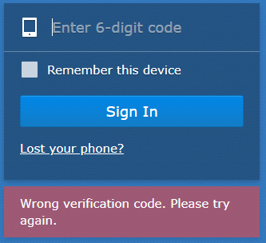

# Resolving 2FA on Synology NAS

If you get the below error it is likely the time between either your NAS or 2FA device is out of sync.

You can confirm whether it is the NAS with a time sync error by updating the time sync on your 2FA device, for example on Google authenticator you can go to:

`Settings > Time correction for codes > Sync now`.

To sync the time for your NAS you will need to SSH onto the box and run the below as root:

`ntpdate -u time.google.com`
