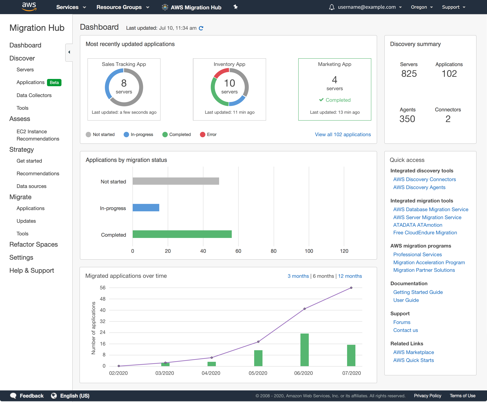

## Migrations

### Design Solutions for Organisational Complexity

- Data backup and restoration

### Design for new solutions

- AWS Storage services (S3, RDS, Elasticache)
- Data transfer costs

### Continuous Improvement for Existing Solutions

- Backup practices and methods
- Data replication

### Accelerate Workload Migration and Modernisation

- Migration assessment and tools
- Application migration tools (AWS Application discovery service, application migration service)

## Migration Hub

- Leverages `Application discovery service` to analyse and groups servers
- Gives instance recommendations to help right-size
- Provides situational migration strategy best practice
- Keeps track of lift and shift

## Application Migration Service (MGN)

- Migrates windows and linux servers to AWS cloud
- Source can be on-prem, AWS or other cloud providers
- Allows for test environment

Can be used to migrate from one region to another.

## Database migration service

- Used to migrate source relational databases to RDS, Aurora or EC2 instance

## AWS Transfer Family

Transfer files to and from EFS

- Multi-AZ for HA
- Uses SFTP, FTP, FTPS and AS2 for file protocols

## Quiz

You have decided to migrate your on-premises legacy Informix database to Amazon Aurora. How might this be facilitated most efficiently?

- Manually create the target schema on Aurora and then use Data Pipeline with JDBC to move the data.

!!! note
    Informix is not supported by either the Data Migration Service or Schema Conversion Tool, so the only choice among these options is manually creating the schema and using Data Pipeline with JDBC to move the data.

Which of the following are valid use cases for AWS Migration Hub?

- Consolidating and visualizing migration progress in a single dashboard
- Tracking the progress of multiple migrations across AWS services

!!! note
    AWS Migration Hub provides a single dashboard to consolidate and visualize migration progress, making it easier to monitor and manage multiple migrations.

You are evaluating a technical migration plan for a customer. Which of the following project assumptions is incorrect?

- We can use AWS Server Migration Service to replicate Linux, Windows, and Solaris VMs, syncing volumes and creating periodic AMIs

!!! note
    Sun Solaris is not a supported OS for AWS, and thus not able to be migrated using AWS SMS.

What is the key difference between AWS DataSync and AWS Storage Gateway?

- AWS DataSync is used for online data transfer between on-premises storage systems and AWS, while Storage Gateway is a hybrid cloud storage service that integrates on-premises environments with cloud storage.

!!! note
    AWS DataSync focuses on transferring data between on-premises storage systems and AWS, whereas AWS Storage Gateway provides a hybrid cloud storage solution that enables on-premises applications to seamlessly use AWS cloud storage.

Which of the following steps are necessary when migrating an application using the AWS Application Migration Service?

- Configure the target infrastructure using the Application Migration Service Console.
- Install the AWS Replication Agent on the source servers.
- Perform a non-disruptive test to validate the migration.

!!! note
    Configuring the target infrastructure is a necessary step when using the Application Migration Service, as it sets up the required resources in the target environment. 
    Performing a non-disruptive test is a critical step in the migration process, as it validates the migration and ensures that the application will function correctly in the target environment. 
    Installing the AWS Replication Agent on the source servers is a required step, as it enables communication between the source servers and the Application Migration Service.

You are migrating from an Oracle on-premises database to an Oracle RDS database. Which of these describes this migration properly?

- Homogeneous migration

!!! note
    A homogeneous migration is when we migrate between the same type of databases.
