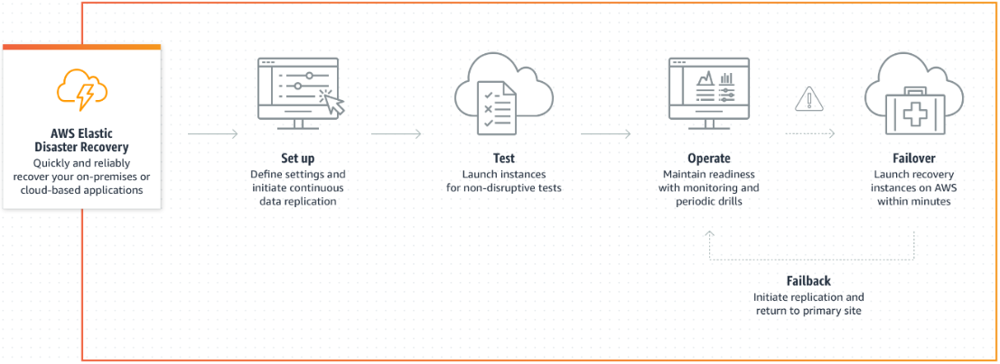
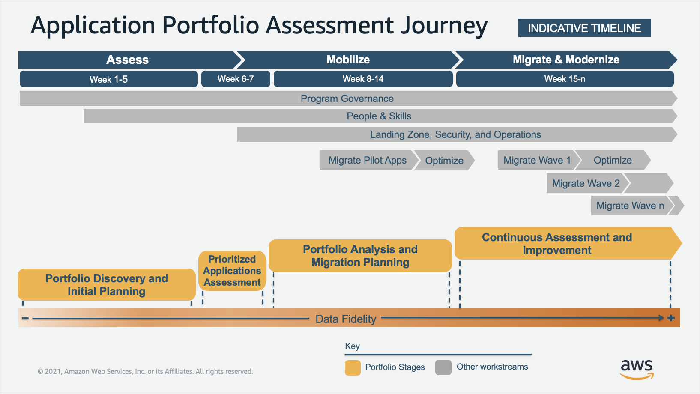
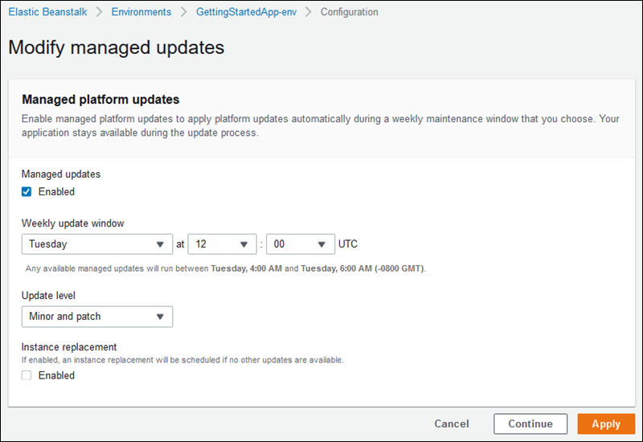

## Free Test

An international travel-booking service company that sees 100 million unique users monthly for their web app, has built and deployed its applications in Amazon EC2 behind Elastic Load Balancer (ELB). To manage the surge in traffic, EC2 instances are configured with Auto Scaling Groups.
To improve the user experience and resolve latency, downtime related issues for global customers, the company is looking for a cross-region traffic management solution to route user traffic to the optimal endpoint based on performance, user’s location, and instant reaction to the changes in application health.

- Place Amazon CloudFront in front of the ELB to enable edge location cache for low latency and better user experience.
- `Use AWS Global Accelerator in front of ELB to improve the availability, performance, and user experience.`

!!! note
    Global Accelerator uses edge locations to find an optimal pathway to the nearest regional endpoint.
___

An international media company uses an on-premises data center, which comprises over 300 servers to store and process its large amount of data for its clients spread across 100 countries. To achieve Disaster Recovery (DR), the company relies on a second nearby data center and replicates its full stack of physical tapes. The DR process is manual, requires a significant number of resources, and staff has to travel to the secondary data center to retrieve the correct tapes if a DR event occurs. The company wants to improve and automate its business unit’s DR to replicate and recover its workloads to achieve faster recovery and minimize data loss during a service interruption. The company hired you as a Solution Architect to guide them in this journey. What would you recommend here?

- `Set up AWS Elastic Disaster Recovery on your source servers to initiate secure data replication. Your data is replicated to a staging area subnet in your AWS account, in the AWS Region you select.`
- Replicate your on-premise data using AWS Storage Gateway and achieve hybrid cloud storage services that provide on-premises access to virtually unlimited cloud storage

!!! note
    AWS Storage Gateway is low latency storage option to connect on-prem to cloud storage. 
    AWS Elastic Disaster Recovery (AWS DRS) minimizes downtime and data loss with fast, reliable recovery of on-premises and cloud-based applications using affordable storage, minimal compute, and point-in-time recovery.

___

A Big Data company stores all its raw data in Amazon S3. Over a few days in every quarter of the calendar year, the petabyte-scale of data needs to be processed to the analytical platform. This processed data gets analyzed during Company’s Quarterly Business Review (QBR) meeting and again in the annual review meeting by the year-end. As part of this solution, they plan to run their S3 data through 10 nodes of the Amazon EMR cluster hosted on c5.xlarge EC2 instances and finally load the data to Amazon Redshift. You are a Solution Architect at the company, and the CTO tasked you to optimize the cost of the overall solution. Which of these will be your pick?

- Store the raw data in S3 Standard Infrequent Access, host the EMR cluster on EC2 On-Demand Instances and Reserved instance for Redshift.
- Use S3 Intelligent Tier to store the raw data, host the EMR cluster on EC2 On-Demand Instances and Reserved instances for Redshift.
- `Store the raw data in S3 Standard, host the EMR cluster on EC2 Spot Instances and Reserved instances for Redshift.`
- Store the raw data in  S3 Standard Infrequent Access, host the EMR cluster on EC2 Reserved Instances for EMR and Reserved instances for Redshift.

!!! note
    The EMR cluster which does the data processing is only used a few times a year so it's best to have this on Spot instances. 
    Redshift is used all year so can be reserved instances.

___

Which of the below activities are **Not** part of the Application Portfolio Assessment phase for AWS Cloud migration? (Select Two)

- Portfolio discovery and initial planning
- Prioritized applications assessment
- Portfolio analysis and migration planning
- `Establish cutover runbooks`
- `Creating Landing Zone`
- Continuous assessment and improvement

!!! note
    The below is the Application Portfolio Assessment: 
    - Portfolio discovery and initial planning 
    - Prioritized applications assessment 
    - Portfolio analysis and migration planning 
    - Continuous assessment and improvement

___

While prioritizing applications for migration to AWS, the focus is on establishing initial criteria to define workloads that are good candidates for pilot applications. Which one of these would define the highest priority application to migrate?

- Business Criticality = High, Number of compute instance = 11 or more, Migration Strategy = Refractor/Re-architect
- Business Criticality = High, Number of compute instance = 4-10, Migration Strategy = Relocate
- Business Criticality = Medium, Number of compute instance = 1-3, Migration Strategy = Replatform
- `Business Criticality = Low, Number of compute instance = 1-3, Migration Strategy = Rehost`

!!! note
    This stage of assessment focuses on establishing initial criteria to prioritize low-risk and low-complexity workloads. These workloads are good candidates for pilot applications.

___

A financial company is embarking on a journey to migrate its on-premises legacy applications to AWS. The company’s purpose of migration is to boost agility and improve business continuity; hence, they are talking about the decomposition of the monoliths to microservices. You are hired as a solution architect to help the company guide in the process of migration. After a few meetings with the business and tech team, you plan to use AWS serverless services to build the microservices.

Which migration strategy best suits this case?

- Relocate
- Replatform
- `Refactor`
- Rehost

!!! note
    Replatform is migrating with a few modifications, many applications can be easily fit to leverage Cloud native services. For example migrating your Database to RDS, this is changing the platform but not much else. 
    Refactor is is also known as Re-architect or “Decouple and Rewrite for Cloud”. This option entails the biggest investment - but yields the best returns. It is often driven by a strong business need for new features, performance, or the ability to scale.

___

You are working in a company as an AWS engineer. Your company uses a lot of Elastic Beanstalk applications on different platforms. Most of the Elastic Beanstalk environments do not enable platform updates. So, your team has to update the platforms during scheduled maintenance windows manually. You would like to enable managed platform updates through the Elastic Beanstalk console. Which of the following options do you need to configure for the managed platform updates? (Select TWO.)

- `The update level`
- The operating system
- `The weekly update period`
- Instance reboot
- Patch baseline from Systems Manager

!!! note
    Elastic Beanstalk platform updates are to provide fixes, software updates, and new features. With managed platform updates, you can configure your environment to automatically upgrade to the latest version of a platform during a scheduled maintenance window.

