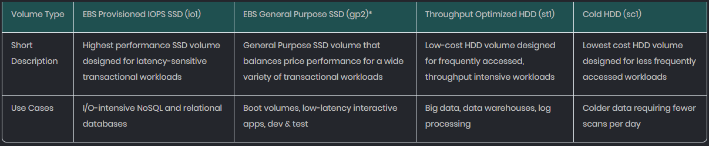
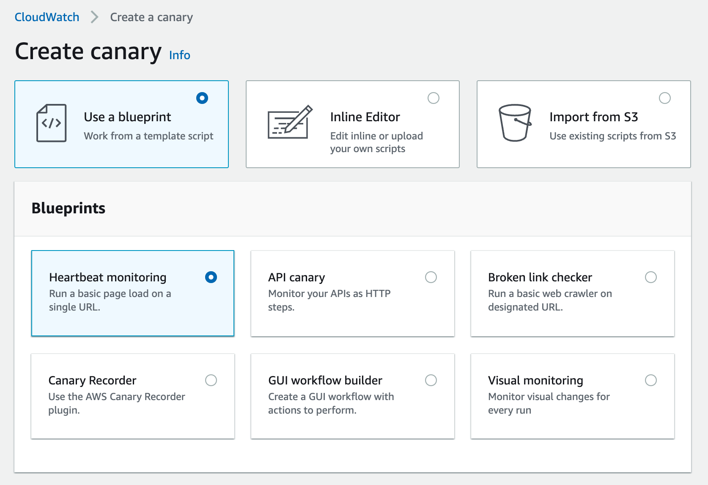
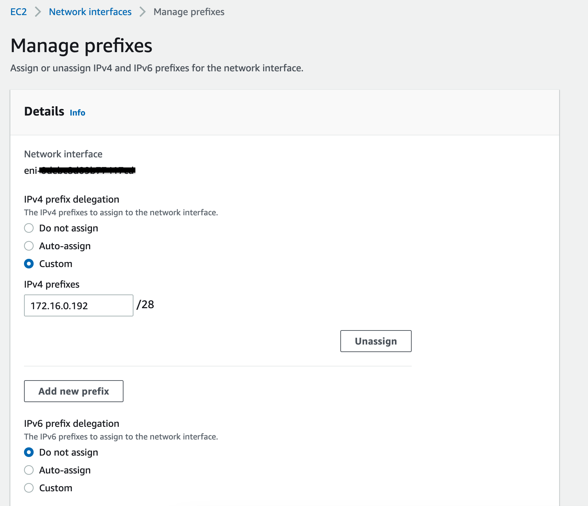

## Practice Test 3

You are an AWS consultant in an IT company. Your development manager just assigned you a task to evaluate if the EBS volume types of the EC2 instances were properly configured in all regions. The major concern that you have found is that almost all EBS volumes are using the Provisioned IOPS SSD (io1) volume type which costs the company a lot. You plan to change the volume type from io1 to other types. However, for which scenarios should you still use the EBS volume type of io1?

- `A Cassandra database that needs extremely low latency and high performance when being processed`
- A data warehouse server that contains a huge amount of customer data. The data needs to be accessed and analyzed by a monitor process frequently

!!! note
    Throughput is a measurement of bits or bytes per second that can be processed by a storage device. IOPS refers to the number of read/write operations per second.<br>
    Hence the Data Warehouse that requires large throughput is best suited for `Throughput Optimized HDD (st1)`<br>
    And the Cassandra database is a good candidate as it needs low latency.


___

AWS Lambda functions are widely used in your company by different teams. There is a requirement to extend the Lambda functions to integrate with other tools for monitoring, observability and security such as AppDynamics, HashiCorp, Splunk, etc. With the integration, some additional code needs to be run during function initialization, invocation or shut down. Which of the following options can achieve the requirement by extending Lambda’s execution environment?

- `Deploy Lambda extensions through Lambda layers by adding the extensions in the Lambda .zip archives`

!!! note
    A Lambda layer is a .zip file archive that contains supplementary code or data. Layers usually contain library dependencies, a custom runtime, or configuration files.


___

You are working for a large company. You have set up the AWS consolidated billing with a Management account and several member accounts. However, the management account’s cost allocation report does not use the AWS generated cost allocation tags to organize the resource costs.

For example, there is an AWS tag called “createdBy” which tracks who created a resource. But in the report, the operator cannot track the cost filtered by “createdBy” tag. How can you fix this issue in the cost allocation report?

- Use the Management account to log in to the AWS console and activate the user-defined tags in the Billing and Cost Management console
- `Log in to the AWS console using the Management account and activate the AWS-generated tags in the Billing and Cost Management console`

!!! note
    The AWS-generated tag `createdBy` is a tag that AWS defines and applies to supported AWS resources for cost allocation purposes.<br>

___

A customer implemented AWS Storage Gateway with a gateway-cached volume at their main office. You need to restore the Storage Gateway data in AWS. How would you implement this?

- Use an HTTPS GET to the Amazon S3 bucket where the files are located
- `Create an Amazon EBS volume from a gateway snapshot and mount it to an Amazon EC2 instance`

!!! note
    The Volume Gateway provides block storage to your on-premises applications using iSCSI connectivity. Data on the volumes is stored in Amazon S3 and you can take point-in-time copies of volumes that are stored in AWS as Amazon EBS snapshots. You can also take copies of volumes and manage their retention using AWS Backup. You can restore EBS snapshots to a Volume Gateway volume or an EBS volume.

___

Your team is working on a plant recognition application. After users upload photos of plants, the application can provide their names and properties.

A MySQL database is deployed in EC2 using an instance store, as instance store-backed storage is very fast in terms of reads and writes, which makes it optimal for running MySQL. However, as the instance store is an ephemeral volume, the database will be lost when the instance stops or is terminated. How should the team plan to back up and migrate the MySQL database? (Select TWO)

- Create snapshots for the instance store volume where the MySQL database resides. Copy the snapshots to other regions for further backup
- `Back up the database filestore to S3`
- `Create a new EBS volume and attach the volume to EC2. Export the MySQL database to the EBS volume using disk management or migration too`

!!! note
    You can back up data stored on an instance store volume in one of the two ways, backup the files to S3 or create a new EBS volume and copy the data over.

___

In Amazon Cognito, your mobile app authenticates with the Identity Provider (IdP) using the provider’s SDK. Once the end-user is authenticated with the IdP, the OAuth or OpenID Connect token returned from the IdP is passed by your app to Amazon Cognito. In addition to the access token, which of the following is returned for the user to provide a set of temporary, limited-privilege AWS credentials?

- `Cognito Identity ID`

___

Server-side encryption is about data encryption at rest. That is, Amazon S3 encrypts your data at the object level as it writes it to disk in its data centers and decrypts it for you when you go to access it. A few different options are depending on how you choose to manage the encryption keys. One of the options is called 'Server-Side Encryption with Amazon S3-Managed Keys (SSE-S3)'. Which of the following best describes how this encryption method works?

- A randomly generated data encryption key is returned from Amazon S3, which is used by the client to encrypt the object data
- `Each object is encrypted with a unique key employing strong encryption. As an additional safeguard, it encrypts the key itself with a master key that it regularly rotates`

!!! note
    The client does not do the encryption.<br>
    All Amazon S3 buckets have encryption configured by default. The default option for server-side encryption is with Amazon S3 managed keys (SSE-S3). Each object is encrypted with a unique key. As an additional safeguard, SSE-S3 encrypts the key itself with a root key that it regularly rotates. SSE-S3 uses one of the strongest block ciphers available, 256-bit Advanced Encryption Standard (AES-256), to encrypt your data.

___

You are an AWS administrator. Your company has two key EC2 instances owned by AWS account A. The users in AWS account B may start/stop these EC2 instances from time to time. These users are under the same IAM user group called “Group_QA”. You already created a cross-account role “EC2Update” in account A.

In account B, “Group_QA” has been added as an inline policy to assume the role of “EC2Update”. How can the users of AWS account B switch role "EC2Update" in account A? (Select TWO)

- In the AWS console, the user clicks its account name and chooses “Switch Accounts”. The user then specifies the account ID, key credentials, and the role name for account A
- `The user chooses the account name on the navigation bar and clicks “Switch Role”. The user specifies the account ID (or alias) and role name`
- `The user can click on a link sent in an email by the administrator which takes the user to the Switch Role page with the details already filled in. The link can be found when the role “EC2Update” was created`

!!! note
    It should be “Switch Role” rather than “Switch Accounts,”

___

You are an AWS solutions architect in a large IT company, and your company has owned several AWS accounts. By using IAM roles, access to resources in other accounts is granted. For example, users in the Test account may switch roles and operate on DynamoDB resources that belong to the Dev account.

For training purposes, you are responsible for preparing a document on how to switch roles properly. Which conditions must be met for IAM users to switch roles successfully across accounts? (Select TWO)

- `The user is signed in as the AWS account non-root user`
- `The user must be explicitly granted permission to assume the role`

!!! note
    You cannot switch roles when signed in as the root user

___

An e-commerce platform has sent online order requests to a standard SQS queue. The visibility timeout for the messages in the queue is set as 30 seconds by default. The message retention period is 7 days. From the backend log system, it has been found that the backend processing of some messages has failed. As a result, these messages were not deleted successfully from the queue. What should you do to isolate the failed messages to troubleshoot the reason why the processing doesn't succeed?

- Enlarge the visibility timer a little bit and monitor the log system to see if there are still messages that fail to be processed
- `Create another SQS standard queue as the dead letter queue. So the problematic messages are isolated`

!!! note
    The visibility timer adjustment does not help to isolate messages that have issues.<br>
    Amazon SQS supports dead-letter queues (DLQ), which other queues (source queues) can target for messages that can't be processed (consumed) successfully.<br>
    Dead-letter queues are useful for debugging your application or messaging system because they let you isolate unconsumed messages to determine why their processing didn't succeed.

___

You work in the integration team of a company, and your team is integrating the infrastructure with Amazon VPC. You are recently assigned a task to create a VPN connection. You have the AWS management console logging access. The first step that you plan to do is to create a customer gateway in the AWS VPC console. In order to do that, which information do you need? (Select TWO)

- A BGP Autonomous System Number (ASN) if the routing type is static
- `A Border Gateway Protocol (BGP) Autonomous System Number (ASN) if the routing type is Dynamic`
- `A static, internet-routable IP address for the customer gateway device`

!!! note
    For static routing, no BGP ASN is needed.

___

You are writing an AWS CloudFormation template, and you want to assign values to properties that will not be available until runtime. You know that you can use intrinsic functions to do this but are unsure which part of the template they can use. Which of the following is correct in describing how you can currently use intrinsic functions in an AWS CloudFormation template?

- `You can use intrinsic functions only in specific parts of a template. You can use intrinsic functions in resource properties, outputs, metadata attributes, and update policy attributes`
- You can use intrinsic functions only in the resource properties part of a template

!!! note
    Intrinsic function examples:<br>
    - Fn::GetAtt<br>
    - Fn::Select<br>
    - Ref<br>
    - Fn::FindInMap<br>

___

A fintech startup company is developing a product on the AWS platform. To speed up the development, the company plans to use a SaaS provided by AWS Marketplace. The SaaS provider already configured an AWS PrivateLink. In the company’s VPC, which configuration is required to utilize this private connection so that traffic flows to the service provider over private AWS networking rather than over the Internet?

- `In the VPC, configure an interface VPC endpoint for the SaaS which creates an elastic network interface in the subnet with a private IP address`
- In the VPC, set up a gateway VPC endpoint for the SaaS which creates an elastic network interface in the subnet with an elastic IP address

!!! note
    Gateway endpoints are for DynamoDB and S3 only.

___

You are an AWS administrator. Recently, you started to use various AWS services in AWS Systems Manager to maintain over 20 EC2 and on-premises instances. In the past month, the AWS bill has increased by about 10% than before. The company’s accountant asked you about the potential cause of this. For the AWS Systems Manager services, which ones may bring additional charges? (Select TWO)

- On-Premises Instance Management
- Patch Manager
- `Advanced Parameter Store`
- `Systems Manager Automation`

!!! note
    Run Command and Patch Manager are free

___

You are maintaining over a dozen EC2 Ubuntu instances. The application installed in the instances had an issue last week, and the development team already knew the root cause. To prevent the issue from happening again, some debug logs have been added to the application. Your manager asked you to use AWS Systems Manager to send the logs to an S3 bucket every 2:00 AM for all the EC2 instances. Which AWS Systems Manager service should you use to meet this requirement? (Select TWO)

- `Use State Manager to run a shell script every 2:00 AM for all the EC2 instances`
- `Create a schedule in AWS Systems Manager Maintenance Windows to move the logs to the S3 bucket every 2:00 AM`

!!! note
    In State Manager, the user can design an association

___

Your company has built a Therapist Finder service. Since the launch last year, over 150K therapists have registered from around the country, and the service is growing rapidly. The management has decided to add a new, much-needed feature to showcase Verified Therapists based on a complex search context and other parameters on their website. Thus, when users search for related therapists, the service can show verified therapists. Their current database is in DynamoDB. The management is ready to do some reengineering if the solution can be cost-effective as well.

- `Stream the DynamoDB data to Amazon OpenSearch using AWS Lambda and use it for the search`
- Use the DynamoDB Accelerator for faster response times and save the read capacity

!!! note
    The questions ask about searching the data

___

Your company is configuring an AWS Outposts to build and run applications on-premises. A VPC and its subnets with EC2 instances are configured in the Outposts. You have also created several S3 buckets and stored files on-premises. Now applications in the Outposts EC2 instances need to utilize AWS CLI (i.e. aws s3api get-object) to access the S3 Outposts objects. In order to successfully manage the S3 on Outposts objects, which of the following conditions must be met?

- On the AWS Outposts S3 bucket, configure the following bucket policy to allow all “s3-outposts” operations:

```JSON
{    
    "Version":"2012-10-17",    
    "Id":"BucketPolicy",    
    "Statement":[       
        {          
            "Sid":"st1",          
            "Effect":"Allow",          
            "Principal":"*",          
            "Action":"s3-outposts:*",
            "Resource":"arn:aws:s3-outposts:region:xxxxxxxxxxxx:outpost/op-example/bucket/example-bucket"       
        }    
    ] 
}
```

- `For Amazon S3 on Outposts, configure Outposts access points attached to the Outposts buckets that will be used by the S3 object operations such as GetObject and PutObject`

!!! note
    Outposts access points are required for the S3 Outposts configurations.<br>

___

Your team owns a business-critical RESTful API deployed in AWS API Gateway. It is important to ensure the endpoint works properly and passes the sanity checks. You want to monitor the endpoint continuously and discover issues on the API endpoint. The monitoring needs to contain the heartbeat checks on the health check API endpoint and other sanity GET/POST HTTP requests. The monitoring should also publish metrics to CloudWatch and integrate with CloudWatch alarms or SNS for automatic notifications. From the following options, which one would you select as the most suitable one?

- `In CloudWatch Application Monitoring, configure Synthetics Canaries with blueprints to perform heartbeat and HTTP request monitoring. Configure alarms in the Synthetics Canaries`
- Create a Lambda function to perform the health checks on the API endpoint and send notifications to an SNS topic if the checks fail. Use a CloudWatch Event rule to trigger the Lambda function periodically

!!! note
    Synthetics Canaries in CloudWatch Application Monitoring can easily monitor the API endpoints on a schedule. Canaries perform the checks that users have defined in the canary scripts.



___

A company owns an AWS Aurora MySQL global database. The global database is configured in two AWS regions. The primary AWS region is us-west-2 and the secondary AWS region is us-east-1. One day, there is an unexpected outage in the us-west-2 region. The Aurora global database is impacted and the primary Aurora DB cluster becomes unavailable. As an AWS cloud engineer, you need to quickly perform a cross-region failover to reconstruct the Aurora global database and recover the application from the regional outage. Which of the following approaches is correct?

- In the Aurora global database, initiate a failover from the primary region (us-west-2) to the secondary region (us-east-1). Use the same database endpoint for the application
- `Detach the secondary DB cluster (us-east-1) from the Aurora global database. Reconfigure the application to send write operations to the DB cluster in us-east-1. Add another AWS region to the DB cluster`

!!! note
    Typically, the chosen secondary cluster assumes the primary role within a few minutes. As soon as the new primary Region's writer node is available, you can connect your applications to it and resume your workloads. After Aurora promotes the new primary cluster, it automatically rebuilds all additional secondary Region clusters.

___

You are an AWS solutions architect and in charge of workload migration projects from on-premises to AWS. A workload needs to be deployed in a single EC2 instance (c5.xlarge). To simplify the management of the workload, multiple IPv4 addresses (less than 15) are required on the same elastic network interface of the EC2 instance. The application on the EC2 instance will be able to select the IPv4 addresses from the network interface when the application scales up. How would you reserve and assign the IPv4 addresses to the EC2 network interface in the most suitable way?

- When creating the EC2 network interface, assign 15 private IP addresses from the subnet to reserve the IP addresses required by the interface
- `When creating the EC2 network interface, assign a /28 IPv4 prefix by selecting auto-assign or custom prefix in the advanced settings`

!!! note
    with the prefix, users can assign a block of IP addresses as opposed to individual IP addresses. This method simplifies management. The following is an example of managing prefix:



___

You are an AWS consultant and helping a financial company to design a disaster recovery plan. The company owns several standalone EC2 servers (both Linux and Windows) in region us-east-1. When any unexpected events such as software issues or hardware failures happen in the us-east-1 region, the applications of the EC2 servers should be recovered in another AWS Region (us-west-1). You plan to use AWS Elastic Disaster Recovery as the disaster recovery solution to manage the point-in-time recovery and minimize the downtime and data loss of the servers. Which of the following options would you use as a best practice for using Elastic Disaster Recovery?

- `In AWS Elastic Disaster Recovery, perform regular drills by launching drill instances and verify if the recovered servers function properly in the AWS region us-west-1`
- In AWS Elastic Disaster Recovery, always use the same instance types and sizes for the recovery instances to align with the configurations of the source instances

!!! note
    Elastic Disaster Recovery allows users to choose a different instance type or size by customizing the EC2 launch templates of the recovery instances. For certain use cases (i.e. drills), a different instance size may be required.

___

You are the AWS Solutions Architect for a large organization that uses AWS Organizations to manage multiple AWS accounts. The organization's management team has requested that you export a complete list of all the AWS accounts in the organization, including the account ID, account name, and account status for each account. They also want this information to be regularly updated, so you need to design a solution that can automatically export this data on a regular basis. How would you design this solution using AWS Organizations and other AWS services?

- `Use the AWS Organizations API's ListAccounts operation to retrieve the list of accounts and their details. Then, use Amazon S3 to store the exported data and set up a scheduled AWS Lambda function to automate the export process.`
- Use the AWS Organizations API's ListAccounts operation to retrieve the list of accounts and their details. Then, use Amazon CloudWatch Events to trigger an AWS Lambda function on a regular basis to export the data

!!! note
    Amazon CloudWatch Events can be used to trigger an AWS Lambda function on a regular basis. However, the question asks for the data to be exported to Amazon S3, and Option B does not specify where the data will be stored.

___

As an AWS Solutions Architect for a global financial institution, you have been tasked with implementing a data storage solution that meets the organization's strict compliance and regulatory requirements. The institution is also aimed to reduce costs and optimize storage usage. The organization currently stores large amounts of financial data on Amazon S3 and management is concerned about the high cost of storage and the lack of visibility into storage usage.

- Utilize the AWS CLI command "aws s3storage-lens enable" to enable Amazon S3 Storage Lens on all S3 buckets, and use the data organization feature to ensure that data is stored with strict compliance and regulatory requirements
- `Enable Amazon S3 Storage Lens on all S3 buckets through the AWS Management Console, and use the cost optimization feature to identify and delete unnecessary data`
- `Contact AWS Support and request to enable Amazon S3 Storage Lens for all S3 buckets and work with the support team to develop a custom regulatory compliance solution`

!!! note
    It is possible to enable Amazon S3 Storage Lens on all S3 buckets using the AWS CLI command, this option alone is not sufficient to ensure that data is stored with strict compliance and regulatory requirements.<br>
    By working with AWS Support to develop a custom regulatory compliance solution, the organization can ensure that the data stored on Amazon S3 is in strict compliance with all relevant regulations and that Amazon S3 Storage Lens is properly configured to meet these requirements.

___

As an AWS Solutions Architect for a large e-commerce company, you have been tasked with designing a highly available and scalable DNS solution that can handle millions of queries per second. The company currently uses Amazon Route 53 as its primary DNS service, but the management team is concerned about the potential for a single point of failure and the need for faster query resolution.

To address these concerns, you decide to implement Amazon Route 53 Resolver, a powerful tool that allows for faster query resolution and increased availability by providing inbound and outbound DNS query capabilities.

Which of the following combination of options would meet the requirement to enable Amazon Route 53 Resolver for the company's DNS infrastructure, while also ensuring high availability and scalability? (Select TWO)

- Using Amazon Route 53 Resolver Rules to forward queries to a specific set of IP addresses based on the query type, in order to optimize query resolution time
- `Creating an inbound resolver endpoint in each availability zone and configuring Amazon Route 53 to forward all queries to the endpoint in the same availability zone as the client`
- `Enabling Amazon Route 53 Resolver for all VPCs within the company's AWS infrastructure, and using Route 53 Resolver to forward queries to on-premises DNS servers for resolution`

!!! note
    Amazon Route 53 Resolver Rules can help optimize query resolution time, but it does not address the concern of high availability and scalability that the company is facing.

___

As the AWS Solutions Architect for a large healthcare organization, you have been tasked with migrating the organization's legacy on-premises data warehouse to Amazon Redshift. The organization's management team is concerned about the potential downtime and data loss during the migration process.

To address these concerns, you decide to use the AWS Schema Conversion Tool (AWS SCT) to convert the existing schema and migrate the data to Amazon Redshift with minimal downtime and data loss.

Which combination of the below options would you recommend to use the AWS Schema Conversion Tool to ensure a successful migration of the legacy data warehouse to Amazon Redshift? (Select TWO)

- Use the AWS SCT to create a new schema in Amazon Redshift and then use AWS Data Pipeline to migrate the data to the new schema
- `Use the AWS SCT to convert the existing schema to a format compatible with Amazon Redshift, and then use AWS DMS to migrate the data to Amazon Redshift`
- `Use the AWS SCT to convert the existing schema to a format compatible with Amazon Redshift, and then use AWS Glue to migrate the data to Amazon Redshift`

!!! note
    AWS SCT can convert the existing schema to another compatible, but cannot create a new schema.<br>
    Once the schema is converted, AWS Glue can be used to extract, transform, and load the data into Amazon Redshift. Glue also has support for incremental loads, which can help minimize downtime and data loss.

___

As the AWS Solutions Architect for a large retail company, you have been tasked with designing a highly available and scalable solution for deploying and managing the company's microservices. The company currently uses a traditional on-premises infrastructure for deploying and managing its microservices, but the management team is concerned about the potential for downtime and lack of scalability.

To address these concerns, you decide to use Amazon Elastic Container Service (ECS) to deploy and manage the company's microservices.

What of the following are the ways to use Amazon Elastic Container Service (ECS) to ensure a highly available and scalable solution for deploying and managing the company's microservices? (Select TWO)

- Create an ECS cluster in multiple availability zones and deploy all microservices to the cluster. Use Amazon Route 53 to distribute traffic to the microservices
- `Create an Auto Scaling group for the ECS cluster and configure the group to automatically scale the number of tasks based on CPU usage`
- `Use AWS Fargate to deploy and manage the microservices on ECS`

!!! note
    Fargate can be used to remove the need to support infrastructure, this allows the container infra to scale as it needs.
