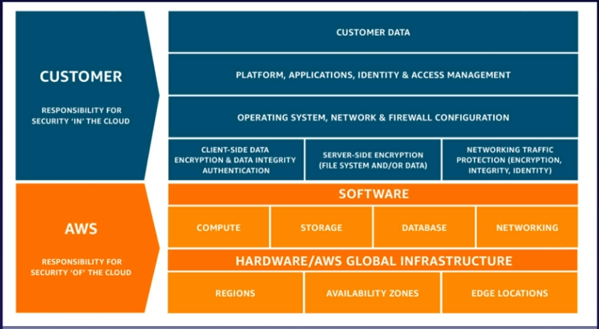
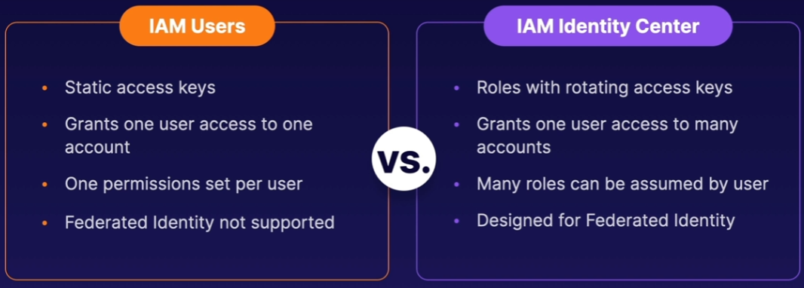
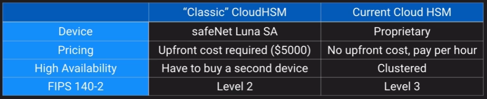
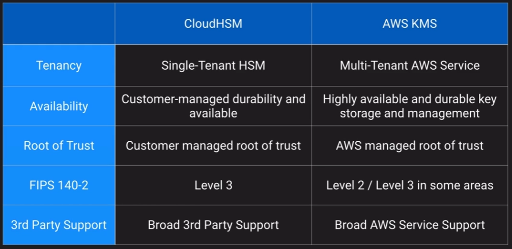
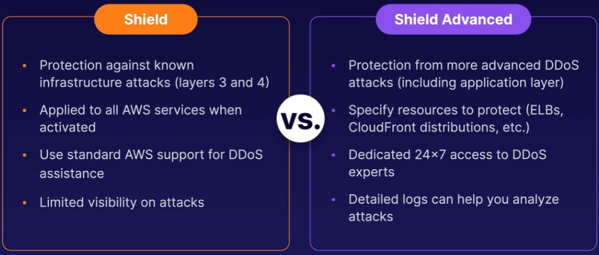

## Security

### Design Solutions for Organisational Complexity

- Network monitoring
- IAM / SSO
- Encryption keys and ACM
- Security - Cloudtrail, IAM Access analyser, Securityhub
- RAM

### Design for new solutions

- IAM
- Encryption for data at rest and in transit
- Credential management
- AWS Managed services - WAF, Shield, GuardDuty

### Continuous Improvement for Existing Solutions

- Data retention
- Secrets management
- Principle of least privilege
- Monitoring - cloudwatch

### Accelerate Workload Migration and Modernisation

- Governance - Organisations / control tower

## Security Concepts

Shared responsibility model

Least privileges:

- Give users and services nothing more than those privileges necessary
- Only when they need them, not long term

## Organisations

Good to split Dev / Prod accounts as if one set of keys get accessed it's only within the one environment.

Consolodated billing with organisations allows for bulk discounts across the organisation rather than account level.

## Control Tower

`Landing Zone` - What you provision when you start using Control Tower, your landing zone is a recommended, customisable starting point.

`Guardrail` - High level rules governed by SCPs or Config rules

`Baseline` - Combination of blueprints (CFN stacks) and guardrailes applied to a member account.

Following accounts created:

- Log Archive - where logs are stored
- Audit - Cross account audit roles

## Service Control Policies

IAM syntax, only `DENY` access, never allow.

Best practice is to only apply SCPs to OUs, not accounts.

A `DENY` list explicitly denies specific actions

An `ALLOW` list denies all actions that are NOT listed. Orgs are assigned FullAWSAccess by default.

## Config

Monitors best practices across Organisation

Defines detective controls and shows which accounts are compliant. Keeps a history of actions that caused non-compliance.

## IAM Identity Center

Formally AWS SSO.

Uses roles instead of IAM users.

Maps users/groups from an identity provider to IAM users and groups

It integrates with identity providers that leverege SAML 2.0 (like Azure AD)

Can act as a user directory.

## Directory Services

| Service | Description | Best For: |
| ------- | ----------- | --------- |
| Cloud Directory | Cloud-native directory to share controll access between applications | Cloud applications that need hierarchical data |
| Cognito | Sign up and sign-in functionality that scales to millions of users | Consumer apps |
| AWS Directory Service for Microsoft AD | Full Microsoft AD (Standard or enterprise) | Hosted AD for LADP |
| AD Connector | Allows on-prem users to log into AWS services with AD | SSO for on prep epmloyees and domain joined EC2 instances |
| Simple AD | Low scale and low cost AD implementation based on Samba | Simple user directory |

## Secrets manager

- Automatically rotates RDS database credentials for MySQL, PostgreSQL and Aurora

Applications need to use the AWS SDK to access the secret 'getSecretValue'.

## Resource access manager

- Share resources with principals across many accounts
- Share with accounts or OUs in an organisation

!!! note
    Resource sharing MUST be enabled in your organisation

You can share a subnet from one account to another. The target account cannot delete the subnet.

## Cloud HSM

- Dedicated hardware device, owned only by you
- Must be within a VPC, can be accessed via peering
- Doesn't integrate with many services like KMS but rather requires custom application scripting
- Offload SSL from web servers, act as a certificate authority

## ACM

- Managed service to provision, manage and deploy public/private SSL/TLS certificates
- Supports wildcard (*.domain.com)
- Managed certificate renewal

## Network Firewall vs WAF

Network firewall assumes traffic is coming into your VPC and filters traffic to and from that VPC.

WAF works with ALB, Cloudfront, API Gateway, Appsync and more

## Shield

Primary service for DDOS mitigation

## Guard Duty

Uses machine learning and log inspection to generate security alerts and recommendations.

Threat detection with low operational overhead.
